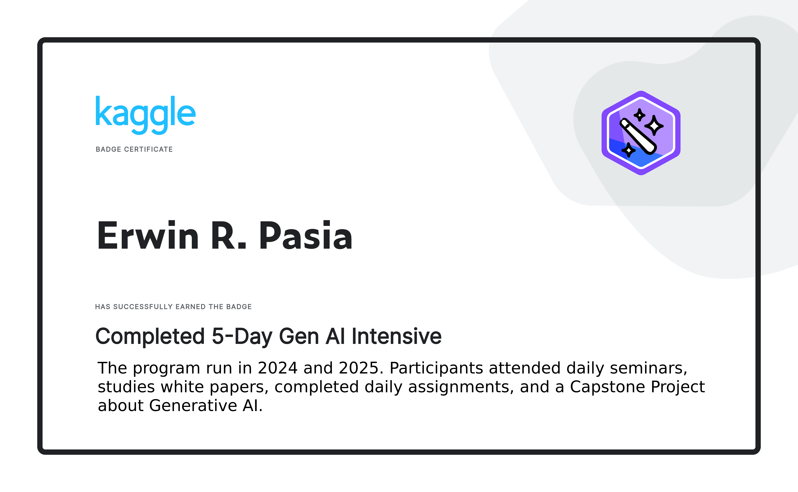

# 5-Day Generative AI Intensive with Google 2025Q1
### *(by Kaggle, Google, and DeepMind. Taken last March 31 - April 4, 2025.)*

## Overview

The **5-Day Gen AI Intensive Course** was a collaborative effort between **Google**, **Kaggle**, and **Google DeepMind** that achieved remarkable success, attracting over **280,000 participants** and earning a **Guinness World Record** for the largest attendance at a virtual AI conference in one week.

The course ran from **March 31 - April 4, 2025** and is now available as a self-paced learning guide.

## Course Leadership \& Organization

### Primary Course Creators

The course was brought together by a distinguished team of AI experts and education leaders:

- **[Anant Nawalgaria](https://openreview.net/profile?id=~Anant_Nawalgaria1)** - Google (Sr. Staff Machine Learning Specialist Engineer)
- **[Antonio Gulli](https://scholar.google.com/citations?user=wfiEFPQAAAAJ&hl=en)** - Google (Senior Director, Distinguished Engineer, CTO Office)
- **[Mark McDonald](https://au.linkedin.com/in/markmcdonald0)** - Google DeepMind (Gemini/AI Developer Relations)
- **[Polong Lin](https://uk.linkedin.com/in/polonglin)** - Google (Staff Developer Advocate, Generative AI)
- **[Paige Bailey](https://www.linkedin.com/in/dynamicwebpaige)** - Google DeepMind (AI Developer Relations Engineering Lead)

### Host \& Primary Face of the Course

**[Paige Bailey](https://www.linkedin.com/in/dynamicwebpaige)** (Google DeepMind) served as the primary host for daily livestream sessions.

## Daily Content \& Featured Contributors

### Day 1: Foundational Models \& Prompt Engineering

**Featured Speakers:**

- [Paige Bailey](https://www.linkedin.com/in/dynamicwebpaige) (Google DeepMind)
- [Warren Barkley](https://www.linkedin.com/in/warrenbarkley) (Google - Head of Product Management for Cloud AI)
- [Logan Kilpatrick](https://www.linkedin.com/in/logankilpatrick) (Google DeepMind - Senior Product Manager, Google AI Studio)
- [Kieran Milan](https://uk.linkedin.com/in/kieran-milan-03b95135) (DeepMind - Research Engineer)
- [Anant Nawalgaria](https://openreview.net/profile?id=~Anant_Nawalgaria1) (Google)
- **Irina Sigler** (Google)
- **Mat Velloso** (Google)

### Day 2: Embeddings and Vector Stores/Databases

**Featured Speakers:**

- **Andre Araujo** (Google)
- **Patricia Florissi** (Google)
- **Alan Li** (Google)
- [Anant Nawalgaria](https://openreview.net/profile?id=~Anant_Nawalgaria1) (Google)
- **Xiaoqi Ren** (Google)
- **Chuck Sugnet** (Google)
- **Howard Zhou** (Google)

### Day 3: Generative AI Agents

**Featured Speakers:**

- **Alan Blount** (Google)
- [Antonio Gulli](https://scholar.google.com/citations?user=wfiEFPQAAAAJ&hl=en) (Google)
- **Steven Johnson** (Google)
- **Jaclyn Konzelmann** (Google)
- **Patrick Marlow** (Google)
- [Anant Nawalgaria](https://openreview.net/profile?id=~Anant_Nawalgaria1) (Google)
- **Julia Wiesinger** (Google)

### Day 4: Domain-Specific LLMs

**Featured Speakers:**

- **Donny Cheung** (Google)
- **Scott Coull** (Google)
- **Ewa Dominowska** (Google)
- **Chris Grier** (Google)
- [Anant Nawalgaria](https://openreview.net/profile?id=~Anant_Nawalgaria1) (Google)
- **Karthik Raman** (Google)

### Day 5: MLOps for Generative AI

**Featured Content:**

- Focus on adapting MLOps practices for Generative AI
- Vertex AI tools for foundation models
- AgentOps for agentic applications
- Live demo of the Agent Starter Pack by [Mark McDonald](https://au.linkedin.com/in/markmcdonald0) and team

## Course Structure

Each day included:

- **AI-generated podcasts** (created using NotebookLM)
- **Expert-written whitepapers**
- **Hands-on codelabs** on Kaggle platform
- **Interactive livestream sessions** with expert Q\&A
- **Community engagement** through Discord

### Key Technologies Covered

- Gemini 2.0 API (led by [Mark McDonald](https://au.linkedin.com/in/markmcdonald0) and [Logan Kilpatrick](https://www.linkedin.com/in/logankilpatrick))
- Vertex AI platform (championed by [Polong Lin](https://uk.linkedin.com/in/polonglin))
- LangGraph for agent development
- Google Cloud Platform services
- Embeddings and vector search
- Function calling and tool use
- Model fine-tuning and evaluation

## Organizational Structure

### Platform Partnerships

- **Kaggle**: Learning platform, community infrastructure, code labs
- **Google**: Technical expertise, content creation, speaker resources
- **Google DeepMind**: Advanced AI research, model development (led by [Paige Bailey](https://www.linkedin.com/in/dynamicwebpaige), [Mark McDonald](https://au.linkedin.com/in/markmcdonald0), [Logan Kilpatrick](https://www.linkedin.com/in/logankilpatrick))
- **Google Research**: AI model development teams (with [Anant Nawalgaria](https://openreview.net/profile?id=~Anant_Nawalgaria1))
- **Google Cloud**: Infrastructure and enterprise AI tools (with [Polong Lin](https://uk.linkedin.com/in/polonglin), [Warren Barkley](https://www.linkedin.com/in/warrenbarkley))

## Course Resources

### Available Materials

- Self-paced learning guide on Kaggle
- Downloadable whitepapers
- Interactive code labs and notebooks (developed by [Mark McDonald](https://au.linkedin.com/in/markmcdonald0) and team)
- Recorded livestream sessions (hosted by [Paige Bailey](https://www.linkedin.com/in/dynamicwebpaige))
- Community Discord for ongoing discussion
- [Open-source Gemini Cookbook](https://github.com/google-gemini/cookbook) (maintained by [Mark McDonald](https://github.com/markmcd))

### Access Information

- **Course Guide**: [Kaggle Learn Guide](https://www.kaggle.com/learn-guide/5-day-genai)
- **Platform**: Kaggle (phone verification required for codelabs)
- **AI Studio**: Google AI Studio account needed for API access (led by [Logan Kilpatrick](https://www.linkedin.com/in/logankilpatrick))
- **Community**: Kaggle Discord server

## Impact \& Recognition

- **280,000+ participants** in 20 days
- **Guinness World Record** for largest virtual AI conference attendance
- **Self-paced format** now available for continued learning
- **Capstone projects** with winning submissions showcased
- **Industry recognition** as a breakthrough in AI education accessibility
- **Over 4M users** on Gemini API (launched by [Mark McDonald](https://au.linkedin.com/in/markmcdonald0))
- **3M downloads/month** for google-generativeai Python SDK (contributed by [Mark McDonald](https://au.linkedin.com/in/markmcdonald0))

## Key Contributors' Professional Profiles

### Leadership Team

- **[Paige Bailey](https://www.linkedin.com/in/dynamicwebpaige)** - Google DeepMind AI Developer Relations Engineering Lead
- **[Anant Nawalgaria](https://openreview.net/profile?id=~Anant_Nawalgaria1)** - Google Sr. Staff ML Specialist Engineer, Researcher
- **[Mark McDonald](https://au.linkedin.com/in/markmcdonald0)** - Google DeepMind Gemini/AI Developer Relations
- **[Logan Kilpatrick](https://www.linkedin.com/in/logankilpatrick)** - Google DeepMind Senior Product Manager (former OpenAI Developer Relations)
- **[Polong Lin](https://uk.linkedin.com/in/polonglin)** - Google Staff Developer Advocate, Generative AI
- **[Antonio Gulli](https://scholar.google.com/citations?user=wfiEFPQAAAAJ&hl=en)** - Google Senior Director, Distinguished Engineer

### Research \& Development

- **[Kieran Milan](https://uk.linkedin.com/in/kieran-milan-03b95135)** - DeepMind Research Engineer
- **[Warren Barkley](https://www.linkedin.com/in/warrenbarkley)** - Former Google Head of Product Management for Cloud AI (now NVIDIA VP of Product)

## Contributing Organizations

This course represents a collaborative effort across multiple Google divisions:

- Google DeepMind
- Google Research
- Google Cloud
- Google Developer Relations
- Kaggle Platform Team

***

*This course demonstrates the power of collaborative AI education, bringing together world-class expertise from across Google's AI ecosystem to deliver accessible, hands-on learning at unprecedented scale.*

***

## Table of Contents

### Day 1: Foundational LLMs and Text Generation
*   Deep Dive into Large Language Models (LLMs) and Text Generation
*   Introduction
*   Transformer Architecture Foundation
*   Input Processing for Transformers
*   Self-Attention Mechanism
*   Multi-Head Attention
*   Layer Normalization & Residual Connections
*   Feed-Forward Network Layer
*   Decoder-Only Architecture
*   Mixture of Experts (MoE)
*   Evolution of LLMs - Timeline & Key Models
*   LLM Training Overview
*   Fine-tuning Techniques
*   Parameter-Efficient Fine-Tuning (PEFT)
*   Prompt Engineering
*   Sampling Techniques
*   Evaluating LLMs
*   Inference Acceleration
*   Applications of LLMs
*   Conclusion and Future

### Day 1: Prompt Engineering Techniques
*   Prompt Engineering Techniques for Large Language Models
*   Introduction to Prompt Engineering
*   Configuring Model Output
*   Prompt Engineering Techniques
*   Advanced Reasoning Techniques
*   Code Prompting Applications
*   Best Practices for Prompt Engineering
*   Conclusion and Future Considerations

### Day 2: Embeddings and Vector Stores
*   Introduction to Embeddings and Vector Stores
*   Importance of Embeddings
*   Applications of Embeddings
*   Evaluating Embedding Effectiveness
*   Retrieval Augmented Generation (RAG)
*   Types of Embeddings
*   Training Embedding Models
*   Vector Search
*   Vector Databases
*   Applications of Embeddings and Vector Stores

### Day 3: Agents
*   Generative AI Agents: A Deep Dive
*   Introduction
*   What is a Generative AI Agent?
*   Cognitive Architecture of Agents
*   Agents vs. Models
*   How Agents Operate: Cognitive Architectures
*   Reasoning and Planning Frameworks
*   ReAct in Practice: Example
*   Tools: Keys to the Outside World
*   Retrieval Augmented Generation (RAG)
*   Tools Recap
*   Enhancing Model Performance
*   Agent Quick Start with LangChain
*   Vertex AI Agents
*   Main Takeaways

### Day 3: Agents Companion
*   AI Agents White Paper Companion: A Deep Dive
*   Introduction to Generative AI Agents
*   Advanced Agent Concepts for Developers
*   Agent Ops: Tailored DevOps for AI Agents
*   Measuring Success with Business KPIs
*   The Importance of Human Feedback
*   Automated Evaluation
*   Analyzing Agent Trajectory
*   Techniques for Measuring Trajectory
*   Judging the Quality of Final Response
*   The Role of Humans in Evaluation
*   Multi-Agent Systems: Divide and Conquer
*   Benefits of Multi-Agent Systems
*   Structuring Multi-Agent Systems: Design Patterns
*   Challenges in Building Multi-Agent Systems
*   Evaluating Multi-Agent Systems
*   Agentic RAG: Retrieval Augmented Generation with Agents
*   Optimizing Basic Search Engine
*   Google Cloud Tools for Search
*   Real-World Example: Google's Co-scientist
*   Automotive AI: Multi-Agent Systems in Cars
*   Patterns in Automotive AI
*   Benefits of Multi-Agent Approach in Automotive AI
*   Agent Builder: Google Cloud's Toolkit for Agent Developers
*   Agents as Contractors: A Conceptual Shift
*   Agentic RAG Deep Dive
*   Optimizing Search for Agentic RAG
*   Conceptual Shifts: Trust and Reliability
*   Fairness

### Day 4: Solving Domain-Specific Problems Using LLMs: Cybersecurity and Medicine
*   Introduction to LLMs and Domain Specialization
*   Cybersecurity Challenges and SecLM
*   Pressures in Cybersecurity
*   LLMs as AI Assistants in Cybersecurity
*   Layered Approach in Cybersecurity
*   SecLM as a Central Resource
*   Standards for SecLM
*   Reasons General-Purpose LLMs Fall Short
*   Creating Specialized SecLMs: Targeted Training Approach
*   Evaluating Performance of Specialized Models
*   Techniques to Help Models
*   Flexible Planning and Reasoning Framework
*   SecLM Applications
*   Ultimate Goal for SecLM
*   Healthcare and Med-PaLM
*   Potential Uses of GenAI in Healthcare
*   Responsible Innovation in Medicine
*   Shift in Scientific Approach
*   Med-PaLM Progress
*   Measuring AI's Medical Knowledge: Evaluation Strategy
*   Human Evaluations
*   Areas for Improvement
*   Task-Specific vs. Broad Domain Models
*   Applications Beyond Patient Care
*   Med-PaLM as a Suite of Commercially Available Models
*   Med-PaLM 2 Training...
*   Conclusion

### Day 5: Operationalizing Generative AI on Vertex AI using MLOps
*   Introduction
*   Foundation Models vs. Traditional ML Models
*   The Generative AI Lifecycle
*   Discovery Phase
*   Development and Experimentation Phase
*   Data Practices for Generative AI
*   Evaluation
*   Deployment
*   Monitoring and Logging
*   Governance
*   Agent Ops: The Next Frontier
*   The Changing MLOps Landscape
*   Conclusion

---
### References:
All "full versions" of Google Whitepapers covered during the training can be found on the links below:
*   [https://www.kaggle.com/whitepaper-foundational-llm-and-text-generation](https://www.kaggle.com/whitepaper-foundational-llm-and-text-generation)
*   [https://www.kaggle.com/whitepaper-prompt-engineering](https://www.kaggle.com/whitepaper-prompt-engineering)
*   [https://www.kaggle.com/whitepaper-embeddings-and-vector-stores](https://www.kaggle.com/whitepaper-embeddings-and-vector-stores)
*   [https://www.kaggle.com/whitepaper-agents](https://www.kaggle.com/whitepaper-agents)
*   [https://www.kaggle.com/whitepaper-agent-companion](https://www.kaggle.com/whitepaper-agent-companion)
*   [https://www.kaggle.com/whitepaper-solving-domains-specific-problems-using-llms](https://www.kaggle.com/whitepaper-solving-domains-specific-problems-using-llms)
*   [https://www.kaggle.com/whitepaper-operationalizing-generative-ai-on-vertex-ai-using-mlops](https://www.kaggle.com/whitepaper-operationalizing-generative-ai-on-vertex-ai-using-mlops)

---  

### [**Badge Certificate For Completion and Capstone Project Entry:**](https://www.kaggle.com/certification/badges/erwinrpasia/96)

