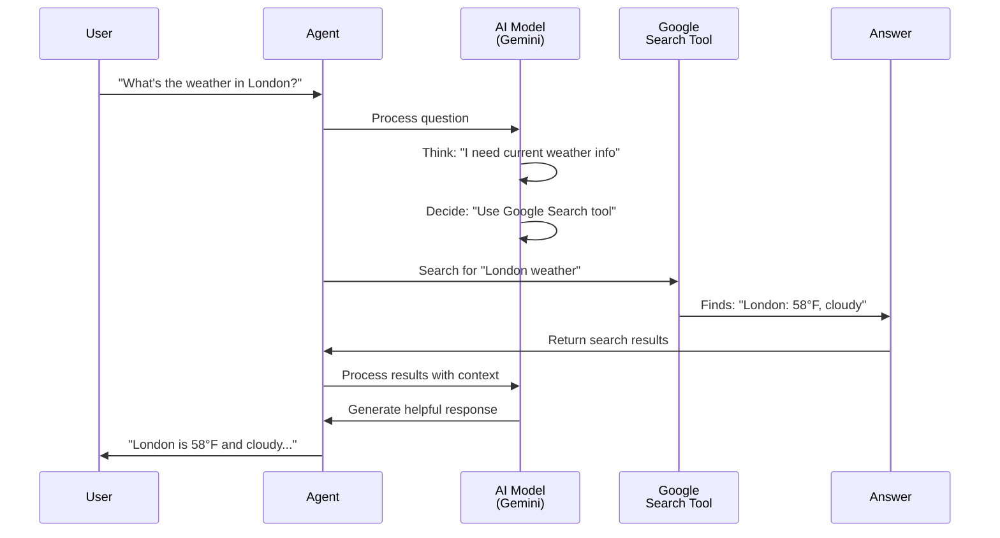

# Chapter 1: Agent

Welcome to the Agent Development Kit (ADK) tutorial series! This is Chapter 1, where we'll explore the foundational concept that makes ADK so powerful: **Agents**.

## The Problem: From Static Responses to Intelligent Action

Imagine you ask an AI assistant: *"What's the weather in London?"*

A traditional chatbot would just respond based on its training data, which might be outdated. It can't actually *look up* current weather information—it can only guess.

An **Agent**, however, is different. An agent doesn't just answer from memory. It **thinks**, **decides what to do**, and **takes action** to find the best answer. It's like hiring a smart assistant who not only knows things but can also make phone calls, search the internet, and gather information to give you accurate answers.

That's what we're building in this chapter: your first intelligent agent that can reason and take action.

## What is an Agent?

An **Agent** in ADK is a self-contained, autonomous unit powered by an AI model (like Gemini) that can:

1. **Understand** your request
2. **Reason** about what to do
3. **Use tools** to take action (like searching the web, calling APIs, running code)
4. **Learn** from the results and refine its approach
5. **Deliver** a thoughtful answer

Think of an agent like a chef in a kitchen:
- The **model** (Gemini) is the chef's brain and knowledge
- The **instructions** are the recipe and cooking philosophy
- The **tools** are the kitchen equipment (knives, ovens, mixers)
- The **agent** is the complete chef who knows how to use everything together

## Core Components of an Agent

Before we build, let's understand what makes up an agent. Every agent has three essential parts:

### 1. **The Brain: An AI Model**

The agent runs on a large language model (LLM) that does the thinking. In ADK, we use models like Gemini.

```python
model=Gemini(model="gemini-2.5-flash-lite")
```

This tells the agent which AI engine to use for reasoning.

### 2. **The Instructions: Guiding Behavior**

Instructions are like a job description for your agent. They tell it:
- What its goal is
- How it should behave
- When and how to use tools

```python
instruction="You are a helpful assistant. Use Google Search for current information."
```

### 3. **The Tools: Superpowers**

Tools let agents take action in the real world. Without tools, an agent can only talk. With tools, it can search, calculate, and get things done.

```python
tools=[google_search]  # The agent can now search the web!
```

## Building Your First Agent

Let's create a simple agent that can search the web for you:

```python
from google.adk.agents import Agent
from google.adk.models.google_llm import Gemini
from google.adk.tools import google_search

my_agent = Agent(
    name="helpful_assistant",
    model=Gemini(model="gemini-2.5-flash-lite"),
    instruction="You are a helpful assistant. Use Google Search for current information.",
    tools=[google_search]
)
```

**What just happened?** We created an agent with:
- A **name** to identify it
- A **model** (Gemini) for intelligent reasoning
- **Instructions** telling it how to behave
- **Tools** (Google Search) it can use

## Running Your Agent

Creating an agent isn't enough—we need to run it! ADK uses a **Runner** to execute agents and manage conversations.

```python
from google.adk.runners import InMemoryRunner

runner = InMemoryRunner(agent=my_agent)
response = await runner.run_debug(
    "What's the capital of France?"
)
```

**What just happened?** The runner:
1. Took your question
2. Sent it to the agent
3. The agent reasoned: *"I should search for this to give accurate information"*
4. The agent used Google Search to find the answer
5. Returned the result to you

## How an Agent Works: Under the Hood

Let's walk through what happens step-by-step when your agent processes a request:



### The Agent Reasoning Loop

Here's what actually happens in the agent's "brain":

**Step 1: Understanding**
The model reads your question and understands what you're asking.

**Step 2: Planning**
The model thinks: *"Do I already know this? Or do I need to search?"* Based on its instructions, it decides whether to use a tool.

**Step 3: Action**
If needed, the agent calls a tool (like Google Search) with a query.

**Step 4: Observation**
The agent receives results from the tool and reads them.

**Step 5: Response**
The model combines its reasoning with the tool results to craft a final answer.

## Looking Inside: Agent Implementation

Let's peek at what's happening inside an agent. Here's a simplified view of how ADK handles this:

```python
# Inside the Agent class (simplified)
class Agent:
    def __init__(self, name, model, instruction, tools):
        self.model = model
        self.instruction = instruction
        self.available_tools = tools
    
    async def process(self, user_input):
        # Step 1: Prepare the context
        context = self.instruction + "\nUser: " + user_input
        
        # Step 2: Ask the model to reason
        thought = await self.model.generate(context)
        
        # Step 3: Check if model wants to use a tool
        if "search" in thought:
            results = self.available_tools[0].search(user_input)
            return await self.model.generate(context + results)
        
        return thought
```

**What's happening?**
1. The agent stores your model, instructions, and available tools
2. When you ask a question, it adds that question to the instructions as context
3. The model generates a response (which might say it wants to use a tool)
4. If a tool is needed, the agent calls it and gets results
5. The model generates a final answer using the results

In reality, ADK does this more sophisticatedly with structured formats and tool schemas, but the basic idea is the same.

## Real-World Example: A Weather Agent

Let's see a concrete example of how an agent solves a real problem:

**Your question:**
```
"Will I need an umbrella in Paris tomorrow?"
```

**What the agent does:**
1. Reads the instruction: "Use Google Search for weather information"
2. Realizes: "I don't have tomorrow's weather in my training data"
3. **Uses the tool:** Searches for "Paris weather tomorrow"
4. Gets results: "Paris: 65°F, 80% chance of rain"
5. **Provides answer:** "Yes, you'll definitely want an umbrella! Paris will have an 80% chance of rain tomorrow."

Without being an agent, the AI would just guess. As an agent, it searches and gives you reliable information.

## Why This Matters

Agents transform AI from something that just talks to something that **acts**:

- ✅ **Current Information**: Agents can search for today's news, weather, or prices
- ✅ **Complex Tasks**: Agents can break problems into steps and execute them
- ✅ **Error Recovery**: Agents can try different approaches if one fails
- ✅ **Reliability**: Agents use real data instead of guessing

## Next Steps

You've now learned what an agent is and how it works! 

In the next chapter, we'll explore [Tools](02_tools_.md)—the superpowers that let agents take action. You'll learn how to give your agents access to different tools and create custom tools for your specific needs.

For now, remember: **An agent is an AI assistant with a brain (model), a job description (instructions), and tools to get things done (tools).**

---

**Key Takeaways:**
- An **Agent** is an autonomous AI unit that can reason and take action
- Agents need three things: a **model** (brain), **instructions** (purpose), and **tools** (abilities)
- Agents follow a reasoning loop: understand → plan → act → observe → respond
- Unlike static chatbots, agents can gather real information and adapt their approach

Ready to give your agent superpowers? Let's move on to [Tools](02_tools_.md)!
