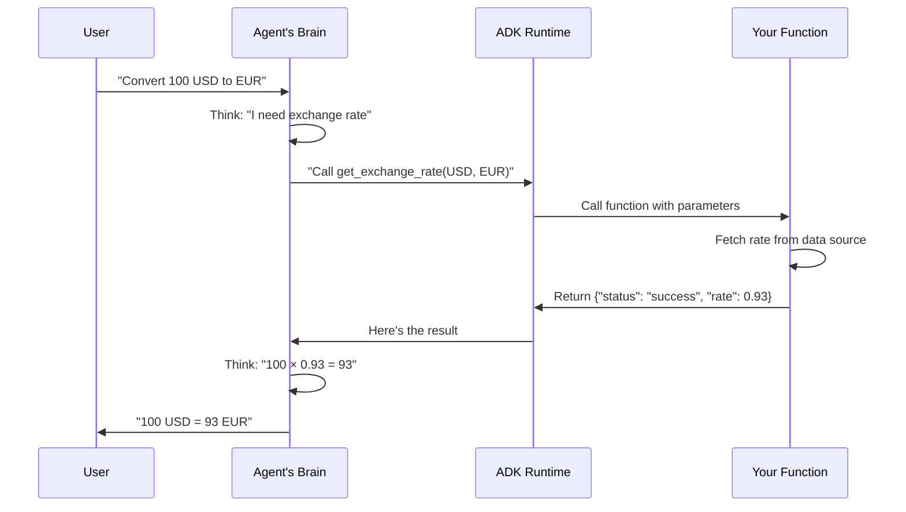

# Chapter 2: Tools

Welcome back! In [Chapter 1: Agent](01_agent_.md), you learned how agents think and reason about problems. But **thinking alone isn't enough**—agents need **tools** to actually *do* something about it.

## The Problem: From Thinking to Doing

Imagine you're an agent asked: *"What's the weather in London right now?"*

Without tools, you're stuck. Your knowledge was frozen when you were trained. You can't look outside. You can't check a weather website. You can only guess based on old memories—which won't help your user.

**With tools, everything changes.** A tool lets you call out to the real world and say: *"Hey, fetch the current weather for me."* Then you get fresh data back and can give an accurate answer.

Think of it like this: An agent without tools is a smart person locked in a library. An agent with tools is that same smart person with a phone, internet access, and the ability to make calls. Suddenly, they can actually *help you*.

## What Are Tools?

**Tools** are **functions or services that agents can call** to interact with the outside world. They bridge the gap between an agent's reasoning and real-world capabilities.

```
Agent's Thought: "I need weather data"
    ↓
Agent Uses Tool: Call google_search("London weather")
    ↓
Tool Returns Data: "London: 58°F, cloudy"
    ↓
Agent's Final Answer: "It's 58°F and cloudy in London"
```

A tool can:
- 🌐 **Search the web** (Google Search)
- 💾 **Query a database** (SQL database)
- 📧 **Send emails or messages** (Email API)
- 🔢 **Do calculations** (Python code execution)
- 📁 **Read/write files** (File system access)
- 🔗 **Call APIs** (REST endpoints)

Basically, **any function you can call in code can become a tool**.

## Core Concepts: Three Types of Tools

In ADK (Agent Development Kit), tools come in different flavors. Let's understand the three main categories:

### 1. **Custom Function Tools** — Tools You Write

These are Python functions you create for your specific needs[7]. They're the most flexible because *you control everything*.

```python
def get_current_weather(location: str) -> dict:
    """Get the weather for a location."""
    # Your code here
    return {"temperature": 58, "condition": "cloudy"}
```

**When to use:** Your specific business logic, internal APIs, or unique requirements.

### 2. **Built-in Tools** — Pre-Made Tools from ADK

ADK provides ready-to-use tools that work immediately[1][2]. No setup needed—just plug and play.

Examples:
- `google_search` — Search the web[1]
- `BuiltInCodeExecutor` — Run Python code safely[1]
- `BigQueryToolset` — Query Google BigQuery databases (if you have Google Cloud access)[2]

**When to use:** Standard tasks like searching, running code, or accessing Google Cloud services.

### 3. **MCP Tools** — Community-Built Tools

MCP (Model Context Protocol) is an open standard where developers share pre-built tools[6]. It's like an app store for agent tools. You can use GitHub tools, file system tools, Discord bots—all standardized.

**When to use:** Connecting to popular services without writing integration code.

## The Central Use Case: A Currency Converter Agent

Let's solve a real problem with tools. Imagine a bank needs an agent that:
1. Looks up **transaction fees** (internal database)
2. Gets **exchange rates** (live API)
3. **Calculates** the final amount
4. Gives the user a clear breakdown

Without tools, the agent is helpless. With tools, it becomes powerful.

## How to Use Tools: The Simple Pattern

Here's how agents use tools in ADK:

### Step 1: Create Your Tool

```python
def get_exchange_rate(from_currency: str, to_currency: str) -> dict:
    """Get the exchange rate between two currencies."""
    rates = {"USD": {"EUR": 0.93, "JPY": 157.50}}
    rate = rates.get(from_currency, {}).get(to_currency)
    
    if rate:
        return {"status": "success", "rate": rate}
    else:
        return {"status": "error", "message": "Currency not found"}
```

**What's happening:** This is just a regular Python function with:
- Clear input parameters with type hints (`str`, `dict`)
- A helpful docstring explaining what it does
- Structured output (`{"status": "success", ...}`)
- Error handling

### Step 2: Give Your Agent the Tool

```python
from google.adk.agents import Agent
from google.adk.tools import google_search

my_agent = Agent(
    name="currency_agent",
    model=Gemini(model="gemini-2.5-flash-lite"),
    instruction="Convert currencies. Use get_exchange_rate() to get rates.",
    tools=[get_exchange_rate, google_search]  # ← Pass your tools here
)
```

**What's happening:** You're telling the agent: "These are the tools you have available." The agent will automatically understand how to call them based on the docstrings and type hints.

### Step 3: The Agent Uses It

```python
runner = InMemoryRunner(agent=my_agent)
response = await runner.run_debug(
    "Convert 100 USD to EUR"
)
# Agent internally: Calls get_exchange_rate("USD", "EUR")
# Gets back: {"status": "success", "rate": 0.93}
# Returns: "100 USD = 93 EUR"
```

**What's happening:** The agent receives your request, decides it needs the exchange rate tool, calls it, gets the result, and responds to you.

## Best Practices: Making Great Tools

When you write custom tools, follow these patterns so agents can use them reliably[1][7]:

### ✅ Pattern 1: Include Clear Docstrings

```python
def lookup_shipping_fee(method: str) -> dict:
    """Look up the shipping fee for a delivery method.
    
    Args:
        method: The shipping method, e.g., "standard", "express"
    
    Returns:
        {"status": "success", "fee": 5.99} or 
        {"status": "error", "message": "..."}
    """
    fees = {"standard": 5.99, "express": 12.99}
    fee = fees.get(method)
    return {"status": "success", "fee": fee} if fee else \
           {"status": "error", "message": f"Method {method} not found"}
```

LLMs read docstrings to understand when and how to use your tool. Good docstrings = smarter tool usage[1].

### ✅ Pattern 2: Use Type Hints

```python
def calculate_discount(price: float, discount_percent: int) -> float:
    """Calculate final price after discount."""
    return price * (1 - discount_percent / 100)
```

Type hints tell ADK what kinds of inputs your tool accepts. This prevents errors[7].

### ✅ Pattern 3: Structured Error Responses

```python
def query_database(table: str, id: int) -> dict:
    """Query the database for a record."""
    try:
        # ... your code ...
        return {"status": "success", "data": record}
    except Exception as e:
        return {"status": "error", "error_message": str(e)}
```

Always return a consistent structure. Agents handle `{"status": "error", ...}` gracefully[1][7].

## Under the Hood: How Tools Actually Work

When you give an agent a tool, here's what happens step-by-step:

```
1. Agent sees your tool in its tools list
2. ADK inspects the tool: reads docstring, parameter types, return type
3. ADK builds a "schema" describing what the tool does
4. Agent receives your question
5. Agent's reasoning: "Do I need a tool for this?"
6. If yes: Agent decides which tool and what parameters
7. ADK calls your function with those parameters
8. Your function returns a result
9. ADK gives result back to the agent
10. Agent uses the result to answer your question
```

Let's see this with a sequence diagram:



## Real Example: Currency Converter in Action

Let's put it all together. Here's a minimal but complete example[1]:

```python
# Define your tools
def get_exchange_rate(base: str, target: str) -> dict:
    """Get exchange rate between currencies."""
    rates = {"USD": {"EUR": 0.93}}
    rate = rates.get(base, {}).get(target)
    return {"status": "success", "rate": rate} if rate \
           else {"status": "error", "message": "Rate not found"}

# Create agent with tools
agent = Agent(
    name="converter",
    model=Gemini(model="gemini-2.5-flash-lite"),
    instruction="Use get_exchange_rate() to convert currencies.",
    tools=[get_exchange_rate]
)

# Run it
runner = InMemoryRunner(agent=agent)
response = await runner.run_debug("How much is 200 USD in EUR?")
# Output: "200 USD is 186 EUR (200 × 0.93)"
```

## Beyond Basic Tools: Advanced Capabilities

As you build more complex agents, you'll discover more tool types[2][6]:

- **Agent Tools**: Use another agent as a tool (specialist agents)[1]
- **Long-Running Tools**: Tools that pause and wait for human approval[6]
- **MCP Tools**: Connect to external services via the Model Context Protocol[6]

These advanced patterns handle real-world scenarios like high-value transactions needing approval or connecting to external systems.

## Summary

**Tools are the bridge between thinking and doing.** They let agents:
- 🌐 Access real-world data (weather, prices, databases)
- 🧮 Perform calculations reliably
- 📤 Take actions (send emails, update databases)
- 🔗 Integrate with external systems

**Best practices:**
1. Write tools as regular Python functions
2. Include clear docstrings
3. Add type hints
4. Return structured responses (especially for errors)
5. Keep tools focused on one job

You now understand the foundation of what makes agents powerful. In the next chapter, we'll explore [Multi-Agent Systems](03_multi_agent_systems_.md), where multiple specialized agents work together—each with their own tools—to tackle even bigger problems.
