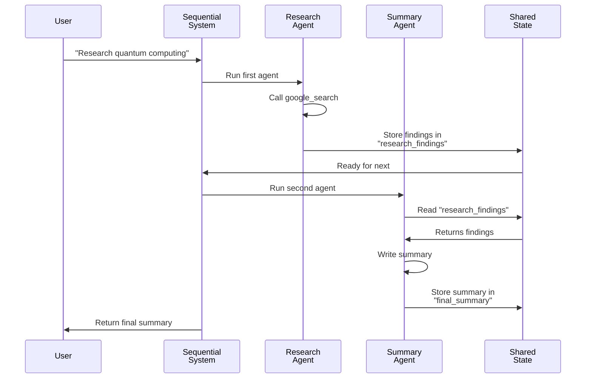

# Chapter 3: Multi-Agent Systems

In [Chapter 1: Agent](01_agent_.md), you learned how to build a single intelligent agent. In [Chapter 2: Tools](02_tools_.md), you discovered how to give agents superpowers with tools and sub-agents. Now we're ready to take the next big step: building **Multi-Agent Systems** where multiple specialized agents work together as a team.

## The Problem: When One Agent Isn't Enough

Imagine you're building a customer support system. A single agent trying to do everything—researching products, checking inventory, processing returns, and writing responses—becomes overwhelmed. Its instructions get confusing and long. It's hard to test. And when something goes wrong, you can't tell which part failed.

**What if instead, you built a team of specialists?**

- One agent specializes in **product information** only
- Another handles **inventory checks** only  
- A third manages **return processing** only
- A coordinator agent brings them all together

Each agent is simpler, easier to test, and better at its job. When they work together, they're far more powerful than one "do-it-all" agent. **This is a Multi-Agent System.**

## The Core Idea: Teams of Specialists

Just like a real organization has departments (accounting, sales, engineering), a multi-agent system has specialized agents. Each agent:

- **Has one clear job** - it knows what it's good at
- **Uses its own tools** - each has the right equipment for their task
- **Communicates with others** - agents share information to solve bigger problems
- **Works reliably** - because it focuses on one thing well

Think of it like a restaurant kitchen:
- The **prep chef** only chops vegetables
- The **saucier** only makes sauces
- The **pastry chef** only makes desserts
- The **head chef** coordinates them all

Each person is excellent at their specialty, and together they create amazing meals.

## Key Concepts: How Multi-Agent Systems Work

### 1. **Specialized Agents**

Each agent in your system has a specific role. In ADK, you create specialized agents just like you create any agent—with a focused instruction and the right tools for that job.

```python
# Specialized agent for researching products
product_researcher = Agent(
    name="ProductResearcher",
    instruction="Look up product information using search.",
    tools=[product_database]
)

# Specialized agent for checking inventory
inventory_checker = Agent(
    name="InventoryChecker",
    instruction="Check stock levels and availability.",
    tools=[inventory_system]
)
```

**What's happening:** Each agent has a laser-focused job. The product researcher only searches for product info. The inventory checker only checks stock. No confusion, no overlap.

### 2. **Coordination Patterns**

How do these agents work together? There are three main patterns:

**Sequential (Assembly Line):** One agent finishes, then the next one starts. Perfect when order matters.

```
Step 1: Researcher finds product info
   ↓
Step 2: Inventory checker verifies stock
   ↓
Step 3: Support agent writes response
```

**Parallel (Simultaneous Work):** Multiple agents work at the same time on independent tasks. Perfect for speed.

```
Researcher finds info  ─┐
Inventory checks stock ─┼─→ All done at once
Pricing looks up cost  ─┘
```

**Loop (Iterative Refinement):** An agent checks work, gives feedback, and another agent improves it. Perfect for quality.

```
Writer drafts story
   ↓
Critic reviews it
   ↓
Writer improves based on feedback
   ↓
(Repeat until critic approves)
```

### 3. **Shared State**

Agents need to pass information to each other. In ADK, each agent stores its output with a key, and other agents can read that key from the shared state.

```python
researcher_agent = Agent(
    name="Researcher",
    instruction="Find product info and store it.",
    output_key="product_info"  # Store output with this key
)

writer_agent = Agent(
    name="Writer",
    instruction="Read {product_info} and write a response.",
    output_key="final_response"  # Will read the key above
)
```

**What's happening:** The researcher stores its findings in `product_info`. The writer reads `{product_info}` in its instructions (notice the curly braces!). ADK automatically fills in the value from the shared state.

## Building Your First Multi-Agent System

Let's build a simple example: a system where one agent researches a topic, and another agent summarizes it.

### Step 1: Create Your Specialized Agents

```python
from google.adk.agents import Agent
from google.adk.tools import google_search

# Agent 1: Research specialist
research_agent = Agent(
    name="Researcher",
    model=Gemini(model="gemini-2.5-flash-lite"),
    instruction="Use google_search to find 2-3 key facts about the topic.",
    tools=[google_search],
    output_key="research_findings"
)

# Agent 2: Summary specialist
summary_agent = Agent(
    name="Summarizer",
    model=Gemini(model="gemini-2.5-flash-lite"),
    instruction="Read these findings: {research_findings}. Make a 3-bullet summary.",
    output_key="final_summary"
)
```

**What's happening:** We created two agents. The researcher searches and stores findings. The summarizer reads those findings (via `{research_findings}`) and creates a summary.

### Step 2: Bring Them Together as a Sequential Pipeline

```python
from google.adk.agents import SequentialAgent

# Run them one after the other in order
research_system = SequentialAgent(
    name="ResearchSystem",
    sub_agents=[research_agent, summary_agent]
)
```

**What's happening:** `SequentialAgent` runs agents in order. First research_agent runs and stores findings. Then summary_agent runs and reads those findings. Simple!

### Step 3: Run It

```python
runner = InMemoryRunner(agent=research_system)
response = await runner.run_debug(
    "Research quantum computing and summarize the key points"
)
```

**What happens internally:**
1. Research agent searches for "quantum computing"
2. Research agent stores results in `research_findings`
3. Summary agent reads `{research_findings}` from state
4. Summary agent writes 3 bullet points
5. You get the final summary

## Understanding What Happens Under the Hood

When you run a multi-agent system, here's the step-by-step flow:



**Breaking it down:**

1. **Initialization** - ADK creates a shared state (like a whiteboard all agents can see)
2. **Run First Agent** - Research agent executes, finds information, stores it with key `research_findings`
3. **Run Second Agent** - Summary agent starts. When it sees `{research_findings}` in its instructions, ADK replaces it with the actual value from state
4. **Continue** - Each agent reads from state and writes to state
5. **Return Result** - Final output is returned to the user

## Three Coordination Patterns Explained

### Pattern 1: Sequential (One After Another)

Use when order matters and each step depends on the previous one.

```python
from google.adk.agents import SequentialAgent

blog_pipeline = SequentialAgent(
    name="BlogWriter",
    sub_agents=[
        outline_agent,      # Step 1: Create outline
        writer_agent,       # Step 2: Write blog
        editor_agent        # Step 3: Edit
    ]
)
```

**Example:** To write a blog, you must outline first, then write, then edit. Can't edit before writing!

### Pattern 2: Parallel (All at the Same Time)

Use when tasks are independent and you want to speed up execution.

```python
from google.adk.agents import ParallelAgent

research_team = ParallelAgent(
    name="ResearchTeam",
    sub_agents=[
        tech_researcher,    # Research tech simultaneously
        health_researcher,  # Research health simultaneously
        finance_researcher  # Research finance simultaneously
    ]
)
```

**Example:** Researching three different topics doesn't require one to finish before another starts. Do them all at once, then combine results.

### Pattern 3: Loop (Iterative Refinement)

Use when you need to improve output through cycles of feedback and revision.

```python
from google.adk.agents import LoopAgent

quality_system = LoopAgent(
    name="StoryRefinement",
    sub_agents=[
        critic_agent,   # Critique the work
        refiner_agent   # Improve based on critique
    ],
    max_iterations=3    # Try up to 3 times to improve
)
```

**Example:** Write a story, critic reviews it, writer improves it, critic reviews again. Keep improving until satisfied.

## Combining Patterns: Complex Workflows

You can combine patterns! Sequential with parallel inside it, or parallel with loops, etc.

```python
from google.adk.agents import SequentialAgent, ParallelAgent

complex_system = SequentialAgent(
    name="ComplexWorkflow",
    sub_agents=[
        initial_research,           # Step 1: One initial research
        ParallelAgent(              # Step 2: Do these 3 in parallel
            name="MultiResearch",
            sub_agents=[
                tech_researcher,
                health_researcher,
                finance_researcher
            ]
        ),
        aggregator_agent            # Step 3: Combine all results
    ]
)
```

**What happens:**
1. Initial research runs
2. All three researchers run at the same time (fast!)
3. Aggregator combines their results
4. You get final output

## Real-World Examples

### Customer Support Multi-Agent System

```
Customer Question
    ↓
Product Info Agent (searches docs)  ─┐
Order Status Agent (checks database) ─┼→ Coordinator Agent
Refund Policy Agent (reads policies)  ─┘
    ↓
All results combined into one helpful response
```

### Content Creation Multi-Agent System

```
Step 1: Outline Agent writes outline
   ↓
Step 2: (In parallel)
   - Writer Agent writes content
   - Researcher Agent finds sources
   - Designer Agent plans layout
   ↓
Step 3: Editor Agent refines everything
```

### Problem-Solving Multi-Agent System

```
Question arrives
   ↓
Loop: (repeat until solved)
   - Solver Agent proposes solution
   - Critic Agent reviews it
   - Solver improves it
   ↓
Solution approved and returned
```

## When to Use Multi-Agent Systems

Use a multi-agent system when:

✅ **Task is complex** - Too much for one agent to handle well  
✅ **Different specialties needed** - Different parts need different tools/knowledge  
✅ **Quality matters** - You want agents to review each other's work  
✅ **Speed matters** - You can run independent tasks in parallel  
✅ **Maintenance matters** - Easier to fix one specialized agent than one giant agent  

Don't use when:

❌ **Task is simple** - One good agent is simpler and faster  
❌ **Everything depends on everything** - True sequential dependency on every step  
❌ **You need perfect coordination** - Coordination overhead might outweigh benefits  

## Summary

A **Multi-Agent System** is a team of specialized agents that work together. Instead of one agent trying to do everything, you have experts that each do one thing well.

**Key takeaways:**

- **Specialize agents** - Each agent has one clear job with the right tools
- **Choose a pattern** - Sequential (order matters), Parallel (speed), or Loop (improve quality)
- **Use shared state** - Agents pass information via `output_key` and `{key}` placeholders
- **Combine patterns** - Mix sequential, parallel, and loops for complex workflows

The beauty of multi-agent systems is that they're **easier to build, easier to debug, and more powerful** than single agents. Just like a real team of specialists beats a generalist every time.

Ready to see these patterns in action? Let's move on to [Chapter 4: Workflow Patterns](04_workflow_patterns_.md) where we'll dive deeper into each pattern and build real examples!
