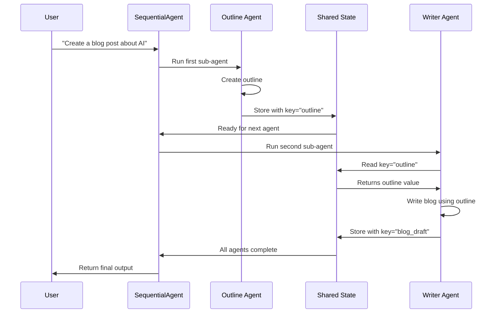

# Chapter 4: Workflow Patterns

Welcome back! In [Chapter 3: Multi-Agent Systems](03_multi_agent_systems_.md), you learned how to build teams of specialized agents that work together. But there's a problem that many beginners face: **how do you actually control the order and flow of your agents?**

Imagine you're directing a movie. You have actors (agents), cameras, lights, and a script. But without a clear shot list—a plan for what happens in what order—everyone gets confused. Actors might perform out of sequence, scenes might film in the wrong order, and the final movie would be a mess.

**Workflow patterns** are your shot list for agents. They're predefined templates that structure exactly how your agents work together: which runs first, which runs second, when they run in parallel, and when they stop and evaluate their work.

In this chapter, you'll learn three core workflow patterns that let you orchestrate your agent teams with precision and reliability[1][2][3].

## The Problem: Unpredictable Agent Orchestration

Let's say you've built a research system. You have three agents:
1. A researcher who finds information
2. A writer who creates content
3. An editor who polishes it

Without workflow patterns, you'd have to write complex instructions in natural language: *"First do research, then write, then edit."* But here's the catch—large language models don't always follow instructions in strict order. Sometimes they get creative. Sometimes they skip steps. Your pipeline becomes unpredictable.

**Workflow patterns solve this by replacing unpredictable LLM orchestration with deterministic, guaranteed execution flows.**[1][3] Instead of trusting an LLM to follow instructions, you explicitly define the flow in code.

## Core Concept: The Three Fundamental Patterns

Just like recipes have different cooking techniques (boil, then simmer; roast everything at once; ferment and check repeatedly), agent workflows have three fundamental patterns[1][2][3]:

### 1. **Sequential Pattern: The Assembly Line**

Tasks run one after another in a fixed order. Each step waits for the previous step to finish before starting.

```
Step 1: Research
   ↓
Step 2: Write
   ↓
Step 3: Edit
   ↓
Done
```

**When to use:** When order matters and each step depends on the previous one's output.

### 2. **Parallel Pattern: The Team**

Independent tasks run at the same time. All finish before the next phase begins.

```
Task A (Research topic 1) ─┐
Task B (Research topic 2) ─┼─→ All done at once
Task C (Research topic 3) ─┘
```

**When to use:** When tasks don't depend on each other and speed matters.

### 3. **Loop Pattern: The Refinement Cycle**

An agent does work, another agent evaluates it, and if it's not good enough, the first agent tries again. This repeats until approval.

```
Write story
   ↓
Critic reviews it
   ↓
Is it approved? → No → Rewrite
   ↓
Yes → Done
```

**When to use:** When you need iterative improvement and quality control[1][2].

## Understanding the Core Concepts

Before we build, let's clarify three key ideas that make workflow patterns work:

### Concept 1: Output Keys (The Whiteboard)

When agents in a workflow work together, they need to share information. Imagine a whiteboard that all agents can see and write on—that's what **output keys** do.

```python
research_agent = Agent(
    name="Researcher",
    instruction="Find information about quantum computing.",
    output_key="research_findings"  # This agent's output goes here
)
```

The `output_key="research_findings"` means: *"When I finish, store my output in a shared space called 'research_findings' so other agents can read it."*

### Concept 2: Input Placeholders (The Template)

When one agent needs to read what another agent wrote, you use **placeholders** in its instruction.

```python
writer_agent = Agent(
    name="Writer",
    instruction="Here are the research findings: {research_findings}. Write an article based on them."
    # The {research_findings} placeholder gets replaced with actual data from the whiteboard
)
```

When the workflow runs, ADK automatically replaces `{research_findings}` with the actual value from the whiteboard.

### Concept 3: Workflow Agents (The Directors)

**Workflow agents** are special container agents that manage how sub-agents execute. There are three types: `SequentialAgent`, `ParallelAgent`, and `LoopAgent`. They orchestrate the flow without making decisions—they just execute according to their pattern.

## Pattern 1: Sequential Workflows

### The Use Case: Blog Post Creation

Imagine you need to create a blog post about AI. It must follow this exact sequence:
1. Create an outline
2. Write the full blog
3. Edit it for quality

Let's build this:

```python
outline_agent = Agent(
    name="OutlineAgent",
    instruction="Create a blog outline about AI with 5 sections.",
    output_key="outline"
)

writer_agent = Agent(
    name="WriterAgent",
    instruction="Using this outline: {outline}, write a 300-word blog post.",
    output_key="blog_draft"
)

editor_agent = Agent(
    name="EditorAgent",
    instruction="Edit this draft for clarity: {blog_draft}",
    output_key="final_blog"
)
```

Notice how each agent reads from the previous one using placeholders like `{outline}` and `{blog_draft}`.

Now, bring them together with a `SequentialAgent`:

```python
blog_pipeline = SequentialAgent(
    name="BlogCreator",
    sub_agents=[outline_agent, writer_agent, editor_agent]
)
```

**What happens when you run this:**

1. `outline_agent` runs first, creates an outline, stores it with key `"outline"`
2. `writer_agent` reads `{outline}` (gets the value from step 1), writes the blog, stores it with key `"blog_draft"`
3. `editor_agent` reads `{blog_draft}` (gets the value from step 2), edits it, stores the final version

Each step guarantees it waits for the previous step to complete. No LLM improvisation—just deterministic execution[1].

## Pattern 2: Parallel Workflows

### The Use Case: Multi-Topic Research

Now imagine you need to research three different topics at once: AI, Healthcare, and Finance. These don't depend on each other, so running them sequentially would be slow. Better to run them simultaneously:

```python
ai_researcher = Agent(
    name="AIResearcher",
    instruction="Research recent AI breakthroughs.",
    tools=[google_search],
    output_key="ai_research"
)

health_researcher = Agent(
    name="HealthResearcher",
    instruction="Research recent medical discoveries.",
    tools=[google_search],
    output_key="health_research"
)

finance_researcher = Agent(
    name="FinanceResearcher",
    instruction="Research recent fintech trends.",
    tools=[google_search],
    output_key="finance_research"
)
```

Bring them together with a `ParallelAgent`:

```python
research_team = ParallelAgent(
    name="ResearchTeam",
    sub_agents=[ai_researcher, health_researcher, finance_researcher]
)
```

**What happens when you run this:**

All three agents start at the same time. The workflow waits until all three finish, then you can proceed. This is much faster than running them one-by-one[2].

If you want to combine their results, add an aggregator agent after:

```python
aggregator = Agent(
    name="Aggregator",
    instruction="Combine these three reports into one executive summary: {ai_research}, {health_research}, {finance_research}",
    output_key="executive_summary"
)

complete_workflow = SequentialAgent(
    name="CompleteWorkflow",
    sub_agents=[research_team, aggregator]  # First: parallel research, then: aggregate
)
```

This shows how you can **combine patterns**. Parallel execution followed by sequential aggregation.

## Pattern 3: Loop Workflows

### The Use Case: Iterative Story Writing

Imagine you want to write a story, but you want it refined through multiple critiques. One agent writes, another critiques, and if the critique isn't satisfied, the writer tries again.

```python
writer = Agent(
    name="Writer",
    instruction="Write or rewrite a short story about: {topic}. Incorporate any feedback from: {feedback}",
    output_key="story"
)

critic = Agent(
    name="Critic",
    instruction="Critique this story: {story}. If it's excellent, respond with exactly 'APPROVED'. Otherwise, provide 2-3 improvement suggestions.",
    output_key="feedback"
)
```

Bring them together with a `LoopAgent`:

```python
refinement_loop = LoopAgent(
    name="StoryRefinement",
    sub_agents=[writer, critic],
    max_iterations=3  # Maximum 3 attempts to improve
)
```

**What happens when you run this:**

1. Writer creates an initial story, stored in `"story"`
2. Critic reads `{story}`, provides feedback, stored in `"feedback"`
3. Writer reads `{feedback}`, rewrites the story
4. Critic reads the new story, evaluates it again
5. This repeats until critic says "APPROVED" or max_iterations is reached

The loop automatically exits early if the condition is met, saving time[1][2][3].

## How Workflow Patterns Work Under the Hood

Let's trace through what happens when you run a sequential workflow:



**Step-by-step explanation:**

1. **Initialization** — The `SequentialAgent` creates a shared state (like a shared document)
2. **Run First Agent** — The outline agent executes, finds/creates the outline, stores it with its `output_key`
3. **Wait for Completion** — The workflow waits until the agent finishes
4. **Read Previous Output** — The next agent requests any placeholder values from the state
5. **Inject Values** — ADK replaces `{outline}` in the agent's instruction with the actual outline text
6. **Run Second Agent** — The writer agent executes with the filled-in instruction
7. **Store Output** — The writer stores its blog draft
8. **Continue** — This repeats for each agent in sequence
9. **Return Result** — The final output is returned to the user

Behind the scenes, ADK is handling all this state management automatically. You just define the agents and their dependencies, and the workflow orchestrates everything[1].

## Comparing the Three Patterns

| Pattern | Execution Order | Use Case | Speed | Reliability |
|---------|-----------------|----------|-------|-------------|
| **Sequential** | One after another | Assembly lines, pipelines | Slower | Very predictable |
| **Parallel** | All at once | Independent research | Faster | Predictable |
| **Loop** | Repeated cycles | Quality refinement | Variable | Predictable |

## When to Choose Each Pattern

Ask yourself these questions:

**Does order matter and does each step depend on previous output?**
→ Use **Sequential**. Example: outline → write → edit

**Are the tasks independent and can they run simultaneously?**
→ Use **Parallel**. Example: research three topics at once

**Do you need to evaluate and improve work repeatedly?**
→ Use **Loop**. Example: write → critique → refine → repeat

**Do you have a complex workflow with multiple stages?**
→ **Combine patterns**. Example: parallel research, then sequential processing, then loop refinement

## Real-World Example: Customer Support System

Here's how you might use workflow patterns for a customer support system:

```python
# First, gather info in parallel (fast!)
support_system = SequentialAgent(
    name="SupportSystem",
    sub_agents=[
        ParallelAgent(
            name="GatherInfo",
            sub_agents=[
                order_lookup_agent,      # Check order history
                inventory_check_agent,   # Check stock
                policy_reader_agent      # Look up policies
            ]
        ),
        response_writer_agent  # Then write a response using all info
    ]
)
```

This workflow first gathers information from three independent sources in parallel (fast!), then uses all that information to write a comprehensive response.

## Summary

**Workflow patterns are templates for orchestrating how your agents work together.** They replace unpredictable LLM-based decision-making with deterministic execution guarantees.

The three core patterns are:
- **Sequential** — One step at a time, in order
- **Parallel** — Multiple steps at the same time
- **Loop** — Repeated cycles for refinement

You orchestrate them using `SequentialAgent`, `ParallelAgent`, and `LoopAgent`. Agents share information through `output_key` and `{placeholder}` syntax. You can combine patterns for complex workflows[1][2][3].

Workflow patterns take you from building single agents to building reliable, coordinated agent teams. They're the difference between chaos and orchestrated intelligence.

Ready to see agents communicate directly with each other? In the next chapter, [Chapter 5: Agent2Agent (A2A) Communication](05_agent2agent__a2a__communication_.md), you'll learn how agents can send messages to each other and handle real-time responses—taking multi-agent systems to the next level!

---

**Key Takeaways:**
- **Workflow patterns eliminate unpredictability** by defining execution order in code instead of relying on LLM instructions
- **Sequential patterns** guarantee order; **Parallel patterns** ensure speed; **Loop patterns** enable refinement
- **Output keys and placeholders** let agents share information through a shared state
- **You can combine patterns** for complex, multi-stage workflows
- **Workflow patterns are deterministic** — the same input always produces the same execution sequence
