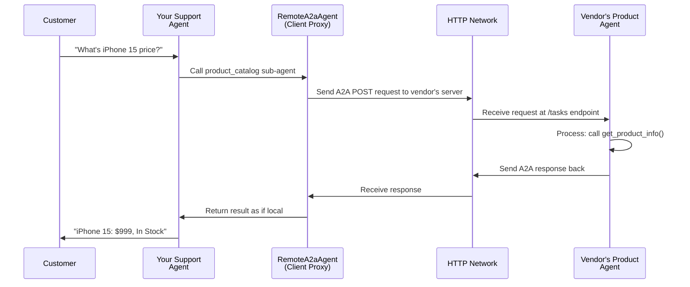

# Chapter 5: Agent2Agent (A2A) Communication

Welcome back! In [Chapter 4: Workflow Patterns](04_workflow_patterns_.md), you learned how to coordinate multiple agents within a single system using sequential, parallel, and loop patterns. But what happens when you need agents to work together **across different organizations, different programming languages, or different machines**?

That's where **Agent2Agent (A2A) Communication** comes in.

## The Problem: Agents That Can't Talk to Each Other

Imagine you're building a customer support system for your company. Your support team needs to answer questions about products, but the product catalog is maintained by a completely different vendor. The vendor has their own agent that knows everything about products—prices, inventory, specifications.

Here's the challenge: **How do you get your support agent to use the vendor's product agent if they're on different servers, written in different languages, and maintained by different teams?**

Without A2A, you'd have to:
- 😞 **Write custom integration code** — Manually call the vendor's API
- 😞 **Maintain compatibility** — When vendor updates their system, you update your code
- 😞 **Limit flexibility** — Hard to swap vendors or integrate new services
- 😞 **Cross-language nightmare** — What if vendor's agent is in Java and yours is Python?

**A2A solves this by creating a standard "language" that any agent can speak, no matter where it runs or what language it's written in.**[1][2]

Think of it like this: Instead of English and French speakers struggling to communicate, A2A is like a universal translation protocol that lets agents from different "countries" (organizations, languages, frameworks) work together seamlessly.

## Core Concept: The A2A Protocol

**Agent2Agent (A2A) Protocol is a standardized way for agents to communicate with each other over networks.**[1][2]

Here's what makes it special:

| Traditional Approach | A2A Approach |
|-----|-----|
| Custom API for each integration | One standard protocol everyone uses |
| Tight coupling between systems | Loose coupling via formal contract |
| Hard to replace one agent | Easy swap agents following the standard |
| Language-specific solutions | Language and framework agnostic |

A2A works like a formal business agreement:

```
Your Company's Agent: "I need product information"
Vendor's Agent: "I provide that! Here's my agent card showing what I can do"
Your Company's Agent: "Perfect! I'll call you using the A2A protocol"
Vendor's Agent: "Got it! I'll respond in A2A format"
(Both agents communicate smoothly!)
```

## Three Key A2A Concepts

### Concept 1: The Agent Card (The Business Card)

When you expose an agent via A2A, it publishes an **agent card**—a formal document that says: *"Here's who I am, what I can do, and how to talk to me."*[1][2]

An agent card is like a business card for your agent:

```json
{
  "name": "product_catalog_agent",
  "description": "Provides product info, prices, and availability",
  "url": "https://vendor.example.com",
  "skills": [
    {
      "name": "lookup_product",
      "description": "Find a product by name"
    }
  ]
}
```

**Why it matters:** Any consumer agent can read the agent card and automatically know how to talk to your agent—no manual documentation needed![1]

### Concept 2: Exposing an Agent (Making It Available)

**Exposing** means making your agent accessible over the network so other agents can call it.

Think of it like opening a shop:
- 🏪 **Before exposure**: Your agent is like a shop with no storefront—nobody can find you
- 🏪 **After exposure**: Your agent has a storefront, a sign, and business hours—others can come in

In ADK, you expose an agent using `to_a2a()`:[1][2]

```python
from google.adk.a2a.utils.agent_to_a2a import to_a2a

# Convert your agent to be A2A-compatible
app = to_a2a(my_agent, port=8001)

# Now my_agent is accessible at:
# - http://localhost:8001 (the agent runs here)
# - http://localhost:8001/.well-known/agent-card.json (agent card published here)
```

**What happens:** `to_a2a()` automatically:
1. ✨ Wraps your agent in a web server
2. ✨ Generates an agent card describing your agent
3. ✨ Handles all A2A protocol details for you

### Concept 3: Consuming a Remote Agent (Using Someone Else's Agent)

**Consuming** means integrating a remote agent into your system—using it as if it were local.

Think of it like this:
- 🍕 **Before consumption**: You cook everything yourself (you need a product catalog)
- 🍕 **After consumption**: You call the vendor's kitchen (use their product agent) to get ingredients, then cook

In ADK, you consume a remote agent using `RemoteA2aAgent`:[1][2]

```python
from google.adk.agents.remote_a2a_agent import RemoteA2aAgent

# Create a proxy to the remote agent
remote_product_agent = RemoteA2aAgent(
    name="product_catalog_agent",
    agent_card="https://vendor.example.com/.well-known/agent-card.json"
)

# Now use it as a sub-agent—your agent doesn't know it's remote!
my_support_agent = LlmAgent(
    name="support_agent",
    sub_agents=[remote_product_agent]  # Remote agent, used like local!
)
```

**What happens:** `RemoteA2aAgent` acts like a proxy—it translates your agent's calls into A2A protocol requests, sends them to the remote agent, and brings back the response.[1][2]

## When to Use A2A

Use A2A when:[1][5]

✅ **Different Organizations** — You integrate with a vendor's agent  
✅ **Different Languages** — Your agent is Python, their agent is Java  
✅ **Different Machines** — Agents run on different servers/cloud regions  
✅ **Formal Contracts** — You need a standardized interface between systems  
✅ **Scalability** — Each agent can be deployed, updated independently  

Don't use A2A when:[1]

❌ **Single Team, Single Codebase** — Use local [sub-agents](03_multi_agent_systems_.md) instead  
❌ **Very Low Latency Needed** — Network communication adds overhead  
❌ **Everything is Tightly Coupled** — You control all code anyway  

## Building a Complete Example: Customer Support + Product Catalog

Let's build the scenario from the beginning: a customer support agent that uses a vendor's product catalog agent via A2A.

### Step 1: Create and Expose the Vendor's Product Agent

First, the vendor creates their product catalog agent:

```python
def get_product_info(product_name: str) -> str:
    """Look up product by name."""
    catalog = {
        "iPhone 15": "$999, In Stock",
        "Samsung S24": "$799, In Stock"
    }
    return catalog.get(product_name, "Product not found")

# Create the agent with this tool
vendor_agent = LlmAgent(
    name="product_catalog",
    instruction="Help customers find product information.",
    tools=[get_product_info]
)
```

Then expose it via A2A:

```python
from google.adk.a2a.utils.agent_to_a2a import to_a2a

# Make the agent accessible
app = to_a2a(vendor_agent, port=8001)

# Vendor runs this on their server
# Now available at: https://vendor.example.com:8001
```

**What just happened:** The vendor's agent is now exposed. Its agent card is published at `https://vendor.example.com:8001/.well-known/agent-card.json`.[1][2]

### Step 2: Your Company Creates a Consumer Agent

Now your company creates a support agent that uses the vendor's agent:

```python
from google.adk.agents.remote_a2a_agent import RemoteA2aAgent

# Create proxy to vendor's agent
remote_catalog = RemoteA2aAgent(
    name="product_catalog",
    agent_card="https://vendor.example.com:8001/.well-known/agent-card.json"
)

# Create your support agent
support_agent = LlmAgent(
    name="support_agent",
    instruction="Help customers. Use product_catalog to get product info.",
    sub_agents=[remote_catalog]  # Add remote agent!
)
```

**What just happened:** Your agent now has access to the vendor's agent. When your agent needs product info, it calls the remote agent via A2A.[1][2]

### Step 3: Customer Gets Help

Now when a customer asks a question:

```
Customer: "What's the price of iPhone 15?"

Your Support Agent:
  1. Reads the question
  2. Realizes: "I need product info"
  3. Calls: product_catalog (which is actually remote via A2A!)
  4. A2A sends HTTP request to vendor's server
  5. Vendor's agent responds with: "$999, In Stock"
  6. Your agent tells customer: "iPhone 15 is $999 and in stock!"
```

## How A2A Communication Works Under the Hood

Let's trace through what happens when your support agent calls the vendor's product agent:



**Step-by-step breakdown:**

1. **Detection** — Your support agent decides it needs to call a sub-agent (product_catalog)
2. **Proxy Check** — The support agent realizes it's a `RemoteA2aAgent`, not a local agent
3. **Protocol Conversion** — `RemoteA2aAgent` converts the call into A2A protocol format (JSON-RPC over HTTP)
4. **Network Send** — The request is sent via HTTPS to the vendor's server
5. **Remote Processing** — Vendor's agent receives the request, processes it (calls `get_product_info`)
6. **Protocol Response** — Vendor sends back an A2A-formatted response
7. **Local Conversion** — `RemoteA2aAgent` converts the response back to local format
8. **Transparent Return** — Your agent receives the result as if it called a local sub-agent

**Key insight:** Your agent doesn't know or care that it's talking to a remote agent. The `RemoteA2aAgent` proxy makes remote feel like local![1][2]

## The A2A Protocol Messages

When `RemoteA2aAgent` communicates with a remote agent, it uses standardized message formats.[1] Here's what a simple exchange looks like:

**Your agent sends this request:**

```json
{
  "jsonrpc": "2.0",
  "method": "call_agent",
  "params": {
    "query": "What's the price of iPhone 15?",
    "task_id": "task-12345"
  },
  "id": 1
}
```

**Vendor's agent responds with:**

```json
{
  "jsonrpc": "2.0",
  "result": {
    "response": "iPhone 15 is $999, In Stock",
    "task_id": "task-12345"
  },
  "id": 1
}
```

**Why this matters:** Because the format is standardized, any A2A-compatible system can understand it—even if it's written in a different language![1][2]

## Real-World A2A Patterns

### Pattern 1: Cross-Organization Integration

```
Your Company          External Vendor
┌─────────────┐      ┌──────────────┐
│ Support Ag. │─────→│ Product Ag.  │
│ (Python)    │ A2A  │ (Java/Node)  │
└─────────────┘      └──────────────┘
   Internal             External
   Your code             Their code
```

Your support agent talks to their product agent. They own their code, you own yours. A2A is the bridge.[1]

### Pattern 2: Microservices Architecture

```
┌──────────────────────────────────────┐
│   Your Company's Internal Agents     │
├──────────────────────────────────────┤
│                                      │
│  Support Ag ──┬──→ Order Ag          │
│       │       │                      │
│       └──────→ Inventory Ag          │
│                                      │
│       (All communicate via A2A)      │
└──────────────────────────────────────┘
```

Multiple specialized agents working together, each can be updated independently. Each one exposes itself via A2A.[1][2]

### Pattern 3: Language Diversity

```
┌─ Python Agent (ADK)
├─ Java Agent (different framework)
├─ Node.js Agent (yet another framework)
│
└─ All communicate via A2A standard
   (Language doesn't matter!)
```

A2A lets Python agents work with Java agents, which work with Node.js agents. The protocol is universal.[1][2]

## Key Takeaways

**Agent2Agent (A2A) Communication** is a standard protocol that lets agents talk to each other across networks, organizations, and even programming languages.

- 🌐 **Exposure**: Use `to_a2a()` to make your agent available; it auto-generates an agent card
- 🔗 **Consumption**: Use `RemoteA2aAgent` to integrate remote agents as if they were local
- 📋 **Agent Cards**: Formal contracts that describe what an agent does and how to use it
- ✨ **Transparency**: Consumer agents don't know they're talking to remote agents—it's seamless
- 🏢 **Interoperability**: Works across organizations, languages, and frameworks

You now understand how to build agent systems that scale across teams and organizations. Rather than tightly coupling everything in one codebase, you can have specialized, independent agents that collaborate through a standard protocol.

Ready to deploy your agents and put them to work? Check out [Chapter 6: Runner](06_runner_.md) where you'll learn how to execute your agents and manage their lifecycle in production!

---

**Key Takeaways:**
- **A2A Protocol**: Standardized agent-to-agent communication over networks
- **Expose agents**: Use `to_a2a()` to make agents publicly accessible with auto-generated agent cards
- **Consume agents**: Use `RemoteA2aAgent` to integrate remote agents as sub-agents
- **Cross-organization**: Perfect for integrating with vendors, partners, or different company teams
- **Language-agnostic**: Agents can be written in any language—A2A is the universal bridge
