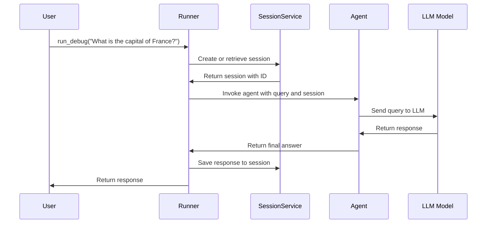

# Chapter 6: Runner

Welcome back! In [Chapter 5: Agent2Agent (A2A) Communication](05_agent2agent__a2a__communication_.md), you learned how agents can communicate with each other across networks and organizations. Now it's time to learn about the **Runner**—the orchestrator that brings everything together.

## The Problem: From Agent to Execution

Imagine you've built a perfect agent. You've given it instructions, tools, and the ability to reason. But here's the problem: **How do you actually run it?**

Without a Runner, you'd have to write all the plumbing yourself:
- 😞 Managing conversation sessions
- 😞 Passing messages to the agent
- 😞 Handling the agent's responses
- 😞 Keeping track of conversation state
- 😞 Streaming responses back to users
- 😞 Managing memory and context

**The Runner solves this.** Think of a Runner like a **concert conductor**. The conductor doesn't play the instruments (that's the agent), but they coordinate all the musicians, manage the timing, handle the audience's needs, and make sure everything flows smoothly. The Runner does exactly this for your agent.

## What is a Runner?

A **Runner** is the execution engine that manages the complete lifecycle of an agent interaction. It handles all the operational details so you can focus on building great agents.

Here's what the Runner does:

1. **Receives user queries** — Takes input from conversations
2. **Manages sessions** — Keeps track of conversation history
3. **Invokes agents** — Sends queries to the agent for processing
4. **Handles streaming** — Streams responses back in real-time
5. **Manages memory** — Retrieves and stores conversation context
6. **Executes tools** — Runs agent tools and returns results
7. **Maintains state** — Keeps everything consistent throughout the conversation

Think of it like a restaurant's order system:
- 👨‍🍳 **Chef (Agent)** — Knows how to cook
- 📋 **Order System (Runner)** — Takes orders, coordinates with kitchen, serves dishes

The chef doesn't need to manage the storefront—the order system handles that.

## Core Concepts: The Runner Architecture

### Concept 1: The Execution Flow

When a Runner processes a user query, here's what happens step-by-step:

```
User Input
    ↓
Runner receives message
    ↓
Runner retrieves/creates session
    ↓
Runner invokes agent with message
    ↓
Agent reasons and generates response
    ↓
Runner streams response to user
    ↓
Runner updates session with response
    ↓
Runner stores in memory (if configured)
    ↓
Response complete
```

Each step is handled automatically by the Runner—you don't write this logic.

### Concept 2: Sessions as Context Containers

The Runner uses **Sessions** to maintain conversation state. A session is like a conversation thread—it contains all the messages and context for one conversation between a user and an agent.

```python
# Session = container for one conversation
session = {
    "id": "user-123-chat-456",
    "user": "user-123",
    "events": [
        {"user": "Hello!"},
        {"agent": "Hi there!"},
        {"user": "What's the weather?"},
        {"agent": "It's sunny today."}
    ]
}
```

The Runner automatically manages these sessions so you don't have to manually track conversation history.

### Concept 3: Services

The Runner connects to different services that handle specific responsibilities:

- **SessionService** — Stores and retrieves sessions (conversation history)
- **MemoryService** — Stores and retrieves long-term knowledge (optional)
- **Model** — The LLM that powers the agent

Think of services like different departments in a company: the Session department handles paperwork, the Memory department handles archives, and the Model department does the thinking.

## Building Your First Runner

Let's solve our central use case: **Running an agent and having a conversation with it.**

### Step 1: Create an Agent

First, you need an agent to run. This is simple—you create one like you learned in [Chapter 1: Agent](01_agent_.md).

```python
from google.adk.agents import Agent
from google.adk.models.google_llm import Gemini

my_agent = Agent(
    name="helpful_assistant",
    model=Gemini(model="gemini-2.5-flash-lite"),
    instruction="You are a helpful assistant."
)
```

**What's happening:** You've defined what your agent will do, but you haven't run it yet.

### Step 2: Create a SessionService

The Runner needs a place to store conversations. You provide this via a SessionService.

```python
from google.adk.runners import InMemoryRunner
from google.adk.sessions import InMemorySessionService

session_service = InMemorySessionService()
```

**What's happening:** You're telling the Runner where to keep conversation history. `InMemorySessionService` stores conversations in memory (they disappear when the program stops). For persistence, you'd use `DatabaseSessionService`.

### Step 3: Create the Runner

Now create the Runner and give it your agent and session service:

```python
runner = InMemoryRunner(
    agent=my_agent,
    session_service=session_service
)
```

**What's happening:** You've instantiated the orchestrator. The Runner now knows:
- Which agent to use for reasoning
- Where to store conversation history

### Step 4: Run a Query

Now use the Runner to have a conversation:

```python
response = await runner.run_debug(
    "What's the capital of France?"
)
```

**What's happening:**
1. The Runner receives your query
2. It creates a session to track this conversation
3. It sends your query to the agent
4. The agent reasons and generates a response
5. The Runner returns the response to you

That's it! The Runner handled all the plumbing.

## How the Runner Works Under the Hood

Let's trace through what happens when you call `run_debug()`:



**Step-by-step breakdown:**

1. **User Input** — You call `run_debug()` with your question
2. **Session Management** — Runner asks SessionService: "Do I have a session for this conversation?"
3. **Session Creation** — If not, SessionService creates a new session and returns it
4. **Agent Invocation** — Runner passes the query to the agent along with the session context
5. **Reasoning** — Agent sends the query to the LLM, which generates a response
6. **Response Processing** — Agent returns its response to the Runner
7. **Session Update** — Runner saves the response back to the session
8. **Return** — Runner returns the complete response to you

All of this happens automatically—you just call one method!

## Real-World Runner Usage

Let's look at a more realistic example with multiple messages in the same conversation:

```python
# First message
response1 = await runner.run_debug("Hi, I'm Sam!")

# Second message (same conversation)
response2 = await runner.run_debug("What's my name?")
# The agent remembers! It's still the same session
```

**What happened:**
- First call: Runner created a new session, stored "Hi, I'm Sam!"
- Second call: Runner retrieved the same session, so the agent knows your name

The Runner automatically maintains conversation context across multiple messages without you doing anything.

## Types of Runners

ADK provides different Runner implementations for different needs:

| Runner Type | Best For | Session Persistence |
|------------|----------|-------------------|
| **InMemoryRunner** | Development, testing | No (resets on restart) |
| **Runner** (with DatabaseSessionService) | Small to medium apps | Yes (database) |
| **Agent Engine Runner** | Production on Google Cloud | Yes (fully managed) |

You pick the Runner based on your needs. The API is the same for all of them, so your code doesn't change.

## Advanced: Streaming Responses

Sometimes you want to show responses as they're being generated (like ChatGPT typing). The Runner supports streaming:

```python
async for event in runner.run_async(
    user_id="user-123",
    session_id="conversation-1",
    new_message=query_content
):
    if event.content and event.content.parts:
        print(event.content.parts[0].text, end="", flush=True)
```

**What's happening:** Instead of waiting for the complete response, you get chunks as they arrive. The Runner streams each piece to you in real-time, giving a live typing effect.

This is much better for user experience than waiting for the entire response at once.

## Advanced: Custom Configuration

You can configure Runners with additional services for memory and other features:

```python
from google.adk.memory import InMemoryMemoryService

runner = Runner(
    agent=my_agent,
    app_name="MyApp",
    session_service=session_service,
    memory_service=InMemoryMemoryService()  # Optional: long-term memory
)
```

**What's happening:** You're giving the Runner additional capabilities. Now it can:
- Manage conversations (SessionService)
- Store long-term knowledge (MemoryService)

You can learn about memory in [Chapter 8: Memory Service](08_memory_service_.md).

## Summary

The **Runner is the execution engine** that orchestrates your entire agent application. Instead of writing complex logic to manage sessions, invoke agents, and handle responses, you let the Runner do it for you.

**Key takeaways:**

- 🎭 **Orchestrator** — The Runner coordinates all components (agent, sessions, memory)
- 🔄 **Lifecycle Management** — Handles complete conversation flow automatically
- 💾 **State Persistence** — Maintains conversation context across messages
- ⚡ **Streaming** — Can return responses in real-time
- 🔌 **Pluggable** — Works with different SessionServices and MemoryServices

The Runner transforms building agents from managing complex infrastructure to simply defining agent behavior and letting the framework handle execution.

Ready to dive deeper into how sessions work? Continue to [Chapter 7: Session Management](07_session_management_.md) to learn how the Runner manages conversation state!

---

**Key Takeaways:**
- **Runner** = execution orchestrator for agents (like a concert conductor)
- **Manages** sessions, invokes agents, streams responses, and maintains state
- **Simple API** — Just call `run_debug()` or `run_async()` to execute
- **Automatic** — Handles all plumbing (session creation, updates, memory)
- **Flexible** — Works with different services for different deployment scenarios
