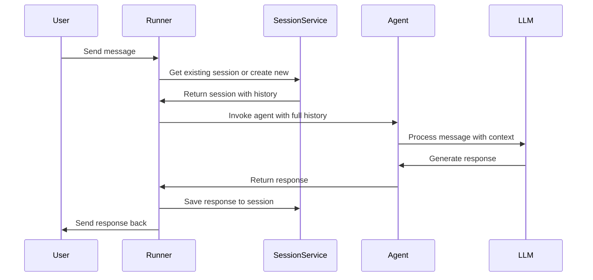

# Chapter 7: Session Management

Welcome back! In [Chapter 6: Runner](06_runner_.md), you learned how the Runner orchestrates your agent and manages its execution. Now it's time to understand one of the most powerful capabilities that the Runner enables: **Session Management**.

## The Problem: Agents That Forget

Imagine you're building a customer support chatbot. A customer writes:

```
Customer: "Hi! My name is Alex. I'd like to track my order #12345."
```

Your agent helps them. Then, five minutes later:

```
Customer: "What's the status of my order?"
Agent: "I'd be happy to help! What's your order number?"
Customer: 😞 "I just told you... #12345"
```

**The agent forgot!** Even though you explained everything to it, Large Language Models are **stateless** by default. Each API call to the LLM starts fresh, with no memory of previous conversations.

This is where **Session Management** comes in. Sessions are like **conversation notebooks** that the Runner maintains. They record everything that happens in a conversation—every message, every response, every piece of context. This allows your agent to remember and build upon the conversation history.

## What is a Session?

Think of a **Session** like a journal entry for a single conversation between a user and your agent[2][3].

A Session contains two key parts:

**📝 Events** — Individual entries in the conversation journal
- User messages
- Agent responses
- Tool calls and results
- Any action the agent took

**{} State** — The agent's scratchpad for dynamic information
- User preferences the agent discovered
- Key facts to remember
- Temporary data during the conversation

```python
# Conceptually, a session looks like this:
session = {
    "id": "conversation-001",
    "user_id": "alex-123",
    "events": [
        {"author": "user", "text": "Hi! My name is Alex."},
        {"author": "agent", "text": "Nice to meet you, Alex!"},
        {"author": "user", "text": "What's my name?"},
        {"author": "agent", "text": "Your name is Alex."}
    ],
    "state": {
        "user:name": "Alex",
        "user:order_id": "12345"
    }
}
```

**Key insight:** Each user has their own sessions. Your customer Alex has completely separate conversations from customer Sam. Sessions don't share information—they're private[2].

## How the Runner Maintains Sessions

The Runner is like a **mail carrier** for your conversation. Here's what it does:



**What's happening:**
1. When you send a message, the Runner asks: "Do we have a session for this user?"
2. If yes, it retrieves all previous messages. If no, it creates a new session.
3. It gives the agent ALL the previous messages so the agent understands the full context.
4. The agent responds.
5. The Runner automatically saves the response to the session for next time.

This happens automatically—you don't write any of this logic!

## Creating Your First Stateful Agent

Let's build an agent that remembers. Here's the minimal code:

```python
from google.adk.agents import Agent
from google.adk.models.google_llm import Gemini
from google.adk.runners import InMemoryRunner
from google.adk.sessions import InMemorySessionService

# Step 1: Create your agent
agent = Agent(
    model=Gemini(model="gemini-2.5-flash-lite"),
    instruction="You are a helpful assistant."
)

# Step 2: Create session storage
session_service = InMemorySessionService()

# Step 3: Create a runner that manages sessions
runner = InMemoryRunner(agent=agent, session_service=session_service)
```

**What each part does:**
- **Agent** — Your brain (knows how to reason)
- **SessionService** — Your filing cabinet (stores conversations)
- **Runner** — Your mail carrier (connects them together and manages the flow)

Now, run a multi-turn conversation:

```python
# First message
response1 = await runner.run_debug("Hi, I'm Sarah!")

# Second message (same session, so agent remembers Sarah)
response2 = await runner.run_debug("What's my name?")
# Output: "Your name is Sarah."
```

**What happened:** Both messages were part of the same session. The Runner automatically:
1. Stored "Hi, I'm Sarah!" in the session events
2. When processing the second message, it gave the agent the full history
3. So the agent knew your name!

## Sessions are Temporary (By Default)

There's an important catch: `InMemorySessionService` stores sessions in RAM (temporary memory). When your program stops, all sessions disappear![2]

```python
# This works while the program runs
await runner.run_debug("Hi, I'm Sarah!")
await runner.run_debug("What's my name?")  # ✅ Agent remembers

# But if you restart the program and run:
await runner.run_debug("What's my name?")  # ❌ Agent forgets
```

For real applications, you need **persistent storage**.

## Persistent Sessions with DatabaseSessionService

To make sessions survive restarts, use `DatabaseSessionService`[2]:

```python
from google.adk.sessions import DatabaseSessionService

# Create a SQLite database (automatically created)
session_service = DatabaseSessionService(
    db_url="sqlite:///conversations.db"
)

# Create runner with persistent storage
runner = InMemoryRunner(
    agent=agent,
    session_service=session_service
)
```

**What changed:** Now your sessions are saved to a real database. Even if your program crashes, the conversation history is preserved.

## How Sessions and the Runner Work Together

Let's zoom in on what happens internally when the Runner processes a message:

**Internal flow in the Runner:**

```
1. User sends: "What's my name?"
   ↓
2. Runner asks SessionService: "Get session for user-123"
   ↓
3. SessionService retrieves from database:
   [
     {user said: "Hi, I'm Sarah!"},
     {agent said: "Nice to meet you, Sarah!"}
   ]
   ↓
4. Runner combines previous history + new message into context:
   "Previous conversation:
    User: Hi, I'm Sarah!
    Agent: Nice to meet you, Sarah!
    
    New message: What's my name?"
   ↓
5. Runner sends this full context to the agent
   ↓
6. Agent processes with LLM: "The user's name is Sarah"
   ↓
7. Runner saves response to session and returns it
```

This is why the agent can "remember"—it's not magic. The Runner is just giving the agent all the context it needs!

## Session State: The Scratchpad

Sessions also have a `state`—a special dictionary for storing structured information[2][3].

You can create custom tools that read and write to session state:

```python
from google.adk.tools import FunctionTool
from google.adk.tool_context import ToolContext

def save_preference(tool_context: ToolContext, key: str, value: str):
    """Save a preference to session state"""
    tool_context.state[f"user:{key}"] = value
    return {"status": "saved"}

def get_preference(tool_context: ToolContext, key: str):
    """Retrieve a preference from session state"""
    value = tool_context.state.get(f"user:{key}", "not found")
    return {"value": value}

# Give your agent these tools
agent = Agent(
    model=Gemini(model="gemini-2.5-flash-lite"),
    instruction="You are a helpful assistant. Use save_preference to remember things.",
    tools=[FunctionTool(save_preference), FunctionTool(get_preference)]
)
```

**Why session state?** Events are full conversation history. State is compact, structured data. Perfect for storing things like:
- User name
- User preferences
- Key facts discovered during the conversation
- Current task status

## Session Isolation: Privacy by Design

Each session is completely isolated. A user's conversations don't see other users' data[2]:

```python
# User 1's session
await runner.run_debug("Hi, I'm Alice", session_id="alice-session")
await runner.run_debug("What's my name?", session_id="alice-session")
# ✅ Agent says: "Your name is Alice"

# User 2's session (completely separate)
await runner.run_debug("What's Alice's name?", session_id="bob-session")
# ❌ Agent says: "I don't know who Alice is"
```

This is enforced automatically—the Runner ensures sessions are isolated by user and by session ID.

## Under the Hood: How SessionService Works

The SessionService is responsible for storing and retrieving sessions. There are different implementations:

| Type | Storage | Best For |
|------|---------|----------|
| **InMemorySessionService** | RAM | Development, testing |
| **DatabaseSessionService** | SQLite/PostgreSQL | Small to medium apps |
| **Cloud Storage** | Google Cloud | Enterprise scale |

All of them have the same interface, so your code doesn't change—you just swap the implementation.

## When Sessions Get Large: Context Compaction

As conversations grow longer, storing every single message becomes expensive. ADK provides **Context Compaction**[2]:

```python
from google.adk.apps.app import App, EventsCompactionConfig

# Configure automatic summarization
app = App(
    name="my_app",
    root_agent=agent,
    events_compaction_config=EventsCompactionConfig(
        compaction_interval=5,  # Summarize every 5 turns
        overlap_size=1  # Keep last 1 turn for context
    )
)

runner = InMemoryRunner(app=app, session_service=session_service)
```

**What happens:** After every 5 conversation turns, the system automatically summarizes the old messages into a concise summary. This keeps the context small and costs down while preserving meaning.

## Summary

**Session Management** is how your agent remembers conversations:

- 📓 **Sessions** store conversation history (events) and dynamic data (state)
- 🔄 **The Runner** automatically manages sessions—you don't write this logic
- 💾 **Persistent Storage** makes conversations survive restarts
- 🏷️ **Session State** stores structured, reusable information
- 🔒 **Isolation** ensures users only see their own data
- 📊 **Compaction** keeps context efficient and costs down

Sessions transform your agents from single-turn responders into true conversational partners that understand context and remember what matters.

You now have everything you need to build agents that can maintain meaningful, multi-turn conversations with users. The Runner handles all the complexity behind the scenes—you just focus on what your agent should do!

Ready to learn how to store information across multiple sessions? Move on to [Chapter 8: Memory Service](08_memory_service_.md) where we'll explore long-term memory that persists beyond individual conversations!

---

**Key Takeaways:**
- **Sessions** = Conversation notebooks that store all events and state
- **InMemorySessionService** = Temporary storage (for development)
- **DatabaseSessionService** = Persistent storage (for production)
- **Session State** = Structured data storage for key information
- **Context Compaction** = Automatic summarization to keep context small
- **Isolation** = Each user's sessions are completely separate
