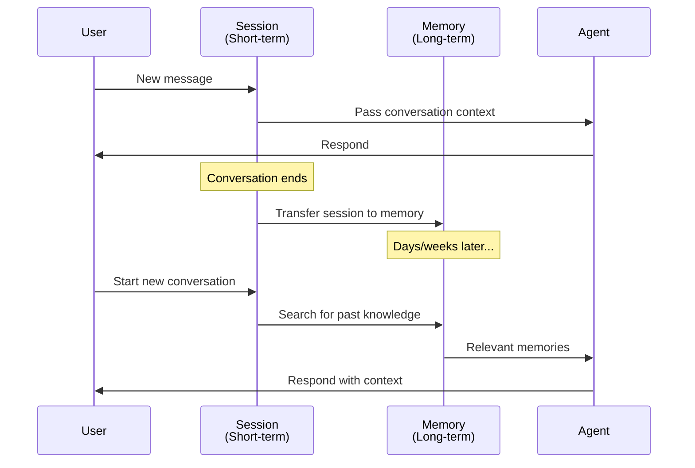
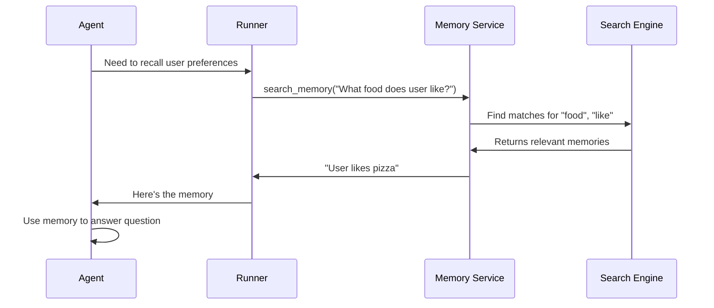

# Chapter 8: Memory Service

Welcome back! In [Chapter 7: Session Management](07_session_management_.md), you learned how the Runner manages conversation threads and maintains history within a single conversation. Now it's time to learn about something even more powerful: **Memory Service**.

## The Problem: Agents That Forget Between Conversations

Imagine you're building a customer support chatbot for a bank. A customer comes in:

```
Day 1, Session 1:
Customer: "Hi! I have a nut allergy. Can you help me open an account?"
Agent: "Got it! I'll remember that you have a nut allergy."
```

Everything is perfect. The agent remembers the allergy during this conversation thanks to sessions.

But then...

```
Day 7, Session 2 (completely different conversation):
Customer: "Hi! I'm back. Can you recommend some snacks for me?"
Agent: "I don't know anything about you or your allergies."
Customer: 😞 "I told you last week I'm allergic to nuts!"
```

**The problem:** Sessions only remember things *within one conversation*. Once a new conversation starts, the agent has no memory of what happened before. The agent forgets everything!

This is where **Memory Service** comes in. Think of it like a personal assistant's filing system:
- 📝 **Sessions** = Today's notepad (temporary, conversation-specific)
- 📚 **Memory** = A filing cabinet (permanent, cross-conversation knowledge)

Memory Service lets your agent remember important facts across multiple conversations, days, and even years.

## What is Memory Service?

**Memory Service** is a long-term knowledge storage system that persists information extracted from conversations and makes it searchable across all future conversations with a user.[1][2][3]

Here's what makes it different from sessions:

| Aspect | Session | Memory |
|--------|---------|--------|
| **Scope** | One conversation | All conversations |
| **Lifespan** | Until conversation ends | Permanent |
| **Purpose** | Maintain context in current chat | Build knowledge over time |
| **Example** | "What did I say 5 minutes ago?" | "What are my preferences?" |

Think of it like this: A **Session** is like a waiter remembering what you ordered during *this meal*. **Memory** is like a restaurant that remembers your favorite table and dietary restrictions *every time you visit*.

## Core Concepts: The Three-Step Memory Workflow

Memory works through three simple steps:[1][2][3]

### Step 1: Initialize Memory Service

```python
from google.adk.memory import InMemoryMemoryService

memory_service = InMemoryMemoryService()
```

**What's happening:** You're creating a storage system for long-term knowledge. Think of it like opening a filing cabinet.

### Step 2: Transfer Session Data to Memory

```python
await memory_service.add_session_to_memory(session)
```

**What's happening:** You're taking a conversation from the session and filing it away in long-term memory. The memory service extracts important facts from the raw conversation.

**Example:** If a session contains 50 messages including "I like pizza," "pizza is great," and "my favorite food is pizza," the memory service consolidates this into one simple fact: "User likes pizza."[1]

### Step 3: Retrieve Memories in Future Conversations

```python
results = await memory_service.search_memory(
    app_name="MyApp",
    user_id="user123", 
    query="What foods does the user like?"
)
```

**What's happening:** You're searching the filing cabinet for relevant information. The memory service finds past facts that match your query and returns them to the agent.[1][2]

**Example:** Even though "pizza" was mentioned weeks ago in a different conversation, the agent can now find and use that knowledge.

## How It All Fits Together

Let's see how Memory Service connects with the systems you already know:



**Step-by-step breakdown:**

1. **Current Conversation** — Session maintains context (this is what you learned in Chapter 7)
2. **End of Conversation** — Session data is transferred to Memory Service
3. **Memory Storage** — Important facts are extracted and stored long-term
4. **New Conversation Starts** — Agent can search Memory for past knowledge
5. **Informed Response** — Agent gives better answers because it remembers

## Building Your First Memory-Enabled Agent

Let's solve our central use case: an agent that remembers customer preferences across multiple conversations.

### Step 1: Create Your Agent and Services

```python
from google.adk.agents import LlmAgent
from google.adk.models.google_llm import Gemini
from google.adk.runners import Runner
from google.adk.memory import InMemoryMemoryService
from google.adk.sessions import InMemorySessionService

# Create the agent
agent = LlmAgent(
    model=Gemini(model="gemini-2.5-flash-lite"),
    instruction="You are a helpful assistant."
)

# Create both services
session_service = InMemorySessionService()
memory_service = InMemoryMemoryService()

# Create runner with BOTH services
runner = Runner(
    agent=agent,
    session_service=session_service,
    memory_service=memory_service  # Enable memory!
)
```

**What's happening:** You're creating a complete system:
- The agent does the thinking
- Session stores the current conversation
- Memory stores long-term knowledge
- Runner coordinates everything together

### Step 2: Have a Conversation (It Gets Stored in Session)

```python
# First conversation - user tells agent about allergies
await runner.run_debug("Hi! I'm allergic to peanuts.")
```

**What's happening:** This conversation is stored in the session, just like you learned in [Chapter 7](07_session_management_.md). But it's only temporary.

### Step 3: Manually Transfer to Memory

```python
# Get the session
session = await session_service.get_session(
    app_name="MyApp",
    user_id="customer1",
    session_id="conversation1"
)

# Transfer to long-term memory
await memory_service.add_session_to_memory(session)
```

**What's happening:** You're promoting important information from temporary session storage to permanent memory storage. Think of it like filing away a receipt after a purchase.

### Step 4: Agent Uses Memory in Next Conversation

```python
# Days later - new conversation, different session ID
# But the agent should still remember the allergy!
await runner.run_debug("Can you suggest some snacks?")
```

**What's happening:** The agent now has access to the memory service. If you give it the right tools, it can search memory and find the allergy information from days ago.

## Understanding Memory Service Implementations

ADK provides different implementations of Memory Service for different needs:[1][2][3]

### InMemoryMemoryService (This Chapter)

```python
memory_service = InMemoryMemoryService()
```

- **Storage:** RAM (temporary)
- **Search:** Keyword matching (simple word matching)
- **Consolidation:** None (stores raw messages)
- **Best for:** Learning, local development, prototyping

Think of it like sticky notes on a whiteboard.

### VertexAiMemoryBankService (Production)

```python
memory_service = VertexAiMemoryBankService(
    project_id="my-project",
    location="us-central1"
)
```

- **Storage:** Cloud database (permanent)
- **Search:** Semantic search (understands meaning)
- **Consolidation:** LLM-powered extraction (intelligent summarization)
- **Best for:** Production systems, enterprise apps

Think of it like a professional filing system with a smart librarian.

**💡 Key Point:** The API is identical! The code you write in this chapter works with production memory services too. You're just learning with the simpler version first.

## Two Ways to Use Memory: Reactive vs. Proactive

Once memory is enabled, agents can retrieve memories in two different ways:

### Reactive: Agent Decides When to Search

```python
from google.adk.tools import load_memory

agent = LlmAgent(
    model=Gemini(model="gemini-2.5-flash-lite"),
    instruction="Use load_memory when you need to recall past conversations.",
    tools=[load_memory]  # Agent has the tool
)
```

**How it works:** The agent receives a question and thinks: "Do I need to search my memory for this?" If yes, it calls `load_memory`. If no, it skips it.[1][3]

**Advantage:** Efficient (only searches when needed)  
**Risk:** Agent might forget to search

**Example:**
```
User: "What's my favorite color?"
Agent: "I should search my memory for this."
Agent: Calls load_memory → Finds "Blue"
Agent: "Your favorite color is blue."
```

### Proactive: Always Load Memory First

```python
from google.adk.tools import preload_memory

agent = LlmAgent(
    model=Gemini(model="gemini-2.5-flash-lite"),
    instruction="Answer questions.",
    tools=[preload_memory]  # Memory always available
)
```

**How it works:** Before processing every request, memory is automatically loaded and given to the agent in its system instructions.[1][3]

**Advantage:** Guaranteed access (memory always available)  
**Cost:** Less efficient (searches even when not needed)

**Example:**
```
User: "Tell me a joke."
System: Automatically loads all memories
Agent: Has memory context even though joke doesn't need it
Agent: "Here's a joke: Why did the chicken cross the road?"
```

## Automating Memory Storage with Callbacks

Manually calling `add_session_to_memory()` every time gets tedious. Let's automate it using **callbacks**:[1][3]

```python
async def save_to_memory(callback_context):
    """Automatically save session to memory after each turn."""
    session = callback_context._invocation_context.session
    memory = callback_context._invocation_context.memory_service
    await memory.add_session_to_memory(session)

agent = LlmAgent(
    model=Gemini(model="gemini-2.5-flash-lite"),
    instruction="Help the user.",
    after_agent_callback=save_to_memory  # Runs after each response!
)
```

**What's happening:** You're telling the agent: "Every time you finish answering a question, save our conversation to memory automatically."[1]

Think of it like a habit: "After every meal, file the receipt away." You don't have to remember—it just happens automatically.

**Result:** Every conversation is instantly transferred to long-term memory without any manual work.

## Under the Hood: What Happens When You Search Memory

Let's trace through what happens when you search for a memory:[1][2][3]



**Step-by-step breakdown:**

1. **Request** — Agent or your code asks: "Search for information about..."
2. **Dispatch** — Request goes to Memory Service
3. **Search** — Search engine looks through all stored memories
4. **Match** — Finds memories that match the query (with different implementations: keywords for InMemory, semantic meaning for Vertex AI)
5. **Return** — Relevant memories come back to the agent
6. **Use** — Agent incorporates memories into its response

**Key insight:** Memory Service acts like a search engine for your conversations. Just like Google finds web pages, Memory Service finds relevant past conversations.

## The Search Process in Different Services

### InMemoryMemoryService (Keyword Matching)

```python
# Search for "favorite color"
results = await memory_service.search_memory(
    app_name="MyApp",
    user_id="user1",
    query="What is favorite color?"
)

# Returns memories containing words: "favorite", "color"
# Example: "My favorite color is blue"
# Non-example: "I prefer the hue blue" (doesn't have "favorite" or "color")
```

**How it works:** Looks for exact words in stored memories. Simple but limited.[1]

### VertexAiMemoryBankService (Semantic Search)

```python
# Same code!
results = await memory_service.search_memory(
    app_name="MyApp",
    user_id="user1",
    query="What color does the user prefer?"
)

# Returns memories about color preferences
# Example: "My favorite color is blue" ✅
# Example: "I love the hue blue" ✅  (understands meaning!)
# Example: "My preferred shade is blue" ✅
```

**How it works:** Understands meaning, not just keywords. Much smarter but requires LLM processing.[2][3]

## Memory Consolidation: Smart Extraction

Here's where managed memory services shine. When you transfer a session to memory, the system automatically extracts the important parts:[2][3]

**Raw conversation:**
```
User: "I'm allergic to nuts"
Agent: "I'll remember that"
User: "Peanuts especially"
Agent: "Got it"
User: "And tree nuts too"
Agent: "Understood"
```

**Consolidated memory:**
```
Allergies: ["peanuts", "tree nuts"]
Severity: "Avoid completely"
```

Instead of storing all 6 messages, Memory Service extracts 2 structured facts. This saves storage and makes searches faster.[2][3]

**💡 InMemoryMemoryService note:** The simple version doesn't consolidate. It stores raw messages. This is fine for learning. Production systems like Vertex AI Memory Bank do automatic, intelligent consolidation.

## Real-World Example: Multi-Conversation Customer Support

Let's bring it all together with a realistic scenario:

**Day 1, Conversation 1:**
```
Customer: "I'm planning a birthday party for my son. He's 5 years old."
Agent: "How fun! I'll help you plan."
(Callback automatically saves to memory)
```

**Day 3, Conversation 2 (new session):**
```
Customer: "Can you suggest some party games?"
Agent: (Searches memory) "Based on your earlier message, your son is 5 years old. 
Here are age-appropriate games..."
(Memory provided context!)
```

**Day 7, Conversation 3 (different user):**
```
Different Customer: "Suggest party games"
Agent: (Searches memory) "I don't have any information about your child's age.
How old are they?"
(Memory is user-specific, not shared)
```

This demonstrates:
- ✅ Memory persists across conversations
- ✅ Information is used automatically
- ✅ Memory is isolated per user
- ✅ Agent provides personalized help

## Key Takeaways

**Memory Service** adds long-term knowledge to your agents:

- 📚 **Persistent Storage** — Information survives beyond one conversation
- 🔍 **Searchable** — Find past facts relevant to current questions
- 🤖 **Automatic** — Use callbacks to save memories without manual work
- 📝 **Smart Extraction** — Consolidates raw conversations into actionable facts
- 🔒 **User-Specific** — Each user has their own private memory

**Three simple steps:**
1. Initialize `MemoryService` alongside `SessionService`
2. Transfer sessions to memory using `add_session_to_memory()`
3. Give agent memory tools (`load_memory` or `preload_memory`) to retrieve

**Two retrieval patterns:**
- **Reactive** (`load_memory`) — Agent decides when to search
- **Proactive** (`preload_memory`) — Always load before each turn

---

You've now learned how to build agents that truly remember. Sessions keep agents focused on the current conversation, while Memory Service lets them learn and grow smarter over time. This is what separates simple chatbots from truly intelligent assistants.

Ready to dive deeper into context management and optimization? Continue to [Chapter 9: Context Engineering](09_context_engineering_.md) where you'll learn advanced techniques for managing what information the agent actually sees, ensuring it stays focused and efficient even with vast amounts of knowledge!
