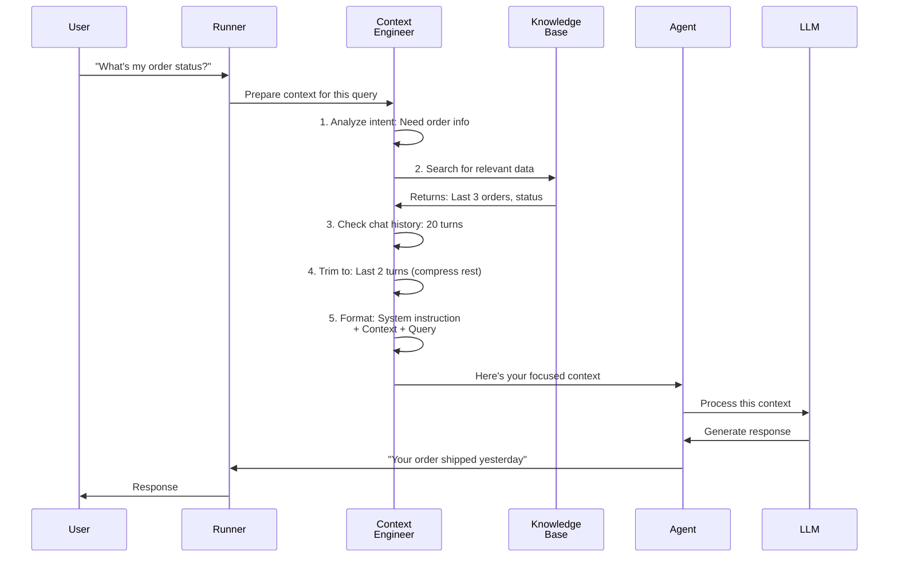

# Chapter 9: Context Engineering

Welcome back! In [Chapter 8: Memory Service](08_memory_service_.md), you learned how agents can remember important facts across multiple conversations using long-term memory. Now it's time to learn about something equally powerful: **Context Engineering**.

## The Problem: Too Much Information at Once

Imagine you're running a customer support agent that helps with a massive e-commerce company. Over the past year, a customer has had hundreds of interactions—past purchases, support tickets, preferences, feedback, complaints, and reviews.

Now the customer writes: *"I need help with my order."*

If you gave the agent **all 300 pieces of information** from the customer's history, here's what would happen:

- 😞 **Expensive** — More tokens = Higher API costs
- 😞 **Slow** — The model has to read through irrelevant information
- 😞 **Confused** — The agent gets distracted by old, irrelevant details
- 😞 **Hallucinations** — Too much noise makes the model make things up

**This is the core problem that Context Engineering solves.** Context Engineering is like **curating a museum exhibit**. Instead of showing visitors *every single artifact in the warehouse*, you carefully select and arrange the most relevant pieces so they have a meaningful experience.

Think of it this way: **Context Engineering = Deciding exactly what information the agent should see, in what order, and how it's presented.**[1][2][3]

## The Central Use Case: A Smart Support Agent

Let's say your customer needs help. Without Context Engineering:

```
Agent receives: 
  "I need help with my order"

  + 300 lines of customer history
  + 50 product descriptions
  + 100 past support tickets
  + 200 company policies
  + Everything else
  
Result: Agent is overwhelmed and confused ❌
```

With Context Engineering:

```
Agent receives:
  "I need help with my order"
  
  + Relevant past orders (last 3)
  + Relevant support tickets (issues with this product type)
  + Relevant policies (return policy for electronics)
  
Result: Agent gives a perfect, fast answer ✅
```

**Context Engineering gets the agent the right information, at the right time, in the right format.**[1][2][3]

## Core Concept 1: The Three Types of Context

When you design what information an agent sees, you're managing three things:

### 1. **Instruction Context** (The Job Description)

These are your agent's standing instructions—the permanent rules that always apply.

```
"You are a helpful customer support agent.
Always be polite.
Never promise more than we can deliver."
```

**The Problem:** If you cache these instructions, they're reused across many requests, saving time and money. This is called **context caching**.[1]

### 2. **Retrieval Context** (The Case File)

This is information you fetch based on the current question—like pulling a customer file when they call in.

```
Customer asks: "What happened with my last order?"

You retrieve:
  - Last 3 orders
  - Recent support tickets about those orders
  - Shipping status for relevant items
```

**The Problem:** You don't want to retrieve everything. You want to retrieve only what's relevant. This is called **selective retrieval**.[1][2]

### 3. **Historical Context** (The Chat History)

This is what happened earlier in the same conversation.

```
Customer: "What's the return policy?"
Agent: "You have 30 days to return items."

Customer: "Does that apply to electronics?"
Agent: Needs to remember the previous answer ✓
```

**The Problem:** Over a long conversation, this grows huge. You need to **trim old messages** or **compress them into summaries**. This is called **context compaction**.[1][2][3]

## Core Concept 2: The Context Engineering Pipeline

Context Engineering follows a simple pipeline:

```mermaid
graph LR
    A["User Query:<br/>What's my order status?"] -->|1. Identify Intent| B["What info do I need?<br/>Order status, shipping"]
    B -->|2. Retrieve Relevant| C["Pull from database:<br/>Last 3 orders, status"]
    C -->|3. Trim Old History| D["Compress old messages:<br/>Keep last 2 turns"]
    D -->|4. Format Context| E["Package it nicely:<br/>System prompt + context + query"]
    E -->|5. Send to Agent| F["Agent receives focused,<br/>relevant information"]
    F -->|6. Get Answer| G["Agent responds with<br/>perfect information"]
```



**What's happening:**
1. Analyze what the user is asking
2. Decide what information is relevant
3. Trim away old, irrelevant history
4. Organize it in a way the agent understands
5. Send it to the agent
6. The agent gives a great answer![1][2]

In ADK, the **Runner** does most of this automatically, but understanding it helps you optimize for your specific use case.

## Core Concept 3: Three Techniques for Managing Context

### Technique 1: **Context Caching** — Reuse Static Instructions

Think of it like a rubber stamp. Instead of retyping the same instructions every time, you pre-stamp them once and reuse them.

```python
system_instruction = "You are a helpful support agent. Be polite. No promises."

# Without caching:
# Every request: Retransmit 500 tokens of instruction
# Cost: 500 tokens × 1000 requests = 500,000 tokens

# With caching:
# First request: Transmit and cache (500 tokens)
# Next requests: Reuse from cache (0 tokens each!)
# Cost: 500 tokens + 999 requests × ~10 tokens = ~10,000 tokens
# Savings: 98% reduction! ✅
```

**Why it matters:** Your standing instructions never change, so why retransmit them every time? Cache them once, reuse forever.[1]

### Technique 2: **Selective Retrieval** — Only Grab What's Relevant

When you query your knowledge base or memory, filter aggressively.

```python
# ❌ Without filtering:
results = memory_service.search("customer preferences")
# Returns: 500 results (too many!)

# ✅ With filtering:
results = memory_service.search(
    "preferences for electronics",
    limit=5,  # Only top 5
    recency_filter="last_30_days"  # Recent only
)
# Returns: 5 results (perfect!)
```

**Why it matters:** More data doesn't equal better answers. You want the **most relevant** information, not all information.[1][2]

### Technique 3: **Event Compaction** — Summarize Old Chat History

As conversations grow long, compress old turns into summaries (like you learned in [Chapter 8: Memory Service](08_memory_service_.md)).

```python
# Before compaction:
[
  "User: Hi, I have a nut allergy",
  "Agent: Got it!",
  "User: Specifically peanuts",
  "Agent: Understood",
  "User: And tree nuts too",
  "Agent: I'll remember",
  ... (50 more messages)
]

# After compaction:
[
  "SUMMARY: User allergic to peanuts and tree nuts",
  ... (last 5 recent messages)
]
```

**Why it matters:** Old messages take up tokens and distract the agent. Summaries capture the essence without the noise.[2][3]

## How Context Engineering Works Under the Hood

Let's trace what happens when you ask an agent a question:



**Step-by-step breakdown:**

1. **Analyze Intent** — What does the user actually want? (Skip irrelevant data)[1]
2. **Selective Retrieval** — Fetch only relevant information from knowledge bases[1][2]
3. **Trim History** — Check: Is the conversation getting long? (Yes, 20 turns)[1]
4. **Compact Old Messages** — Summarize turns 1-18 into one summary[2][3]
5. **Format Context** — Arrange it: System instructions → Context → Query[1]
6. **Send to Agent** — Agent receives clean, focused information[1]

The beauty is: **ADK handles most of this automatically**. You just configure what you want.[1][2][3]

## Implementing Context Engineering in Your Agent

Let's solve our central use case: A support agent that only sees relevant information.

### Step 1: Enable Basic Caching

System instructions get cached so you don't retransmit them:

```python
from google.adk.models.google_llm import Gemini

# Your standing instructions (these get cached)
instruction = """You are a helpful support agent.
Always verify the customer's request.
Never promise faster shipping than possible."""

agent = Agent(
    model=Gemini(model="gemini-2.5-flash-lite"),
    instruction=instruction,
    # The Runner automatically caches this instruction
)
```

**What's happening:** Your instruction is now cached by the LLM provider. Every subsequent request reuses it instead of retransmitting.[1]

### Step 2: Implement Selective Retrieval

When you retrieve information, filter it:

```python
async def search_order_info(customer_id: str, query: str):
    """Retrieve only relevant order information."""
    # ✅ Selective: Only get orders from last 90 days
    orders = await db.query(
        "SELECT * FROM orders WHERE customer_id = ? AND date > now() - 90 DAYS",
        customer_id
    )
    # ✅ Filter: Only include orders related to query
    relevant = [o for o in orders if query.lower() in o.product_name.lower()]
    return relevant[:3]  # ✅ Limit: Return only top 3
```

**What's happening:** Instead of returning 100 orders, you return only the 3 most relevant recent ones.[1][2]

### Step 3: Enable Event Compaction (You Already Know This!)

From [Chapter 8: Memory Service](08_memory_service_.md), create an app with compaction:

```python
from google.adk.apps.app import App, EventsCompactionConfig

app = App(
    name="support_bot",
    root_agent=agent,
    events_compaction_config=EventsCompactionConfig(
        compaction_interval=5,  # Summarize every 5 turns
        overlap_size=1  # Keep 1 turn for overlap
    )
)
```

**What's happening:** Every 5 conversation turns, old messages get summarized automatically.[2][3]

## Real-World Example: The Complete Picture

Let's put it all together. Here's how context engineering works in a real support scenario:

```
TURN 1:
User: "Hi, I need help with my order"
- Context size: ~200 tokens (fresh start)
  - System instruction (cached, 100 tokens)
  - Empty history
  - Query (100 tokens)

TURN 2-5:
User asks follow-up questions
- Context size: grows to ~600 tokens
  - System instruction (cached, reused)
  - Chat history (300 tokens, growing)
  - Query (100 tokens)

TURN 6: COMPACTION TRIGGERS
- Old turns 1-5 get summarized into 1 summary
- Context size: drops back to ~300 tokens
  - System instruction (cached, reused)
  - Compressed summary + last turn (200 tokens)
  - Query (100 tokens)

TURN 10:
User: "What about shipping?"
- Context Engineering automatically retrieves relevant info:
  - Shipping policy (from knowledge base)
  - Their order's current shipping status
  - Similar support tickets resolved
- Agent has exactly what it needs, nothing more
```

**Result:** Fast responses, lower costs, happier customers.[1][2][3]

## When to Use Each Technique

| Situation | Technique | Why |
|-----------|-----------|-----|
| Same instructions for many requests | Context Caching | Reuse saved, massive cost savings |
| Long conversations (10+ turns) | Event Compaction | Tokens grow too expensive |
| Need background knowledge | Selective Retrieval | Only relevant info, no noise |
| Combination | Use All Three | Optimal performance and cost |

## Key Principles of Context Engineering

**1. Relevance Over Completeness** — 5 relevant facts beat 100 facts.[1][2]

**2. Recency Matters** — Recent information is usually more important than old information.[1]

**3. Structure Helps** — Well-organized context is easier for agents to use.[1]

**4. Less is More** — Fewer tokens = faster responses = lower costs = happier users.[1][2][3]

## Summary

**Context Engineering** is the discipline of deciding what information your agent sees, when, and in what format. It's like editing a movie—you don't use every take, just the best ones in the right order.

**Three core techniques:**
- 💾 **Context Caching** — Cache static instructions, reuse them
- 🎯 **Selective Retrieval** — Only fetch relevant information
- 📊 **Event Compaction** — Summarize old conversation history

**Why it matters:**
- ⚡ Faster responses
- 💰 Lower costs
- 🎯 Better answers (less noise)
- 🔍 More relevant information

Context Engineering transforms your agents from systems that process **everything** to systems that process **what matters**. This is the difference between a rambling assistant and a focused professional.

You've now learned the complete journey of building intelligent agents: from basic agent architecture to sophisticated context management. Your agents can now reason, use tools, communicate with each other, remember information, and manage context efficiently.

---

**Key Takeaways:**
- **Context Engineering** = Curating what information agents see
- **Three techniques:** Caching (reuse), Retrieval (select), Compaction (summarize)
- **Trade-off:** Fewer relevant tokens beats many irrelevant tokens
- **Automatic:** ADK handles most of this behind the scenes
- **Result:** Faster, cheaper, better agent responses

---

Congratulations! You've completed the foundational chapters on building with agents. You're now ready to explore specialized topics like callbacks, long-running operations, and advanced patterns. Ready to learn about [Chapter 10: Callbacks](10_callbacks_.md)?
