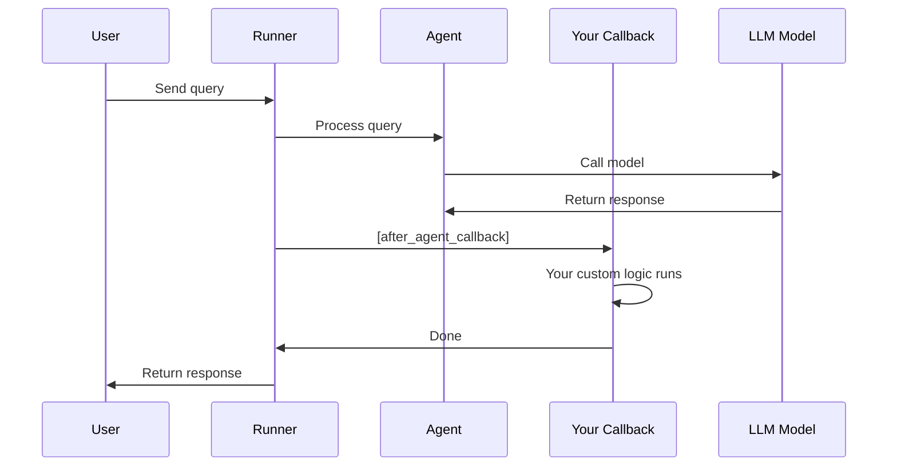

# Chapter 10: Callbacks

Welcome back! In [Chapter 9: Context Engineering](09_context_engineering_.md), you learned how to manage what information your agent sees and processes. Now it's time to learn about **Callbacks**—a powerful feature that lets you inject custom logic into your agent's lifecycle without modifying the agent's core code.

## The Problem: Cross-Cutting Concerns Without Cluttering Agent Code

Imagine you're building a customer support agent. You want to do several things **every time** the agent processes a request:

- 📝 **Log** what the agent is doing (for debugging)
- 💾 **Save** the conversation to a database automatically
- ✅ **Validate** that responses meet quality standards
- 📊 **Track metrics** like response time and token usage
- 🚨 **Alert** if something goes wrong

Without Callbacks, you'd have to add all this logic **inside the agent code itself**, making it messy and hard to maintain:

```python
class MyAgent:
    async def process(self, query):
        # Log it
        logger.info(f"Processing: {query}")
        
        # Validate input
        if not validate_input(query):
            alert_error("Invalid input")
        
        # ... agent logic ...
        
        # Save to database
        await save_to_db(response)
        
        # Track metrics
        metrics.record_time(time_taken)
        
        return response
```

**This is a mess!** The agent code is cluttered with infrastructure concerns that have nothing to do with reasoning or tool use.

**Callbacks solve this problem.** They're like **hooks on a wall**—you hang decorations (your custom logic) on them **without rebuilding the wall** (the agent). Think of it like event listeners in your agent's execution flow.[1][2]

## What Are Callbacks?

**Callbacks are functions that ADK automatically calls at specific points in an agent's lifecycle.** You define them once, attach them to an agent, and they run automatically—no manual invocation needed.

Here's the core idea:

```python
# Before: Logic is mixed in agent code ❌
class Agent:
    async def process(request):
        # ... agent code ...
        # ... logging code ...
        # ... validation code ...
        # ... database code ...

# After: Clean separation ✅
def my_logging_callback(context):
    logger.info(context.message)

agent = Agent(
    after_agent_callback=my_logging_callback  # Attached, not mixed in!
)
```

## Core Concept: The Callback Lifecycle

An agent's execution has several stages, and you can hook into each one:

```
Request arrives
    ↓
[BEFORE_AGENT] ← Your callback here?
    ↓
Agent thinks and reasons
    ↓
[BEFORE_TOOL] ← Your callback here?
    ↓
Agent calls a tool
    ↓
[AFTER_TOOL] ← Your callback here?
    ↓
[AFTER_AGENT] ← Your callback here?
    ↓
Response sent
```

**Each stage is a checkpoint where you can inject custom behavior.**[1][2]

## The Central Use Case: Automatic Logging and Persistence

Let's solve a practical problem: **automatically log every conversation and save it to a database without touching the agent code.**

Here's our goal:

```
User: "What's the weather?"
↓
Agent processes (our callback logs this)
↓
Agent responds: "It's sunny"
↓
Our callback automatically saves to database
↓
User gets response
```

All of this happens automatically through callbacks.

## How Callbacks Work: Key Concepts

### Concept 1: Callback Functions

A callback is simply an async Python function that ADK calls at specific moments. It receives a `callback_context` parameter that gives it access to information about what's happening:

```python
async def my_callback(callback_context):
    # callback_context contains information about the current execution
    session = callback_context._invocation_context.session
    memory = callback_context._invocation_context.memory_service
    # Do something with this information
    print(f"Session has {len(session.events)} events")
```

**What's happening:** ADK creates the `callback_context` automatically and passes it to your function. You get information about the current execution without asking for it.[1][2]

### Concept 2: Callback Types

ADK provides callbacks for different stages in the agent's lifecycle:[1][2]

| Callback | When It Runs | Use Case |
|----------|--------------|----------|
| `before_agent_callback` | Before agent starts | Validate input, setup |
| `after_agent_callback` | After agent finishes | Save to DB, log result |
| `before_tool_callback` | Before tool is called | Log which tool is used |
| `after_tool_callback` | After tool returns | Validate tool result |
| `before_model_callback` | Before LLM is called | Log what we're asking LLM |
| `after_model_callback` | After LLM responds | Log LLM's response |
| `on_model_error_callback` | When LLM errors | Handle errors gracefully |

**Choose the right callback for your need.** For our logging use case, `after_agent_callback` is perfect—it runs after the agent finishes its response.

### Concept 3: The Callback Context

The `callback_context` is like a **reference to everything happening right now**. It's passed to your callback automatically and contains:

- The current session
- The memory service
- The agent's state
- Tool results
- Error information (if any)

You access these using the `_invocation_context` attribute:

```python
async def save_to_memory(callback_context):
    # Access current session
    session = callback_context._invocation_context.session
    # Access memory service
    memory = callback_context._invocation_context.memory_service
    # Save session to memory
    await memory.add_session_to_memory(session)
```

**What's happening:** The context gives your callback access to runtime information without polluting the agent code.[1][2]

## Building Your First Callback: Automatic Logging

Let's solve our central use case—automatically log every agent turn.

### Step 1: Define the Callback Function

```python
async def logging_callback(callback_context):
    """Log every agent turn automatically."""
    session = callback_context._invocation_context.session
    # Get the last event (what just happened)
    last_event = session.events[-1] if session.events else None
    
    if last_event and last_event.content:
        print(f"✓ Agent response: {last_event.content.parts[0].text[:50]}...")
```

**What's happening:** We extract the last event from the session (which contains the agent's latest response) and log it. Simple!

### Step 2: Attach the Callback to an Agent

```python
agent = Agent(
    model=Gemini(model="gemini-2.5-flash-lite"),
    instruction="You are helpful.",
    after_agent_callback=logging_callback  # Attach here!
)
```

**What's happening:** We tell the agent "whenever you finish a turn, call my logging callback automatically."

### Step 3: The Callback Runs Automatically

```python
runner = Runner(agent=agent, session_service=session_service)

# When we run this:
response = await runner.run_debug("What's 2+2?")

# The callback automatically runs after the agent responds!
# Output: ✓ Agent response: The sum of 2 and 2 is 4...
```

**What's happening:** The callback runs transparently. You didn't call it—ADK did!

## Real-World Example: Memory Auto-Save Callback

A practical use case: **automatically save conversations to long-term memory** (like you learned in [Chapter 8: Memory Service](08_memory_service_.md)).

```python
async def auto_save_memory(callback_context):
    """Save session to memory after each turn."""
    session = callback_context._invocation_context.session
    memory = callback_context._invocation_context.memory_service
    
    # No manual calls needed—this runs automatically!
    await memory.add_session_to_memory(session)

agent = Agent(
    model=Gemini(model="gemini-2.5-flash-lite"),
    after_agent_callback=auto_save_memory
)
```

**Result:** Every conversation automatically persists to long-term memory. Zero manual code needed after the initial callback definition!

## How Callbacks Work Under the Hood

When you attach a callback to an agent and run it, here's what happens:



**Step-by-step breakdown:**

1. **Runner receives query** — User sends a message
2. **Agent processes** — Agent calls LLM and gets response
3. **Callback triggers** — After agent finishes, Runner calls your callback automatically
4. **Your logic runs** — Your callback function executes (logging, saving, etc.)
5. **Continue** — Runner returns the response to the user

The key insight: **Callbacks run at predetermined points in the execution flow, transparently and automatically.**[1][2]

## Multiple Callbacks: Composing Multiple Concerns

You can attach multiple callbacks of the same type, and they'll all run:

```python
async def log_callback(context):
    print("Logging...")

async def validate_callback(context):
    print("Validating...")

async def save_callback(context):
    print("Saving...")

agent = Agent(
    model=Gemini(model="gemini-2.5-flash-lite"),
    after_agent_callback=save_callback,  # Wait, can we attach multiple?
)
```

**Note:** Each callback type accepts one function. If you need multiple actions, combine them into one callback:

```python
async def multi_purpose_callback(context):
    """One callback that does multiple things."""
    await log_callback(context)
    await validate_callback(context)
    await save_callback(context)

agent = Agent(
    after_agent_callback=multi_purpose_callback
)
```

**What's happening:** We compose multiple concerns into a single callback that runs in sequence.

## Practical Patterns

### Pattern 1: Quality Validation

```python
async def validate_response(callback_context):
    """Ensure response meets quality standards."""
    session = callback_context._invocation_context.session
    last_response = session.events[-1]
    
    # Check response length
    text = last_response.content.parts[0].text
    if len(text) < 10:
        print("⚠️  Warning: Response too short")
    
    # Check for required information
    if "I don't know" in text:
        print("⚠️  Warning: Agent expressed uncertainty")

agent = Agent(
    model=Gemini(model="gemini-2.5-flash-lite"),
    after_agent_callback=validate_response
)
```

**Use case:** Catch quality issues automatically instead of waiting for user complaints.

### Pattern 2: Error Handling

```python
async def handle_error(callback_context):
    """Handle errors gracefully."""
    if callback_context._invocation_context.error:
        error = callback_context._invocation_context.error
        print(f"Error detected: {error}")
        # Send alert, log to error tracking, etc.

agent = Agent(
    model=Gemini(model="gemini-2.5-flash-lite"),
    on_model_error_callback=handle_error
)
```

**Use case:** Catch and respond to errors without letting them crash your app.

### Pattern 3: Metrics Collection

```python
import time

async def track_metrics(callback_context):
    """Track performance metrics."""
    session = callback_context._invocation_context.session
    
    # Number of messages in this conversation
    msg_count = len(session.events)
    print(f"Conversation length: {msg_count} messages")
    
    # Could send to monitoring system (Datadog, CloudWatch, etc.)

agent = Agent(
    model=Gemini(model="gemini-2.5-flash-lite"),
    after_agent_callback=track_metrics
)
```

**Use case:** Track how agents are performing in production and identify bottlenecks.

## When to Use Callbacks

Use callbacks for:

✅ **Logging and observability** — Track what agents are doing  
✅ **Data persistence** — Save conversations automatically  
✅ **Validation** — Ensure outputs meet standards  
✅ **Error handling** — Respond to failures  
✅ **Metrics** — Monitor performance  
✅ **Side effects** — Send alerts, update dashboards  

Don't use callbacks for:

❌ **Core business logic** — That belongs in the agent itself  
❌ **Tool implementations** — Use the tools system instead  
❌ **Flow control** — Use workflow patterns instead  

## Summary

**Callbacks are hooks that let you inject custom logic into an agent's lifecycle without modifying agent code.**

- 🪝 **Callback types:** `before_agent_callback`, `after_agent_callback`, `before_tool_callback`, etc.
- 🔌 **Attachment:** Pass them when creating an agent
- ⚡ **Automatic:** Run transparently at key execution points
- 📊 **Access:** Use `callback_context._invocation_context` to reach session, memory, and state
- 🎯 **Use cases:** Logging, persistence, validation, error handling, metrics

Callbacks transform your agent system from something you have to manually manage into a system that handles operational concerns automatically. They're like hiring an invisible assistant who watches your agent and handles all the administrative tasks.

You've now completed the foundational chapters on building intelligent agents! You understand agents, tools, multi-agent systems, workflows, communication, runners, sessions, memory, context engineering, and callbacks. You have everything needed to build sophisticated, production-ready agent systems.

---

**Key Takeaways:**
- **Callbacks** = Functions that run automatically at specific points in agent execution
- **Attach once, forget it** — No manual invocation needed
- **Clean separation** — Infrastructure logic stays out of agent code
- **Context access** — Use `callback_context` to reach runtime information
- **Multiple callbacks** — Compose them for multiple concerns

Ready to go deeper? Callbacks are just one tool in your toolkit. As you continue building agents, you'll discover how callbacks integrate with other systems like memory and observability to create truly intelligent, manageable applications.
