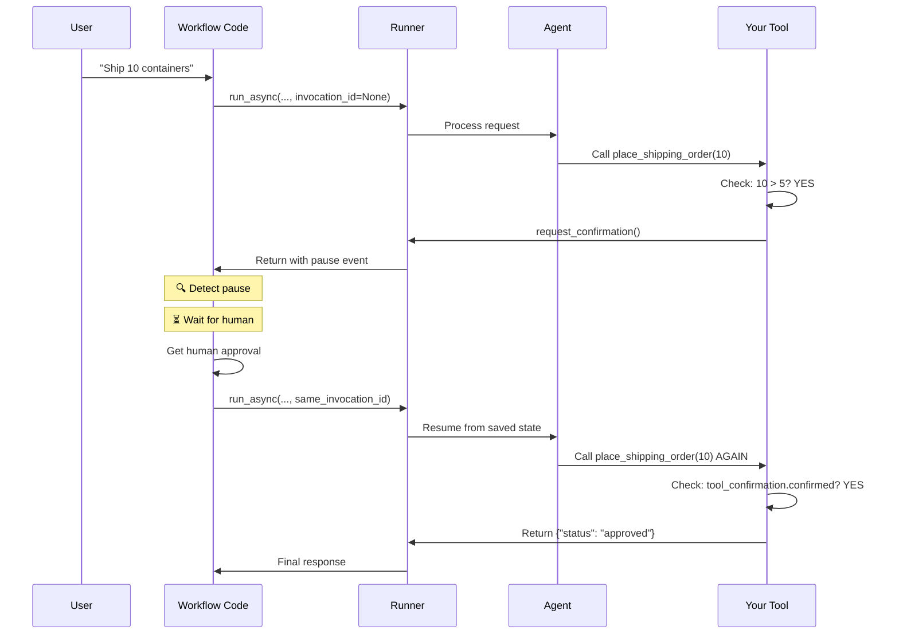

# Chapter 11: Long-Running Operations

Welcome back! In [Chapter 10: Callbacks](10_callbacks_.md), you learned how to inject custom logic into your agent's lifecycle using callbacks. Now it's time to explore one of the most powerful patterns for building real-world applications: **Long-Running Operations**.

## The Problem: Operations That Need Human Approval

Imagine you're building a shipping coordinator agent for an e-commerce company. Everything works great until a customer makes a **massive order**:

```
User: "Ship 100 containers to Europe"
Agent: "Done! Order placed immediately"
Customer: "Wait, I didn't authorize that! That's $500,000!"
```

**The problem:** Some operations are too important to execute automatically. They need human approval before completing—like:

- 💰 Large financial transactions (approvals before charging accounts)
- 🗑️ Bulk deletions (confirm before deleting 1000 records)
- 📋 Compliance checkpoints (regulatory approval needed)
- ⚠️ Irreversible operations (account closure needs confirmation)

Without **Long-Running Operations**, your agent either:
- ❌ Executes immediately without safety checks
- ❌ Refuses to do important work
- ❌ Makes users guess at approval workflows

**Long-Running Operations solve this by letting your agent pause execution, ask for human approval, and resume from exactly where it paused—seamlessly.**[1][2][3]

## The Central Use Case: Shipping with Approval

Let's focus on a concrete example throughout this chapter:

```
User: "Ship 10 containers to Rotterdam"
   ↓
Agent: "That's a large order. Requesting approval..."
   ↓
[PAUSED - Waiting for human decision]
   ↓
Human: "Approved ✅"
   ↓
Agent: "Order confirmed! ID: ORD-10-HUMAN"
```

Everything the agent needs to know (the conversation, the order details, where exactly it paused) is saved. The operation truly **resumes** from where it paused, not restarted from scratch.

## Core Concept 1: How Pausing Works

A **Long-Running Operation** is when a tool detects it needs approval and explicitly requests it, then the agent's execution pauses until that approval is received.[1][2][3]

Here's the key insight: **Your tool decides internally when to pause.**

Think of it like a cashier at a store:
- 🛒 Small purchase ($10): Cashier charges immediately
- 💳 Large purchase ($1000): Cashier calls a manager for approval
- ⏸️ While waiting: Everything stops (the transaction is paused)
- ✅ Manager approves: Cashier continues from exactly where they paused

Your tool works the same way. It examines the request and decides: "Do I need approval?" If yes, it pauses.

## Core Concept 2: The Three-Phase Lifecycle

Every long-running operation goes through three phases:

### Phase 1: First Attempt (Initial Call)

```python
def place_shipping_order(num_containers: int, tool_context: ToolContext):
    if num_containers <= 5:
        # ✅ Small order: approve immediately
        return {"status": "approved", ...}
    
    if not tool_context.tool_confirmation:
        # ⏸️ Large order: request approval and pause
        tool_context.request_confirmation(
            hint="Large order - approve?"
        )
        return {"status": "pending", ...}
```

**What happens:** Tool checks the request size. If large, it calls `request_confirmation()` which signals ADK: "I'm pausing here."[1]

### Phase 2: Pause (Agent Waits)

Between Phase 1 and Phase 3, everything stops. ADK:
- 📝 Saves the conversation state (all messages so far)
- 💾 Saves which tool was called and its parameters
- 🏷️ Tags the execution with an `invocation_id` (unique identifier)
- ⏱️ Waits for the human to make a decision[1]

### Phase 3: Resume (Continue with Approval)

```python
def place_shipping_order(num_containers: int, tool_context: ToolContext):
    # ... (same as Phase 1) ...
    
    if tool_context.tool_confirmation:
        # ✅ Phase 3: Tool is being called AGAIN with human decision
        if tool_context.tool_confirmation.confirmed:
            return {"status": "approved", "order_id": "ORD-10", ...}
        else:
            return {"status": "rejected", ...}
```

**What happens:** ADK restores the saved state and calls your tool again. This time, `tool_context.tool_confirmation` is populated with the human's decision.[1][2][3]

## Core Concept 3: The Two Key Objects

### `ToolContext` — Your Window to Pause/Resume

When your tool is called, ADK automatically passes a `ToolContext` object. It has everything you need:

```python
def my_tool(tool_context: ToolContext):
    # Check: Is this the first call or a resume?
    if not tool_context.tool_confirmation:
        # First call - request approval
        tool_context.request_confirmation(hint="Approve?")
        return {"status": "pending"}
    
    # Resume - check human's decision
    approved = tool_context.tool_confirmation.confirmed
    return {"status": "approved" if approved else "rejected"}
```

**What `ToolContext` provides:**[1]
- 🔍 `tool_confirmation` — Was this tool already called? What was the decision?
- 📡 `request_confirmation()` — Method to pause and ask for approval

### `App` with `ResumabilityConfig` — Making Resume Possible

To enable pause/resume, wrap your agent in an `App`:

```python
from google.adk.apps.app import App, ResumabilityConfig

app = App(
    name="shipping_coordinator",
    root_agent=my_agent,
    resumability_config=ResumabilityConfig(is_resumable=True)
)
```

**What this does:**[1][2]
- Enables state saving (so pause/resume works)
- Makes resume possible via `invocation_id`
- Without this, execution would always restart instead of resume

## How Long-Running Operations Work Under the Hood

Let's trace through what happens when you run a long-running operation:[1][2][3]



**Step-by-step breakdown:**

1. **Initial Call** — Workflow calls `runner.run_async()` without an `invocation_id`
2. **Agent Processes** — Agent decides to call your tool
3. **Tool Checks** — Your tool examines the request (is it large?)
4. **Request Approval** — If large, tool calls `request_confirmation()`
5. **Pause Event** — ADK creates a special `adk_request_confirmation` event and stops
6. **Detect Pause** — Your workflow code looks for this event and knows it's paused
7. **Wait for Human** — Workflow waits for human decision (could be seconds or hours)
8. **Resume Call** — Workflow calls `runner.run_async()` again with the **same `invocation_id`**
9. **State Restoration** — ADK loads the saved state (conversation, tool parameters)
10. **Tool Called Again** — Your tool is called with `tool_context.tool_confirmation` now populated
11. **Final Decision** — Tool checks `confirmed` and returns success/failure
12. **Complete** — Agent responds with final result[1][2][3]

**The critical detail:** The `invocation_id` tells ADK: "This is a resume, not a new execution." Without it, ADK would start fresh instead of resuming.[1]

## Building Your First Long-Running Operation

Let's solve our central use case step-by-step.

### Step 1: Create a Tool That Can Pause

```python
from google.adk.tool_context import ToolContext

def place_shipping_order(
    num_containers: int, 
    destination: str, 
    tool_context: ToolContext
) -> dict:
    """Place a shipping order (auto-approve small, pause for large)."""
    
    # Phase 1: First call - check if approval needed
    if num_containers <= 5:
        return {"status": "approved", "order_id": "AUTO"}
    
    # Phase 2: Large order - pause here
    if not tool_context.tool_confirmation:
        tool_context.request_confirmation(
            hint=f"⚠️ Large order: {num_containers} containers. Approve?"
        )
        return {"status": "pending"}
    
    # Phase 3: Resume - human decided
    if tool_context.tool_confirmation.confirmed:
        return {"status": "approved", "order_id": "ORD-10-HUMAN"}
    else:
        return {"status": "rejected"}
```

**What's happening:**
- Phase 1: Small orders skip straight to approval
- Phase 2: Large orders check `if not tool_context.tool_confirmation` to detect first call, then request approval
- Phase 3: On resume, `tool_context.tool_confirmation` is populated, so we check the human's decision[1][2]

### Step 2: Create the Agent with This Tool

```python
from google.adk.agents import LlmAgent
from google.adk.tools.function_tool import FunctionTool

agent = LlmAgent(
    name="shipping_agent",
    model=Gemini(model="gemini-2.5-flash-lite"),
    instruction="Help ship containers. Use the shipping tool.",
    tools=[FunctionTool(func=place_shipping_order)]
)
```

**What's happening:** The agent now has access to your pausable tool.[1]

### Step 3: Enable Resumability with App

```python
from google.adk.apps.app import App, ResumabilityConfig

app = App(
    name="shipping_coordinator",
    root_agent=agent,
    resumability_config=ResumabilityConfig(is_resumable=True)
)
```

**What's happening:** This enables state saving, which makes pause/resume actually work.[1]

### Step 4: Create Runner and Session

```python
runner = Runner(
    app=app,  # Pass the app, not just the agent
    session_service=session_service
)
```

**What's happening:** The runner now knows this app supports resumability.[1]

## The Workflow Code: Detecting and Handling Pauses

Your workflow code is responsible for three things:

1. **Detect the pause** — Look for `adk_request_confirmation` events
2. **Get human decision** — Show UI or simulate approval
3. **Resume with same `invocation_id`** — Tell ADK to continue, not restart

Here's a minimal example:[1][2][3]

```python
async def handle_shipping_request(query: str, approved_by_human: bool):
    # Step 1: Send initial request
    events = []
    async for event in runner.run_async(
        user_id="user123",
        session_id="session456",
        new_message=types.Content(
            role="user", 
            parts=[types.Part(text=query)]
        )
    ):
        events.append(event)
    
    # Step 2: Check if paused
    pause_info = None
    for event in events:
        if event.content and event.content.parts:
            for part in event.content.parts:
                if part.function_call and \
                   part.function_call.name == "adk_request_confirmation":
                    pause_info = {
                        "approval_id": part.function_call.id,
                        "invocation_id": event.invocation_id
                    }
    
    # Step 3: If paused, resume with approval
    if pause_info:
        # Create approval response
        approval = types.FunctionResponse(
            id=pause_info["approval_id"],
            name="adk_request_confirmation",
            response={"confirmed": approved_by_human}
        )
        
        # Resume with SAME invocation_id
        async for event in runner.run_async(
            user_id="user123",
            session_id="session456",
            new_message=types.Content(
                role="user",
                parts=[types.Part(function_response=approval)]
            ),
            invocation_id=pause_info["invocation_id"]  # CRITICAL!
        ):
            print(event)  # Final response
```

**Key points:**[1][2][3]

- First `run_async()` starts fresh (no `invocation_id`)
- Look for `adk_request_confirmation` events to detect pause
- Save the `invocation_id` and `approval_id` from the event
- Second `run_async()` with the **same `invocation_id`** tells ADK to resume
- Pass human decision in `FunctionResponse`

## When to Use Long-Running Operations

Use long-running operations when:[1][2][3]

✅ **Financial transactions** — Orders, transfers, payments  
✅ **Destructive operations** — Deletes, account closures  
✅ **Compliance needs** — Regulatory approval required  
✅ **High-cost actions** — Infrastructure provisioning  
✅ **Irreversible changes** — Data modifications that can't be undone  

Don't use when:[1][2][3]

❌ **Instant operations** — Simple reads or safe writes  
❌ **No human involvement** — Pure tool-to-tool workflows  
❌ **Real-time systems** — Can't afford to pause for seconds  

## Real-World Example: Order Processing

Imagine your e-commerce agent:

```
User: "Refund my $5 order"
→ Agent: "Approved immediately" ✅

User: "Refund my $50,000 order"
→ Agent: "⏸️ Requesting approval"
→ [Paused]
→ Manager: "Approved"
→ Agent: "Refund processed"

User: "Refund my $1,000,000 order"
→ Agent: "⏸️ Requesting approval"
→ [Paused for 1 hour]
→ CFO: "Approved"
→ Agent: "Refund processed"
```

Different thresholds trigger different approval workflows, but your agent code stays the same.[1][2][3]

## Summary

**Long-Running Operations** let your agents pause for human approval and resume seamlessly.

**Three phases:**
1. 🔍 **Detect need** — Tool checks if approval needed
2. ⏸️ **Pause** — Tool calls `request_confirmation()`, ADK saves state
3. ✅ **Resume** — Workflow resumes with same `invocation_id` and human decision

**Key components:**
- 🔧 `ToolContext` — Access to pause mechanism and human decision
- 🏗️ `App` with `ResumabilityConfig` — Enables state saving
- 📡 Workflow code — Detects pause, gets human decision, resumes

**Critical pattern:**
- First call: `run_async()` with no `invocation_id`
- Detect pause event: `adk_request_confirmation`
- Second call: `run_async()` with **same `invocation_id`** to resume

You've now learned how to build agents that handle complex, real-world workflows requiring human oversight. Your agents can now safely handle high-stakes operations by pausing for approval, executing only when appropriate, and maintaining complete state across the pause—exactly like a professional would.

Long-Running Operations transform your agents from autonomous executors into collaborative tools that work safely within organizational guardrails.

---

**Key Takeaways:**
- **Long-Running Operations** = Operations that pause for external input (typically human approval)
- **Three phases:** First attempt → Pause for approval → Resume with decision
- **`ToolContext`** = Your window to request pause and check human decision
- **`ResumabilityConfig`** = Enables state saving for pause/resume
- **`invocation_id`** = Critical identifier that tells ADK to resume, not restart
- **Workflow code** = Responsible for detecting pause, getting decision, resuming with same ID

Ready to put all these concepts together? You've now completed the entire `codes_2` Agent Development Kit curriculum! You understand agents from first principles through advanced patterns like multi-agent systems, workflows, communication, runners, sessions, memory, context engineering, callbacks, and long-running operations. You have everything you need to build production-grade agent applications.

Congratulations on completing this comprehensive journey into agent development! 🎉
