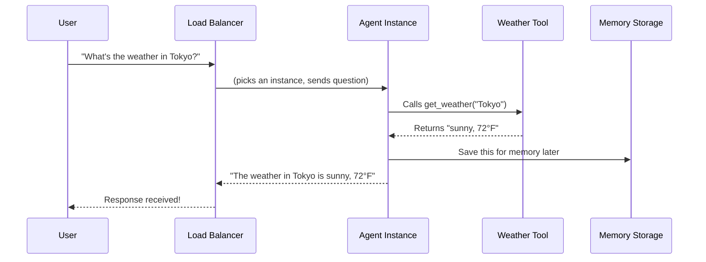

# Chapter 1: Vertex AI Agent Engine

## The Problem: From Laptop to Production

Imagine you've built an amazing AI agent that answers questions, calls tools, and has helpful conversations. It works perfectly on your computer. You can chat with it anytime.

But here's the problem: **Your agent only exists on your machine.** When you close your laptop, it disappears. Your friends can't use it. Your users can't access it. It's like building a restaurant kitchen that only works when you're standing in front of it!

This is where **Vertex AI Agent Engine** comes in. It's like renting a specialized apartment building for your agent—one that never closes, automatically grows when busy, and handles all the boring stuff like keeping the lights on, managing traffic, and monitoring health.

## What is Vertex AI Agent Engine?

At its core, **Vertex AI Agent Engine** is Google Cloud's fully-managed service for running AI agents in production.[8] Think of it as a specialized home for your agent that takes care of everything except the agent's logic itself.

Here's what that means:

**Without Agent Engine (your laptop):**
- Your agent stops working when you stop your code
- Only you can talk to it
- If 100 people try to use it at once, it crashes
- You have to manually restart it when it fails
- You can't see what's happening inside

**With Agent Engine (the cloud apartment building):**
- Your agent runs 24/7, even when your computer is off
- Anyone can talk to it via the internet
- It automatically creates more copies when busy, then removes them when quiet (saving money!)
- It automatically restarts if something goes wrong
- You can watch everything happening in real-time
- It handles security, backups, and all the infrastructure stuff

### Key Concepts

Let me break down the three main things Agent Engine does for you:

**1. Auto-Scaling: Growing and Shrinking as Needed**

Imagine your agent is like a pizza restaurant. On Friday night, you need 10 workers. On Tuesday morning, you need 1. Agent Engine automatically hires and fires workers based on demand.

```
Monday 3 AM  → 0 instances running (saves money - you're not paying!)
Monday 10 AM → 5 instances (busy with users)
Monday 2 PM  → 2 instances (fewer users)
Monday 11 PM → 0 instances (nobody asking questions)
```

**2. Session Management: Remembering Conversations**

Your agent can have multiple conversations happening at the same time. Agent Engine keeps each conversation separate, so User A's questions don't get mixed up with User B's questions.

**3. Deployment & Monitoring: Keeping Everything Running**

Agent Engine handles:
- Turning your agent code into a running service
- Checking if your agent is healthy
- Automatically fixing broken connections
- Recording what your agent is doing (for debugging)

## How to Use Agent Engine: A Real Example

Let's walk through the main use case: **Taking an agent from your laptop and making it available to the world.**

### Step 1: Prepare Your Agent Code

You organize your agent code into a folder with a few files:

```python
# agent.py - Your actual agent logic
from google.adk.agents import Agent

def get_weather(city: str) -> str:
    """A tool that returns weather info"""
    return f"Weather in {city} is sunny"

my_agent = Agent(
    name="weather_bot",
    model="gemini-2.5-flash-lite",
    tools=[get_weather]
)
```

This file contains your agent exactly as you built it during development. The key idea: **Agent Engine takes this code and makes it available to the internet.**

### Step 2: Add Configuration Files

You need two small files that tell Agent Engine how to run your agent:

```
# requirements.txt - What Python packages to install
google-adk
opentelemetry-instrumentation-google-genai
```

```json
# .agent_engine_config.json - Hardware instructions
{
    "min_instances": 0,
    "max_instances": 5,
    "resource_limits": {"cpu": "1", "memory": "1Gi"}
}
```

Translation:
- `min_instances: 0` = "When nobody's using it, turn it off completely (save money!)"
- `max_instances: 5` = "If too many people use it, never create more than 5 copies"
- `cpu: 1, memory: 1Gi` = "Each copy gets 1 processor and 1GB of memory"

### Step 3: Deploy to Agent Engine

With one command, your agent goes live:

```bash
adk deploy agent_engine --project=my-project --region=us-west1 ./sample_agent
```

**What happens behind the scenes:**
1. Your code gets packaged up
2. Uploaded to Google Cloud
3. Turned into a Docker container (a standard format for code)
4. Started running on Agent Engine
5. Given a public URL so anyone can talk to it

### Step 4: Use Your Deployed Agent

Now your agent is live! You can send it questions from anywhere:

```python
from vertexai import agent_engines

# Get your deployed agent
my_agent = agent_engines.get(resource_name="projects/.../reasoningEngines/abc123")

# Ask it a question
response = my_agent.stream_query(message="What's the weather in Tokyo?")

# Your agent responds just like on your laptop!
print(response)
```

**Output:**
```
The weather in Tokyo is sunny and 72°F.
```

## What Happens Inside Agent Engine?

### The Journey of a Question

Let's trace what happens when someone asks your deployed agent a question:



Here's what each step means:

1. **User sends question** → Your question goes to the internet
2. **Load Balancer** → A traffic cop that decides which agent copy handles your question (if 5 copies are running, it picks one)
3. **Agent Instance** → One copy of your agent processes your question
4. **Tool calls** → Your agent calls the `get_weather` tool to look up information
5. **Memory Storage** → Important facts get saved for later sessions
6. **Response returns** → The answer comes back to you

### Why This Architecture?

This design solves real problems:

- **If your agent crashes** → Load Balancer sends new questions to other working copies
- **If 1000 people ask questions at once** → Agent Engine creates more instances automatically
- **If it's 3 AM and nobody's asking** → All instances shut down (you pay $0)
- **If an instance gets slow** → Load Balancer stops sending it questions and starts a fresh one

## Looking Under the Hood: The Container

Agent Engine runs your agent inside a **Docker container**. This is like a box that contains your Python code, all its dependencies, and everything needed to run it—completely isolated from everything else.

When you run `adk deploy`, here's what happens:

```
Your agent code → Packaged into container → Stored in Google Cloud
                                                       ↓
                                          Run: 1 copy, 5 copies, or 0 copies
                                                       ↓
                                              Depending on demand
```

The container format means:
- Your agent runs the same way on Google Cloud as it did on your laptop
- Other services can't interfere with your agent
- If your agent needs special Python packages, the container includes them

## Costs: How Much Does This Actually Cost?

This is a great question for beginners! Here's how pricing works:

| Scenario | Cost |
|----------|------|
| Agent not running (min_instances=0) | $0 |
| 1 hour of 1 instance running | ~$0.10-0.20 |
| 1 month of always-on agent | ~$70-150 |

The best part: **You only pay for instances that are actually running.** If your agent sits idle for 23 hours, you only pay for 1 hour.

For learning and testing, always set `min_instances: 0` so your agent stops automatically when not in use.

## Comparison: Local vs. Agent Engine

| Feature | Your Laptop | Agent Engine |
|---------|------------|--------------|
| Runs 24/7 | ❌ (need computer on) | ✅ (always available) |
| Multiple users | ❌ (might crash) | ✅ (auto-scales) |
| Easy to access | ❌ (only on your network) | ✅ (public URL) |
| Automatic restarts | ❌ (you restart manually) | ✅ (automatic) |
| Monitoring/logs | ❌ (basic) | ✅ (comprehensive) |
| Cost when idle | ❌ (still running) | ✅ ($0 with min_instances=0) |

## Your First Steps with Agent Engine

Here's what you'll do in the next chapters:

1. **[Chapter 2: Agent Development Kit (ADK)](02_agent_development_kit__adk__.md)** → Learn how to structure your agent code so it's ready for Agent Engine

2. **[Chapter 3: Agent Object](03_agent_object_.md)** → Understand the core building block that Agent Engine runs

3. Then we'll gradually build toward actually deploying your agent

Each chapter builds on the previous one, just like building with LEGO blocks.

## Summary

**Vertex AI Agent Engine** is Google Cloud's answer to the question: "How do I make my AI agent available to real users?"

Instead of your agent living on your laptop, it lives in a cloud apartment building that:
- ✅ Runs 24/7 without you
- ✅ Automatically scales up when busy, down when quiet
- ✅ Costs $0 when nobody's using it
- ✅ Handles all the infrastructure boring stuff
- ✅ Lets anyone access it via the internet

The big insight: **You focus on building a great agent. Agent Engine focuses on keeping it running reliably.**

---

**Next:** [Chapter 2: Agent Development Kit (ADK)](02_agent_development_kit__adk__.md) will teach you how to structure your agent code so it works perfectly with Agent Engine.

---

Generated by [Erwin R. Pasia](https://github.com/erwinpasia/Full-Stack-Data-Science)