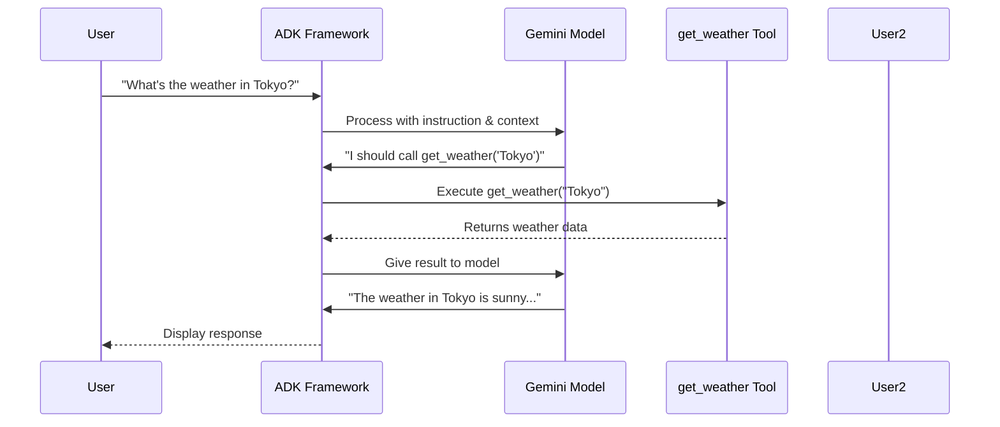

# Chapter 2: Agent Development Kit (ADK)

## From Ideas to Reality: Taking Your Agent Beyond Your Laptop

In [Chapter 1: Vertex AI Agent Engine](01_vertex_ai_agent_engine_.md), you learned that **Vertex AI Agent Engine** is like renting a cloud apartment building for your agent—it handles the infrastructure so your agent runs 24/7 without your laptop.

But here's the question: *What exactly are you deploying to that apartment building?*

That's where **Agent Development Kit (ADK)** comes in. ADK is the toolbox and blueprint system that helps you build agents in a way that's ready for production deployment.

## The Problem: Building Agents That Actually Work

Imagine you're building an AI agent for the first time. You need to make decisions:

- **Where do I organize my code?** (Should my agent be one file or many?)
- **How do I give my agent tools to use?** (How does the agent know what functions it can call?)
- **How do I tell my agent how to behave?** (What if I want it to be friendly vs. professional?)
- **How do I run it locally before deploying?** (How can I test it on my computer?)
- **How do I deploy it so others can use it?** (What format does Agent Engine expect?)

Without a standard framework, everyone would solve these problems differently. Your agent might work great on your machine but fail when deployed.

**ADK solves this by providing a standardized way to build, organize, and deploy agents.**

Think of ADK as a **LEGO instruction manual for building agents**. Instead of figuring out how to stack blocks randomly, you follow a proven pattern that works every time.

## What is ADK, Really?

Agent Development Kit is **a Python framework that handles all the plumbing for you.**[1][2]

Here's what that means:

**Without ADK (doing it manually):**
```
You write code → You handle tool calling → You manage responses → 
You figure out deployment
```

**With ADK (using the framework):**
```
You define: Agent + Tools + Instructions → 
ADK handles: tool calling, responses, running locally, deploying
```

ADK is like the difference between:
- Building a car from individual metal scraps (hard, error-prone)
- Assembling a car from pre-made parts (standardized, reliable)

## The Three Core Ingredients: Agent + Tools + Instructions

Every AI agent needs three things to work. ADK makes it easy to define all three:[1]

### 1. The Agent (The Brain)

This is the language model—the actual AI that thinks and decides what to do. You specify which model to use:

```python
from google.adk.agents import Agent

my_agent = Agent(
    name="weather_bot",
    model="gemini-2.5-flash-lite"  # The AI brain
)
```

**What this means:** You're creating an agent named "weather_bot" powered by Google's Gemini 2.5 Flash Lite model. ADK handles all the complexity of connecting to that model.

### 2. Tools (The Hands)

Tools are functions your agent can call to get information or perform actions.[1] Without tools, your agent can only talk—it can't actually *do* anything.

```python
def get_weather(city: str) -> str:
    """A tool the agent can use"""
    return f"Weather in {city}: Sunny, 72°F"

my_agent = Agent(
    name="weather_bot",
    model="gemini-2.5-flash-lite",
    tools=[get_weather]  # Agent can now call this function
)
```

**What this means:** You defined a `get_weather` function and gave it to your agent. Now when users ask "What's the weather in Tokyo?", your agent can call `get_weather("Tokyo")` to get an answer.

### 3. Instructions (The Personality)

Instructions tell your agent *how* to behave—its personality and rules.[1]

```python
my_agent = Agent(
    name="weather_bot",
    model="gemini-2.5-flash-lite",
    tools=[get_weather],
    instruction="You are a friendly weather assistant. Always respond in a cheerful tone."
)
```

**What this means:** Same agent, same tools, but now it acts friendly instead of robotic.

## A Real Use Case: Building a Weather Assistant

Let's walk through the **complete, minimal example** from Chapter 1's notebook to see how these three ingredients work together:

### Step 1: Create Your Agent File

You create a file called `agent.py` with your agent definition:

```python
from google.adk.agents import Agent

def get_weather(city: str) -> dict:
    """Fetch weather for a city"""
    weather_data = {
        "tokyo": {"report": "Sunny, 72°F"},
        "new york": {"report": "Cloudy, 65°F"}
    }
    return weather_data.get(city.lower(), {"report": "Unknown"})

root_agent = Agent(
    name="weather_assistant",
    model="gemini-2.5-flash-lite",
    description="A helpful weather assistant",
    instruction="You are friendly. When asked about weather, use the get_weather tool.",
    tools=[get_weather]
)
```

**What's happening here:**
- You defined a `get_weather` function (the tool)
- You created an agent with a name, model, instructions, and tools
- ADK will handle the complex stuff (connecting to Gemini, managing tool calls, etc.)

### Step 2: Run It Locally

Before deploying, you test locally using ADK's web interface:

```bash
adk web sample_agent
```

**What happens:** ADK spins up a local website on your computer where you can chat with your agent and see what's happening inside. It's like a testing playground.[2]

### Step 3: Deploy to the Cloud

Once you're happy, you deploy with one command:

```bash
adk deploy agent_engine --project=my-project --region=us-west1 sample_agent
```

**What happens:** ADK packages everything (your code, dependencies, configuration) and sends it to Vertex AI Agent Engine. Your agent is now live on the internet![1]

## How ADK Works Under the Hood

When you ask your deployed agent a question, here's the journey:



Let's break this down:

1. **You send a message** → User asks: "What's the weather in Tokyo?"

2. **ADK prepares everything** → ADK combines:
   - Your instructions ("You are a friendly assistant")
   - Your tools (the `get_weather` function)
   - The user's message
   - Sends this to Gemini

3. **Gemini decides** → The AI model thinks: "The user asked about weather in Tokyo. I have a tool for that. I should call `get_weather('Tokyo')`"

4. **ADK calls the tool** → ADK actually runs `get_weather("Tokyo")` for you

5. **Tool returns data** → `get_weather` returns: `{"report": "Sunny, 72°F"}`

6. **ADK feeds back to Gemini** → ADK tells Gemini the result

7. **Gemini generates response** → Model creates: "The weather in Tokyo is sunny and 72°F!"

8. **ADK returns to you** → You see the friendly response

The key insight: **ADK is the glue that coordinates everything.** Without it, you'd have to manually handle each step yourself.

## The Project Structure: How ADK Expects Files

ADK has an opinion about how you organize your code. This structure is called the **project structure**, and it's important for deployment.[3]

Here's the minimal structure ADK expects:

```
sample_agent/
├── agent.py                    # Your agent definition
├── requirements.txt            # Python packages needed
├── .env                        # Configuration (API keys, etc.)
└── .agent_engine_config.json   # Deployment settings
```

Let's understand each file:

### agent.py: Your Agent Logic

This file defines your agent using ADK's `Agent` class:

```python
from google.adk.agents import Agent

root_agent = Agent(
    name="weather_assistant",
    model="gemini-2.5-flash-lite",
    tools=[get_weather]
)
```

**Why it's called `root_agent`:** Your agent is the "root" of the system—the starting point. When ADK deploys, it looks for an object named `root_agent`.

### requirements.txt: Dependencies

This tells ADK what Python packages to install:

```
google-adk
opentelemetry-instrumentation-google-genai
```

**Why this matters:** When ADK deploys your agent to the cloud, it runs `pip install -r requirements.txt` to install everything needed.

### .env: Configuration

This file stores configuration like API keys:

```
GOOGLE_CLOUD_LOCATION="global"
GOOGLE_GENAI_USE_VERTEXAI=1
```

**Why it's separate:** You don't want to hardcode secrets in your agent.py file. `.env` keeps them organized.

### .agent_engine_config.json: Deployment Settings

This file tells Agent Engine how much compute your agent needs:

```json
{
    "min_instances": 0,
    "max_instances": 1,
    "resource_limits": {"cpu": "1", "memory": "1Gi"}
}
```

**What this means:**
- `min_instances: 0` = "Turn off when nobody's using it" (saves money!)
- `max_instances: 1` = "Never create more than 1 copy"
- `cpu: 1` and `memory: 1Gi` = "Give each copy 1 CPU and 1GB RAM"

## Two Ways to Run Your Agent Locally

Before deploying to the cloud, ADK lets you test locally in two ways:

### Option 1: CLI Interface (Terminal)

```bash
adk run sample_agent
```

**What happens:** You chat with your agent directly in the terminal. Simple and fast for quick testing.[2]

### Option 2: Web Interface (Browser)

```bash
adk web sample_agent
```

**What happens:** ADK opens a website on your computer. You can:
- Chat with your agent in a nice interface
- See all the internal events happening
- Watch tool calls in real-time
- Debug issues easily[2]

The web interface is great for beginners because you can see what's happening!

## Key Concepts You Need to Know

### Concept 1: Agent as a Blueprint

When you define an `Agent` in ADK, you're creating a **blueprint**, not running it yet.

```python
my_agent = Agent(name="weather_bot", ...)  # This is a blueprint
```

You can use this blueprint to:
- Run it locally with `adk run`
- Test it with `adk web`
- Deploy it to the cloud with `adk deploy`

### Concept 2: Tools Are Just Functions

Your agent doesn't know what code is inside your tools. It just knows:
- Tool name: `get_weather`
- What parameters it needs: `city: str`
- What it returns: `dict`

```python
def get_weather(city: str) -> dict:  # Signature tells ADK what to do
    """Fetch weather for a city"""
    return {"temp": 72, "condition": "sunny"}
```

ADK uses this information to decide when and how to call your tool.

### Concept 3: The Root Agent Entry Point

When ADK deploys or runs your agent, it looks for a variable named `root_agent`:

```python
root_agent = Agent(...)  # This must exist!
```

If you name it something else (like `my_agent`), ADK won't find it. Think of `root_agent` as the "main" entry point.

## Common Questions Beginners Ask

**Q: Do I need to understand how Gemini works?**
A: No! ADK abstracts that away. You just define your agent, and ADK handles talking to Gemini.

**Q: Can I use different AI models, not just Gemini?**
A: ADK supports multiple models. Gemini is a good default for beginners. See the [documentation](https://google.github.io/adk-docs/) for other options.

**Q: What if my tool is slow?**
A: Your agent will wait. In production, you can set timeouts to prevent hanging.

**Q: Can my agent use multiple tools?**
A: Yes! Just pass a list: `tools=[get_weather, get_news, get_stocks]`

## Summary: What You've Learned

ADK is a **Python framework that standardizes agent building**. Instead of building agents from scratch, you use ADK's proven patterns:

✅ **Define your agent** with name, model, and instructions
✅ **Add tools** (Python functions) your agent can call
✅ **Test locally** using `adk run` or `adk web`
✅ **Deploy to production** with one command
✅ **Follow the project structure** so deployment works smoothly

The beauty of ADK is that it handles the complicated plumbing—you focus on the interesting part: **what your agent should do and how it should behave.**

---

**Next:** [Chapter 3: Agent Object](03_agent_object_.md) will zoom in on the Agent class itself, showing you exactly how to configure it for different use cases.

---

Generated by [Erwin R. Pasia](https://github.com/erwinpasia/Full-Stack-Data-Science)