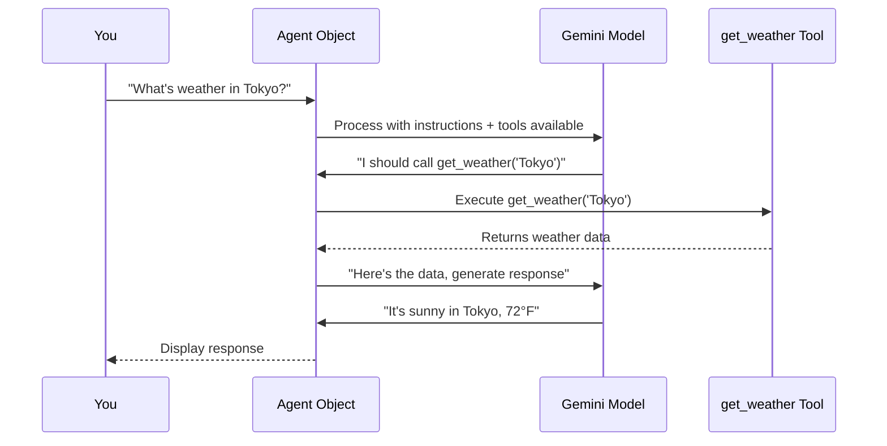

# Chapter 3: Agent Object

In [Chapter 2: Agent Development Kit (ADK)](02_agent_development_kit__adk__.md), you learned that ADK is the framework that standardizes how you build agents. You saw that every agent needs three things: a model, tools, and instructions.

Now it's time to zoom in on the **Agent Object itself**—the actual thing you create and configure. This is the central component that brings everything together.

## The Problem: How Do I Actually Create My AI Assistant?

Imagine you want to build an AI assistant, but you have so many options and decisions:

- Which AI model should power it?
- What tools should it have access to?
- How should it behave and respond?
- What's its personality?
- Can I change these things later?

Without a clear way to organize this, you might scatter these decisions across your code. One file for the model, another for tools, another for instructions. It becomes messy fast.

**The Agent Object solves this problem.** It's a single place where you define **everything about your AI assistant in one organized way.**

Think of the Agent Object like a **person's ID card**. It describes:
- **Who they are** (name)
- **What they're good at** (brain = model)
- **What skills they have** (tools)
- **How they behave** (personality = instructions)

Instead of scattered information, everything about your AI assistant is in one place.

## What is an Agent Object?

An Agent Object is a Python class from ADK that represents your complete AI assistant.[1][2]

Here's the simplest possible Agent:

```python
from google.adk.agents import Agent

my_agent = Agent(
    name="weather_bot",
    model="gemini-2.5-flash-lite"
)
```

**What this creates:** A basic AI assistant named "weather_bot" powered by Google's Gemini 2.5 Flash Lite model. It can think and respond, but it can't do anything special yet.

This is the **Agent Object**—a single Python object that represents your entire AI assistant.

## The Four Core Parts of an Agent Object

Every Agent Object has four main things you can configure:[1][2]

### 1. Name: What is Your Agent Called?

The name is just a label to identify your agent:

```python
my_agent = Agent(
    name="weather_bot"  # Your agent's name
)
```

This name shows up in logs, dashboards, and helps you remember what this agent does.

### 2. Model: What AI Brain Powers It?

The model is the **thinking engine** of your agent. This is the language model that actually generates responses:

```python
my_agent = Agent(
    name="weather_bot",
    model="gemini-2.5-flash-lite"  # The AI brain
)
```

**What this means:** You're choosing which AI model to use. Different models have different strengths:
- `gemini-2.5-flash-lite` → Fast and cheap (good for chatbots)
- `gemini-2.0-pro` → More powerful but slower (good for complex reasoning)

Think of it like choosing between a fast car and a powerful truck. For most beginners, `gemini-2.5-flash-lite` is perfect.

### 3. Tools: What Can Your Agent Do?

Tools are Python functions your agent can call to get information or perform actions.[1]

```python
def get_weather(city: str) -> str:
    """Get weather for a city"""
    return f"Weather in {city}: Sunny"

my_agent = Agent(
    name="weather_bot",
    model="gemini-2.5-flash-lite",
    tools=[get_weather]  # Agent can now use this tool
)
```

**What this means:** You're giving your agent **hands** to interact with the world. Without tools, your agent can only talk. With tools, it can:
- Look up information
- Call other systems
- Perform calculations
- Actually accomplish tasks

When a user asks "What's the weather?", your agent can call `get_weather()` to get a real answer.

### 4. Instructions: What's Your Agent's Personality?

Instructions are a text description of **how your agent should behave**.[1]

```python
my_agent = Agent(
    name="weather_bot",
    model="gemini-2.5-flash-lite",
    tools=[get_weather],
    instruction="You are a friendly weather assistant. Always be cheerful and helpful."
)
```

**What this means:** You're giving your agent a **personality and rules**. The same agent with the same tools can behave differently based on instructions:

**Friendly version:**
```
instruction="Be cheerful and use emojis!"
```
Output: "🌞 The weather in Tokyo is sunny! Hope you have a great day!"

**Professional version:**
```
instruction="Respond formally and concisely."
```
Output: "Tokyo weather: Sunny. 72°F."

Same agent, different personalities!

## A Complete Real-World Example

Let's see all four parts working together:

```python
from google.adk.agents import Agent

def get_weather(city: str) -> dict:
    """Fetch weather data"""
    weather_db = {
        "tokyo": {"temp": 72, "condition": "sunny"},
        "london": {"temp": 58, "condition": "rainy"}
    }
    return weather_db.get(city.lower(), {"error": "Unknown city"})

my_weather_agent = Agent(
    name="friendly_weather_bot",                    # 1. Name
    model="gemini-2.5-flash-lite",                 # 2. Model
    tools=[get_weather],                            # 3. Tools
    instruction="""You are a friendly weather assistant.
    When users ask about weather:
    1. Use the get_weather tool to find the answer
    2. Respond in a warm, helpful tone
    3. If the city isn't found, suggest alternatives"""
)
```

**What you've created:**
- An agent named "friendly_weather_bot"
- Powered by Gemini
- Can call the `get_weather` function
- Has instructions to be friendly and helpful

Now when someone asks "What's the weather in Tokyo?", your agent will:
1. Read the instructions (be friendly)
2. Decide to call `get_weather("tokyo")`
3. Get the result `{"temp": 72, "condition": "sunny"}`
4. Generate a friendly response like: "🌞 It's beautiful in Tokyo! 72°F and sunny!"

## How Agent Objects Work Under the Hood

When you send a message to your Agent Object, here's the journey:



**Step-by-step:**

1. **User asks question** → "What's the weather in Tokyo?"

2. **Agent receives input** → Agent Object takes your message

3. **Agent prepares context** → Agent combines:
   - Your instructions (personality)
   - Available tools (what it can do)
   - Your question

4. **Model decides** → Gemini thinks: "The user asked about Tokyo weather. I have a `get_weather` tool. I should use it."

5. **Agent calls tool** → Agent Object actually executes `get_weather("Tokyo")`

6. **Tool returns data** → Gets back `{"temp": 72, "condition": "sunny"}`

7. **Agent re-feeds to model** → "Here's the weather data. Now generate a friendly response."

8. **Model generates response** → "It's 72°F and sunny in Tokyo!"

9. **Agent returns to user** → You see the answer

**The key insight:** The Agent Object is the **orchestrator**—it coordinates between the model, your tools, and the user.

## The Agent Object in Code: Implementation Details

When you create an Agent Object using ADK, here's what happens internally.[2]

### Creating an Agent

```python
from google.adk.agents import Agent

my_agent = Agent(
    name="weather_bot",
    model="gemini-2.5-flash-lite",
    tools=[get_weather]
)
```

**What ADK does behind the scenes:**

1. **Validates your inputs** → Checks that the model name exists, tools are callable functions
2. **Registers your tools** → Creates a tool registry so the model knows what functions are available
3. **Stores your configuration** → Saves name, model, instructions in memory
4. **Creates the object** → `my_agent` is now a Python object ready to use

### Using the Agent Object

When you ask your agent a question:

```python
response = my_agent.stream_query(
    message="What's the weather in Tokyo?"
)
```

**What ADK does:**

1. **Receives your message**
2. **Calls Gemini with context** → Sends to the model: "You have these tools: [get_weather]. Instructions: [your instructions]. User asked: [message]"
3. **Monitors for tool calls** → Listens for Gemini to say "call get_weather('Tokyo')"
4. **Executes tools** → Actually runs your Python function
5. **Feeds results back** → Shows results to Gemini: "get_weather returned this data"
6. **Returns final response** → Streams the final answer back to you

## The Agent Object's Properties

Once you create an Agent Object, you can access and inspect its configuration:

```python
# See what your agent is configured with
print(my_agent.name)           # Output: "weather_bot"
print(my_agent.model)          # Output: "gemini-2.5-flash-lite"
print(my_agent.tools)          # Output: [<function get_weather>]
```

**Why this matters:** You can inspect your agent's configuration at any time. This is useful for debugging: "Why isn't my agent calling the tool? Let me check if the tool is registered."

## Different Types of Agents

You can create different kinds of agents by changing the configuration. They all use the same Agent Object class:

### Simple Chatbot (No Tools)

```python
chatbot = Agent(
    name="chatbot",
    model="gemini-2.5-flash-lite",
    instruction="Be friendly and conversational"
)
```

This agent can only chat—no special tools.

### Information Retriever (Multiple Tools)

```python
info_agent = Agent(
    name="research_assistant",
    model="gemini-2.5-flash-lite",
    tools=[search_web, lookup_database, read_pdf],
    instruction="Help users find information from multiple sources"
)
```

This agent can access three different tools.

### Professional Assistant (Strict Instructions)

```python
professional = Agent(
    name="customer_support",
    model="gemini-2.0-pro",  # More powerful model
    tools=[lookup_order, process_refund],
    instruction="""You are a customer support agent.
    - Always be professional
    - Never make promises you can't keep
    - Escalate complex issues
    - Follow company policies exactly"""
)
```

This agent has strict rules to follow.

## Customizing Your Agent Object

You can customize more than just the four main parts. Here are additional options:[1]

```python
my_agent = Agent(
    name="weather_bot",
    model="gemini-2.5-flash-lite",
    tools=[get_weather],
    instruction="Be friendly",
    description="Provides weather information",  # For documentation
    enable_web_search=True,                      # Can search the web
    temperature=0.7  # Controls creativity (0=factual, 1=creative)
)
```

**What these mean:**
- `description` → Explains what your agent does (useful in dashboards)
- `enable_web_search` → Agent can search the internet for current information
- `temperature` → Controls how "creative" responses are. For weather, you want low (factual). For creative writing, you want high.

## Common Beginner Questions

**Q: Can I change my agent after creating it?**
A: Yes! You can update the configuration and redeploy. See [Chapter 2: Agent Development Kit (ADK)](02_agent_development_kit__adk__.md) for deployment details.

**Q: What happens if I give my agent wrong instructions?**
A: Your agent will follow them! If you say "Always respond in 3 words," it will try. Instructions are powerful—use them carefully.

**Q: Can I use the same agent object twice?**
A: Yes! You can reuse an Agent Object for multiple conversations. Each conversation is separate.

```python
response1 = my_agent.stream_query(message="Weather in Tokyo?")
response2 = my_agent.stream_query(message="Weather in London?")
# Both use the same agent configuration
```

**Q: What's the difference between `name` and `description`?**
A: `name` is the identifier (used in code, logs, dashboards). `description` explains what it does (shown to users or in documentation).

## Summary: What You've Learned

The **Agent Object** is the central component that represents your complete AI assistant. It brings together:

✅ **Name** → What to call your agent
✅ **Model** → The AI brain powering it
✅ **Tools** → What functions it can call
✅ **Instructions** → How it should behave

Once you create an Agent Object, you have a complete, configured AI assistant ready to answer questions and accomplish tasks.

The beauty is **simplicity**: Instead of managing five separate configurations, you have one unified object that represents your entire agent.

---

**Next:** [Chapter 4: Tools](04_tools_.md) will teach you how to create powerful tools that your agents can use to interact with the world.

---

Generated by [Erwin R. Pasia](https://github.com/erwinpasia/Full-Stack-Data-Science)