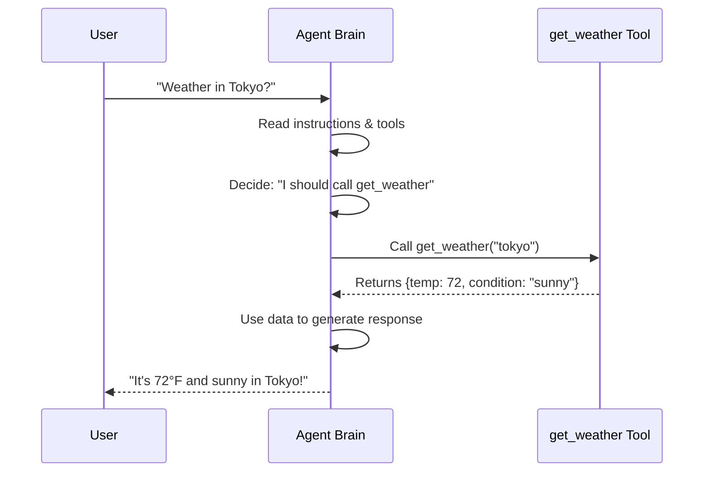

# Chapter 4: Tools

In [Chapter 3: Agent Object](03_agent_object_.md), you learned how to create an Agent with a name, model, and instructions. You now have an AI assistant that can think and respond intelligently.

But here's the problem: **Your agent can only talk. It can't actually do anything.**

Imagine you ask your agent "What's the weather in Tokyo?" Without tools, your agent can only guess or make something up. It can't look up real weather information. It can't call a database, search the web, or perform calculations. It's like having a smart friend who can only give opinions—not someone who can actually accomplish tasks.

**Tools solve this problem.** Tools are Python functions that give your agent **hands** to interact with the real world.[1][2] They bridge the gap between what your agent knows (language understanding) and what it can do (real-world actions).

## The Problem: From Talking to Doing

Let's make this concrete with an example.

**Without tools:**
```
User: "What's the weather in Tokyo?"
Agent: "Uh... I think it's probably nice? Maybe sunny?"
User: "That's not helpful..."
```

**With tools:**
```
User: "What's the weather in Tokyo?"
Agent: "Let me check for you..." → Calls get_weather("Tokyo") → Gets real data
Agent: "It's 72°F and sunny in Tokyo!"
User: "Perfect!"
```

The difference? **Tools let your agent take action instead of just guessing.**

## What is a Tool, Really?

A tool is simply **a Python function that your agent can call when it needs to.**[1][2]

Think of your agent as a person with a toolbox. Each tool in the toolbox does one specific job:

- `get_weather()` → Looks up weather
- `send_email()` → Sends an email
- `lookup_database()` → Searches a database
- `calculate_total()` → Performs math

When your agent needs to accomplish something, it grabs the right tool from the toolbox and uses it.

Here's the simplest possible tool:

```python
def get_weather(city: str) -> str:
    """Get weather for a city"""
    return f"Weather in {city}: Sunny, 72°F"
```

**What this is:** A simple Python function that takes a city name and returns weather information. That's a tool! Nothing magical—just a regular function.

## The Three Parts of a Tool

Every useful tool has three parts. Let's break them down using our weather example:

### 1. The Function Name

The function name tells your agent what the tool does:

```python
def get_weather(city: str) -> str:  # Name is "get_weather"
    ...
```

Your agent reads this name and thinks: "Oh, this tool gets weather information. I should use it when someone asks about weather."

### 2. The Parameters (What Information Does It Need?)

Parameters are the input your tool needs:

```python
def get_weather(city: str) -> str:
              # ^^^ Parameter: the tool needs a city name (str type)
    ...
```

Your agent knows: "To use this tool, I need to provide a city name as text."

### 3. The Return Type (What Information Does It Give Back?)

The return type is the output your tool provides:

```python
def get_weather(city: str) -> str:
                            # ^^^ Returns a string
    return f"Weather in {city}: Sunny, 72°F"
```

Your agent knows: "This tool will give me back a text string with weather information."

## A Real-World Example: Weather Assistant with Tools

Let's build the example from the provided notebook. Here's how to create a tool:

```python
def get_weather(city: str) -> dict:
    """Returns weather information for a given city"""
    weather_data = {
        "tokyo": {"temp": 72, "condition": "sunny"},
        "london": {"temp": 58, "condition": "rainy"}
    }
    return weather_data.get(city.lower(), 
                           {"error": "City not found"})
```

**What this does:**
- Takes a city name as input
- Looks it up in a dictionary (mock data)
- Returns the weather info as a dictionary
- If the city doesn't exist, returns an error

Now you give this tool to your agent:

```python
from google.adk.agents import Agent

my_agent = Agent(
    name="weather_bot",
    model="gemini-2.5-flash-lite",
    tools=[get_weather],  # Add your tool here
    instruction="Help users find weather"
)
```

**What happens:** Your agent now knows about the `get_weather` tool and can call it when needed.

## How Tools Work: The Journey of a Question

When a user asks your agent a question, here's what happens internally:



**Let me explain each step:**

1. **User asks a question** → "Weather in Tokyo?"

2. **Agent reads its instructions** → "I'm a weather assistant, I should help with weather"

3. **Agent looks at available tools** → "I have `get_weather` function"

4. **Agent decides to use the tool** → "The user asked about weather, I should call `get_weather('tokyo')`"

5. **Agent calls your Python function** → Your `get_weather()` function actually runs

6. **Tool returns data** → `get_weather()` returns the weather dictionary

7. **Agent processes the data** → Reads the dictionary and creates a response

8. **Agent responds naturally** → "It's 72°F and sunny in Tokyo!"

**The key insight:** Your agent is smart enough to decide when to use a tool and how to use it. You just define the tool—ADK (Agent Development Kit) handles calling it at the right time.

## Under the Hood: How ADK Makes Tools Work

When you add a tool to your agent, ADK does several things automatically:

```python
root_agent = Agent(
    name="weather_bot",
    model="gemini-2.5-flash-lite",
    tools=[get_weather]  # ADK inspects this function
)
```

**What ADK does internally:**

1. **Reads the function signature** → Sees `get_weather(city: str) -> dict`

2. **Extracts the function name** → `"get_weather"`

3. **Extracts parameter names and types** → `city: str`

4. **Extracts return type** → `dict`

5. **Reads the docstring** → `"Returns weather information for a given city"`

6. **Tells the Gemini model about it** → Sends information like:
   - "You have a tool called `get_weather`"
   - "It takes one parameter: `city` (text)"
   - "It returns weather data"
   - "Use it when users ask about weather"

The Gemini model now knows about your tool and can decide when to use it.

When the model decides to use your tool, ADK:

1. **Intercepts the tool call** → "Model wants to call `get_weather('tokyo')`"

2. **Validates the parameters** → "Is 'tokyo' actually a string? Yes ✓"

3. **Runs your function** → Executes `get_weather("tokyo")`

4. **Captures the result** → Gets `{"temp": 72, "condition": "sunny"}`

5. **Shows the result to the model** → "Here's what the tool returned"

6. **Model generates a response** → Uses the data to answer the user

## Creating Different Types of Tools

Tools can do many different things. Here are some examples:

### Tool 1: Simple Information Lookup

```python
def get_stock_price(symbol: str) -> float:
    """Get current stock price"""
    prices = {"AAPL": 150.25, "GOOGL": 2800.50}
    return prices.get(symbol, None)
```

**What it does:** Returns a single number (stock price)

### Tool 2: Performing Actions

```python
def send_message(recipient: str, text: str) -> bool:
    """Send a message to someone"""
    # In real code, this would actually send a message
    print(f"Message sent to {recipient}: {text}")
    return True
```

**What it does:** Takes action (sends a message) and returns success/failure

### Tool 3: Searching Information

```python
def search_documents(query: str) -> list:
    """Search company documents"""
    # In real code, this would query a database
    results = [f"Document about {query}", "Another match"]
    return results
```

**What it does:** Searches and returns multiple results as a list

### Tool 4: Complex Calculations

```python
def calculate_loan_payment(principal: float, 
                          rate: float, 
                          months: int) -> dict:
    """Calculate monthly loan payment"""
    monthly_rate = rate / 100 / 12
    payment = principal * monthly_rate / (1 - (1 + monthly_rate) ** -months)
    return {"monthly_payment": payment, "total_paid": payment * months}
```

**What it does:** Takes multiple inputs, performs calculations, returns detailed results

## Common Tool Patterns

### Pattern 1: Data Lookup (Most Common)

Your agent needs information that isn't in its training data:

```python
def lookup_order(order_id: str) -> dict:
    """Look up an order in the database"""
    # Query your database
    return {"status": "shipped", "estimated_delivery": "Dec 5"}
```

### Pattern 2: Calling External APIs

Your agent needs to call another service:

```python
def get_weather_from_api(city: str) -> dict:
    """Call the weather API"""
    import requests
    response = requests.get(f"https://api.weather.com/{city}")
    return response.json()
```

### Pattern 3: Performing Calculations

Your agent needs to do math:

```python
def calculate_discount(price: float, discount_percent: float) -> float:
    """Calculate final price after discount"""
    return price * (1 - discount_percent / 100)
```

## Best Practices: Writing Good Tools

### 1. Clear Names

```python
# ✅ Good - name describes what it does
def get_weather(city: str) -> dict:
    pass

# ❌ Bad - vague name
def do_stuff(x: str) -> dict:
    pass
```

### 2. Strong Type Hints

```python
# ✅ Good - clear input and output types
def send_email(recipient: str, subject: str) -> bool:
    pass

# ❌ Bad - no type hints
def send_email(recipient, subject):
    pass
```

### 3. Helpful Docstrings

```python
# ✅ Good - explains what it does and when to use it
def get_weather(city: str) -> dict:
    """Get current weather for a city.
    
    Use this when users ask about weather conditions.
    """
    pass

# ❌ Bad - no documentation
def get_weather(city: str) -> dict:
    pass
```

### 4. Error Handling

```python
# ✅ Good - handles invalid input gracefully
def get_weather(city: str) -> dict:
    if not city or not isinstance(city, str):
        return {"error": "Invalid city name"}
    return weather_data.get(city.lower(), 
                           {"error": "City not found"})

# ❌ Bad - crashes on bad input
def get_weather(city: str) -> dict:
    return weather_data[city]  # Crashes if city not in dict
```

## Debugging Tools: What If Something Goes Wrong?

When your tool isn't working, here are common issues:

### Issue 1: Tool Not Being Called

**Problem:** You added a tool but the agent never uses it.

**Cause:** The agent doesn't think it's relevant. Check your tool's docstring and instructions.

**Solution:**
```python
def get_weather(city: str) -> str:
    """Get WEATHER information for a city.
    
    Call this when users ask about WEATHER, temperature, 
    rain, sunny, forecast, etc.
    """
    ...
```

Clearer docstring = agent knows when to use it!

### Issue 2: Tool Returns Wrong Format

**Problem:** The agent gets confused by the tool's output.

**Cause:** Your return type doesn't match what you actually return.

**Solution:** Make sure what you return matches your type hint:

```python
# ❌ Wrong - says it returns str but returns dict
def get_weather(city: str) -> str:
    return {"temp": 72}  # This is a dict, not a str!

# ✅ Correct
def get_weather(city: str) -> dict:
    return {"temp": 72}  # Now it matches!
```

## Putting It All Together: Complete Example

Let's look at the example from the provided notebook with all the pieces:

```python
from google.adk.agents import Agent

# Step 1: Define your tool
def get_weather(city: str) -> dict:
    """Returns weather info for a city"""
    weather_data = {
        "tokyo": {"temp": 72, "condition": "sunny"},
        "london": {"temp": 58, "condition": "rainy"}
    }
    return weather_data.get(city.lower(), 
                           {"error": "Unknown city"})

# Step 2: Create your agent with the tool
root_agent = Agent(
    name="weather_assistant",
    model="gemini-2.5-flash-lite",
    tools=[get_weather],  # Include your tool
    instruction="Help users find weather"
)
```

**What you've created:**
- An agent with one tool (`get_weather`)
- The agent can call this tool when users ask about weather
- The tool looks up real data and returns it
- The agent uses the data to answer naturally

When someone asks "Weather in Tokyo?", the agent:
1. Sees the question
2. Decides to use `get_weather`
3. Calls it with `"tokyo"`
4. Gets `{"temp": 72, "condition": "sunny"}`
5. Responds: "It's 72°F and sunny in Tokyo!"

## Summary: What You've Learned

**Tools** are Python functions that give your agent the ability to do real work:

✅ **Define functions** → Write regular Python functions

✅ **Add type hints** → Specify input and output types

✅ **Write docstrings** → Explain what the tool does

✅ **Include in agent** → Pass `tools=[...]` to your Agent

✅ **Agent uses automatically** → ADK orchestrates tool calls

The beauty of tools is **simplicity with power**: You write simple Python functions, and your agent automatically learns when and how to use them.

---

**Next:** [Chapter 5: Environment Configuration (.env)](05_environment_configuration___env__.md) will teach you how to safely manage configuration and secrets that your agent needs to run.

---

Generated by [Erwin R. Pasia](https://github.com/erwinpasia/Full-Stack-Data-Science)