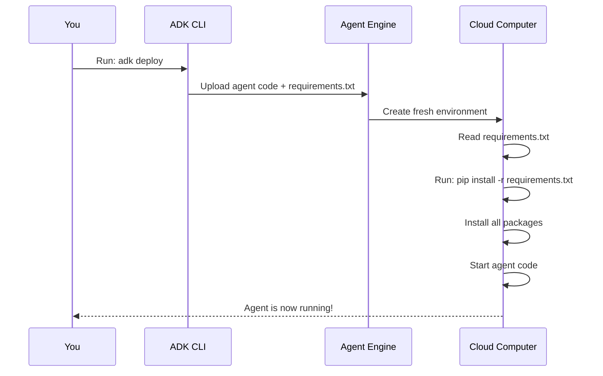

# Chapter 6: Requirements Management

In [Chapter 5: Environment Configuration (.env)](05_environment_configuration___env__.md), you learned how to safely store secrets and configuration settings your agent needs. Your agent knows *what* values to use (API keys, cloud locations, etc.).

But here's a new problem: **Your agent depends on Python packages to run, and you need to tell the cloud exactly which ones to install.**

Imagine you're preparing to deploy your weather agent to the cloud. Your agent code uses functions from libraries like `google-adk` and `opentelemetry-instrumentation-google-genai`. Your laptop has these installed, so your agent works perfectly locally. But when Agent Engine tries to run your agent on a fresh cloud computer, those libraries don't exist. Your agent crashes immediately.[1][3]

**How does Agent Engine know what packages to install?** Through a `requirements.txt` file—a simple list that declares: "Hey cloud, please install these Python packages before running my agent."[1]

Think of `requirements.txt` as a **recipe's ingredient list**. Just like a baker writes down "2 cups flour, 1 egg, 1 cup sugar" so anyone can recreate the recipe, you write down "google-adk==0.5.0, opentelemetry==1.2.3" so any machine can recreate your agent's environment.[1][3]

## The Problem: From Local Success to Cloud Failure

Let's make this concrete.

**On your laptop (it works!):**
```bash
# You've installed packages manually
pip install google-adk
pip install opentelemetry-instrumentation-google-genai

# Your agent runs perfectly
python agent.py
```

**In the cloud (it crashes!):**
```
❌ ModuleNotFoundError: No module named 'google'
❌ ModuleNotFoundError: No module named 'opentelemetry'
```

**Why?** The cloud computer is brand new. It doesn't have these packages. It doesn't know your agent needs them.

**Solution: `requirements.txt`**

With a `requirements.txt` file, the deployment works:

```bash
# Agent Engine reads requirements.txt
pip install -r requirements.txt

# All packages installed automatically ✅
# Your agent runs perfectly
```

## What is `requirements.txt`, Really?

A `requirements.txt` file is simply **a text file listing Python packages your agent needs, one per line.**[1]

Here's the simplest possible `requirements.txt`:

```
google-adk
opentelemetry-instrumentation-google-genai
```

**What this is:** Two package names. That's it! Nothing complicated—just a list.

When you deploy your agent, Agent Engine reads this file and runs:

```bash
pip install -r requirements.txt
```

This command tells `pip` (Python's package manager): "Install everything listed in this file." It's like giving someone a shopping list—they know exactly what to buy.

## The Three Core Concepts

Every `requirements.txt` file has three important ideas:

### 1. Package Names (What Packages Does Your Agent Use?)

Each line lists a package your agent depends on:[1]

```
google-adk
opentelemetry-instrumentation-google-genai
requests
```

**What this means:** Your agent needs three packages: `google-adk`, `opentelemetry-instrumentation-google-genai`, and `requests`. Without these, your agent code won't work.

### 2. Exact Versions (Which Version Should Be Installed?)

You can specify exact versions to ensure reproducibility:[1]

```
google-adk==0.5.0
opentelemetry-instrumentation-google-genai==0.47b0
requests==2.31.0
```

**Why this matters:** Package versions change over time. Version 0.5.0 might work perfectly with your agent, but version 0.6.0 might have breaking changes. By specifying exact versions, you guarantee your agent works the same way everywhere.

### 3. Installation Command (How Does the Cloud Know to Install These?)

During deployment, Agent Engine automatically runs:[1]

```bash
pip install -r requirements.txt
```

**What this does:** Installs every package listed in your file, with exact versions if specified.

## A Real-World Example: Your Weather Agent's Dependencies

Let's see what your weather agent from the provided notebook needs:[1]

```
google-adk
opentelemetry-instrumentation-google-genai
```

**What each package does:**

- `google-adk` → The Agent Development Kit framework (lets you build agents)
- `opentelemetry-instrumentation-google-genai` → Tracing and monitoring (helps you debug)

When Agent Engine deploys your weather agent, it reads this list and installs both packages before starting your agent code.

## How `requirements.txt` Works: The Journey

When you deploy your agent, here's what happens internally:



**Let me explain each step:**

1. **You deploy** → Run `adk deploy agent_engine ...`

2. **ADK packages everything** → ADK reads your `requirements.txt` file

3. **Uploads to Agent Engine** → Your code, requirements, and config go to the cloud

4. **Agent Engine creates a fresh computer** → A brand-new machine with nothing installed

5. **Read requirements** → Agent Engine reads your `requirements.txt` file

6. **Install packages** → Runs `pip install -r requirements.txt` automatically

7. **Install completed** → All packages are now ready

8. **Start your agent** → Runs your agent code with all dependencies available

9. **Agent is live** → Your agent can now handle requests

**The key insight:** `requirements.txt` is like a shopping list that Agent Engine reads automatically during deployment. It ensures your agent gets everything it needs before it starts.

## Creating Your First `requirements.txt` File

Let's create a `requirements.txt` file for your project.[1][3][4]

### Method 1: Write It Manually (Recommended for Learning)

Simply create a text file named `requirements.txt` and list the packages:

```
google-adk
opentelemetry-instrumentation-google-genai
```

**Why this is great:** You know exactly what's in your file. No surprises.

### Method 2: Auto-Generate From Your Installed Packages

If you've already installed packages on your laptop, you can automatically capture them:[1][3][4]

```bash
pip freeze > requirements.txt
```

**What this does:** Creates a snapshot of every package installed in your current environment.

**Output example:**
```
google-adk==0.5.0
opentelemetry-instrumentation-google-genai==0.47b0
requests==2.31.0
certifi==2024.2.2
charset-normalizer==3.3.2
idna==3.6
urllib3==2.1.0
```

**Note:** This includes *everything* installed, even packages you don't need. For production, it's better to manually list only your actual dependencies.

## Where Should `requirements.txt` Live?

In your agent project structure, `requirements.txt` goes at the root level:[1]

```
sample_agent/
├── agent.py                    # Your agent code
├── requirements.txt            # Python dependencies ← HERE
├── .env                        # Configuration
└── .agent_engine_config.json   # Deployment settings
```

When you run `adk deploy`, ADK looks for `requirements.txt` in your project folder and includes it automatically.

## Common Requirements Patterns

### Pattern 1: Minimal (Only What You Need)

```
google-adk
opentelemetry-instrumentation-google-genai
```

**Best for:** Production. Keeps deployment size small, faster startup.

### Pattern 2: With Exact Versions (Production-Safe)

```
google-adk==0.5.0
opentelemetry-instrumentation-google-genai==0.47b0
requests==2.31.0
```

**Best for:** Production deployments where you want consistency across machines.

### Pattern 3: With Version Ranges (Flexible)

```
google-adk>=0.5.0
opentelemetry-instrumentation-google-genai>=0.47b0
requests>=2.31.0
```

**Best for:** Development. Allows newer versions while ensuring minimum compatibility.

## Best Practices: Writing Good `requirements.txt` Files

### Practice 1: List Only Your Actual Dependencies

```
# ✅ Good - only packages your agent uses
google-adk
opentelemetry-instrumentation-google-genai

# ❌ Bad - includes unrelated packages
numpy
pandas
matplotlib
scipy
scikit-learn
```

Your agent only uses the top two. The others are just clutter.

### Practice 2: Use Exact Versions in Production

```
# ✅ Good for production
google-adk==0.5.0
requests==2.31.0

# ⚠️ Risky for production
google-adk
requests
```

Exact versions prevent surprises when new versions are released.

### Practice 3: Add Comments to Explain Why Packages Are Needed

```
# Core ADK framework
google-adk

# Monitoring and observability
opentelemetry-instrumentation-google-genai

# HTTP requests for calling APIs
requests
```

Future developers (including yourself!) will understand why each package is there.

### Practice 4: Keep Version Numbers Updated

```bash
# Check for outdated packages
pip list --outdated

# Update a specific package
pip install --upgrade google-adk
```

Periodically update to get bug fixes and improvements (but test thoroughly!).

## Understanding Deployment: What Happens Inside

When you run the `adk deploy` command from the provided notebook:

```bash
adk deploy agent_engine --project=$PROJECT_ID --region=$deployed_region sample_agent
```

Here's what ADK does with `requirements.txt`:[1]

1. **Reads your `requirements.txt`** → Parses all package lines

2. **Validates packages** → Checks each package exists on PyPI (Python Package Index)

3. **Creates deployment package** → Includes your code + requirements

4. **Uploads to Agent Engine** → Sends everything to Google Cloud

5. **Builds container** → Creates a Docker container with your agent

6. **Installs packages** → Runs `pip install -r requirements.txt` inside the container

7. **Starts agent** → Your agent runs with all dependencies ready

**The key point:** `requirements.txt` is automatically read and processed. You don't manually install anything in the cloud—Agent Engine does it for you.

## Debugging `requirements.txt` Problems

### Problem 1: Missing Package

**Error:**
```
ModuleNotFoundError: No module named 'requests'
```

**Cause:** You used `requests` in your code but forgot to add it to `requirements.txt`.

**Solution:** Add it!
```
google-adk
opentelemetry-instrumentation-google-genai
requests
```

### Problem 2: Wrong Package Name

**Error:**
```
ERROR: Could not find a version that satisfies the requirement 'request'
```

**Cause:** Package name is wrong. It's `requests`, not `request`.

**Solution:** Check the correct name on [PyPI.org](https://pypi.org):
```
google-adk
requests  # Correct spelling
```

### Problem 3: Version Conflict

**Error:**
```
ERROR: pip's dependency resolver does not currently take into account...
```

**Cause:** Two packages require conflicting versions of the same dependency.

**Solution:** Update to compatible versions:
```
# Instead of
google-adk==0.4.0  # Needs requests==2.28.0
requests==2.31.0   # Conflicts!

# Use compatible versions
google-adk==0.5.0  # Works with requests==2.31.0
requests==2.31.0
```

## Your First Deployment: Putting It All Together

From the provided notebook, here's the complete setup:[1]

**Step 1: Create project directory**
```bash
mkdir sample_agent
```

**Step 2: Write `requirements.txt`**
```
google-adk
opentelemetry-instrumentation-google-genai
```

**Step 3: Write your agent code** (in `agent.py`)

**Step 4: Deploy**
```bash
adk deploy agent_engine --project=my-project sample_agent
```

**What happens:** Agent Engine reads your `requirements.txt`, installs both packages, and starts your agent. Everything works because all dependencies are ready!

## Summary: What You've Learned

**`requirements.txt` is your dependency declaration file:**

✅ **List packages** → Write package names, one per line
✅ **Specify versions** → Use `package==1.0.0` for exact versions
✅ **Deploy automatically** → Agent Engine reads it and installs everything
✅ **Ensure reproducibility** → Same packages everywhere (laptop, staging, production)
✅ **Keep it simple** → Only list packages your agent actually uses

The beauty of `requirements.txt` is that it **standardizes package management**. Instead of each developer manually installing packages (and forgetting things), you have one file that defines everything. When you deploy, the cloud reads this file and automatically creates the exact same environment every time.[1][3][4]

---

**Next:** [Chapter 7: Deployment Configuration](07_deployment_configuration_.md) will teach you how to configure hardware resources (CPU, memory, scaling rules) for your deployed agent.

---

Generated by [Erwin R. Pasia](https://github.com/erwinpasia/Full-Stack-Data-Science)