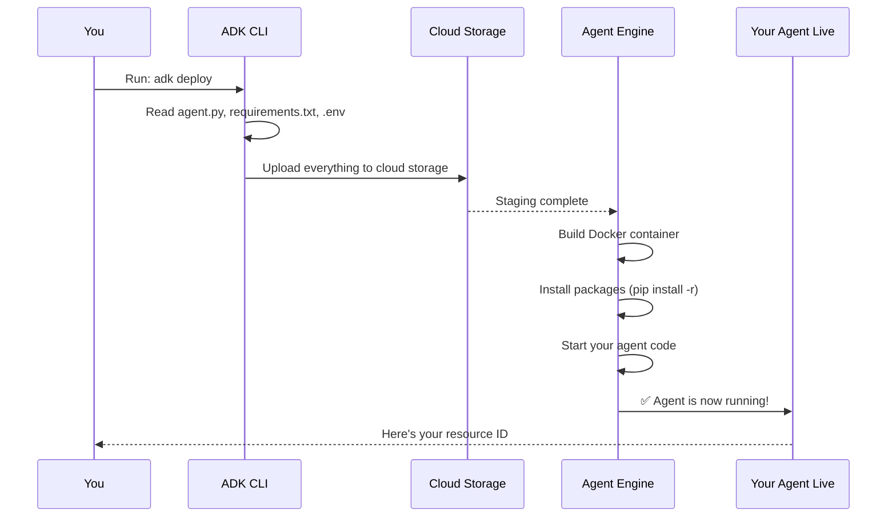

# Chapter 8: Agent Deployment Process

In [Chapter 7: Deployment Configuration](07_deployment_configuration_.md), you learned how to configure the hardware resources and scaling rules your agent needs in the cloud. You've created a blueprint describing "how much compute power" your agent should get.

But here's the moment of truth: **How do you actually take your agent from your laptop and make it live on the internet?**

Imagine you've built an amazing restaurant in your kitchen at home. You've perfected the recipes, trained your cooking techniques, and everything works perfectly. But your friends can't taste it—it only exists in your home! To let others enjoy your food, you need to **move your restaurant to a public location, set up the infrastructure, hire staff, and handle the traffic.**

**The Agent Deployment Process is exactly this.** It's the step-by-step workflow that takes your local agent code and transforms it into a publicly accessible service running in the cloud.[1][2]

Think of deployment as **publishing a book**. You write locally (agent code). You send to a publisher (Agent Engine). Readers everywhere can now access it (your agents' users).

## The Problem: From Testing to Production

Let's make this concrete with a real scenario.

**On your laptop (development):**
```
✅ Your agent works perfectly
✅ You can chat with it
✅ Tools execute correctly
```

**But:**
```
❌ Only YOU can use it
❌ If your laptop sleeps, it stops
❌ If 100 people try to use it, it crashes
❌ Nobody on the internet can access it
```

**What you need:**
```
✅ Run 24/7 without your laptop
✅ Handle 100+ users simultaneously
✅ Give users a URL to access it
✅ Automatic restarts if something fails
✅ Detailed logs to debug problems
```

**The deployment process solves all of this.** In a few commands, your local agent becomes a globally accessible service.

## What is Agent Deployment, Really?

Agent Deployment is **the automated process of packaging your agent code, uploading it to the cloud, and starting it running on infrastructure managed by Google Cloud.**[1][2]

Here's what "deployment" includes:

1. **Package your code** → Bundle agent.py, requirements.txt, .env, config into a container
2. **Upload to cloud** → Send everything to Google Cloud Storage
3. **Build environment** → Install Python packages (from requirements.txt)
4. **Start service** → Run your agent on cloud hardware
5. **Get URL** → Your agent is now publicly accessible

The key insight: **You don't manually do any of this.** One command does everything automatically.

## The Three Core Steps of Deployment

Every deployment follows the same pattern. Let me break down each step:

### Step 1: Prepare Your Agent (Package Everything)

Before deploying, you organize all your agent files into one folder with the right structure:[1]

```
sample_agent/
├── agent.py                    # Your agent code
├── requirements.txt            # Python dependencies
├── .env                        # Configuration
└── .agent_engine_config.json   # Hardware specs
```

**What this means:** You've already done this in previous chapters! These four files contain everything your agent needs to run in production.

### Step 2: Run the Deploy Command (Upload to Cloud)

You tell ADK to deploy your agent with one command:[1]

```bash
adk deploy agent_engine \
    --project=my-cloud-project \
    --region=us-central1 \
    sample_agent
```

**What this does:** ADK takes your entire `sample_agent` folder and uploads it to Agent Engine in Google Cloud.

### Step 3: Agent Engine Builds and Starts It (Cloud Takes Over)

Agent Engine automatically:

1. Creates a Docker container (a standardized package)
2. Installs all Python packages (from requirements.txt)
3. Loads configuration (from .env)
4. Starts your agent running
5. Gives you a URL to access it

**You don't do any of this manually—it's all automatic.**

## The Journey of Deployment: From Laptop to Live

Let me trace what happens when you deploy. Here's the complete flow:



**Let me explain each step:**

1. **You run the command** → `adk deploy agent_engine ...`

2. **ADK prepares your files** → Reads all your agent files from the local folder

3. **Upload to staging area** → ADK uploads everything to Google Cloud Storage (a temporary holding area)

4. **Agent Engine receives it** → Google Cloud's Agent Engine service detects the upload

5. **Build container** → Agent Engine creates a Docker container (a sealed box with your code)

6. **Install dependencies** → Inside the container, it runs `pip install -r requirements.txt`

7. **Start your agent** → Agent Engine runs your `agent.py` file

8. **Agent is live** → Your agent is now running on the internet!

9. **You get the resource ID** → ADK gives you back something like `projects/abc123/locations/us-central1/reasoningEngines/xyz789`

**The key insight:** Once you run that one command, Google Cloud handles everything else automatically.

## A Real Example: Complete Deployment Walk-Through

Let's trace through the exact example from the provided notebook to see deployment in action.

### Before Deployment

You have these files ready:

**sample_agent/agent.py:**
```python
from google.adk.agents import Agent

def get_weather(city: str) -> dict:
    weather_data = {"tokyo": {"temp": 72}}
    return weather_data.get(city.lower(), {})

root_agent = Agent(
    name="weather_assistant",
    model="gemini-2.5-flash-lite",
    tools=[get_weather]
)
```

**sample_agent/requirements.txt:**
```
google-adk
opentelemetry-instrumentation-google-genai
```

**sample_agent/.env:**
```
GOOGLE_CLOUD_LOCATION="global"
GOOGLE_GENAI_USE_VERTEXAI=1
```

**sample_agent/.agent_engine_config.json:**
```json
{
    "min_instances": 0,
    "max_instances": 1,
    "resource_limits": {"cpu": "1", "memory": "1Gi"}
}
```

### Deployment Command

You run this command:[1]

```bash
adk deploy agent_engine \
    --project=my-project-id \
    --region=us-central1 \
    sample_agent
```

### What Happens Behind the Scenes

**In Terminal (what you see):**
```
📦 Packaging agent code...
⬆️ Uploading to Google Cloud...
🏗️ Building Agent Engine instance...
⚙️ Installing dependencies...
✅ Deployment complete!
Resource: projects/123/locations/us-central1/reasoningEngines/abc
```

**In the Cloud (what actually happens):**

1. ADK reads your `sample_agent` folder
2. Creates a compressed archive with all files
3. Uploads to Google Cloud Storage
4. Agent Engine detects the upload
5. Pulls the files and creates a Docker image
6. Runs `pip install -r requirements.txt` (installs google-adk and opentelemetry packages)
7. Loads `.env` configuration
8. Starts your `root_agent` code
9. Agent Engine's load balancer makes it accessible via a URL

### After Deployment

Your agent is now live! You can access it:[1]

```python
from vertexai import agent_engines

# Get your deployed agent using the resource name
my_agent = agent_engines.get(
    resource_name="projects/123/locations/us-central1/reasoningEngines/abc"
)

# Query it (it's running in the cloud!)
async for item in my_agent.async_stream_query(
    message="Weather in Tokyo?"
):
    print(item)  # Agent responds from the cloud!
```

**What happens:** Your query goes over the internet to your agent running in Google Cloud. It responds within seconds. Thousands of people can query it simultaneously.

## Under the Hood: The Internal Process

When Agent Engine deploys your agent, here's exactly what happens inside:

### Phase 1: Preparation (ADK's Job)

```python
# ADK does this automatically:
# 1. Reads agent.py
with open("sample_agent/agent.py", "r") as f:
    agent_code = f.read()

# 2. Reads dependencies
with open("sample_agent/requirements.txt", "r") as f:
    dependencies = f.read()

# 3. Compresses everything into a tar.gz file
# 4. Uploads to Google Cloud Storage
```

ADK packages your entire folder into a standard format that Agent Engine understands.

### Phase 2: Building (Agent Engine's Job)

Agent Engine receives your package and:

```bash
# Step 1: Extract files
tar -xzf agent_package.tar.gz

# Step 2: Install Python packages (from requirements.txt)
pip install -r requirements.txt

# Step 3: Create a Docker container around your code
docker build -t weather_agent .

# Step 4: Start the container
docker run --cpus 1 --memory 1Gi weather_agent
```

Your code now runs inside a isolated Docker container with all its dependencies.

### Phase 3: Running (Continuous Operation)

Once running, Agent Engine continuously:

- **Monitors health** → Checks if your agent is responding
- **Routes traffic** → Directs user queries to your agent
- **Scales automatically** → Creates more copies if needed (up to max_instances)
- **Records logs** → Captures all activity for debugging
- **Restarts if crashed** → Automatically recovers from failures

## The Deployment Configuration File's Role

Remember [Chapter 7: Deployment Configuration](07_deployment_configuration_.md)? That `.agent_engine_config.json` file you created plays a crucial role during deployment:

```json
{
    "min_instances": 0,      // Scale to 0 when idle
    "max_instances": 1,      // Max 1 copy running
    "resource_limits": {
        "cpu": "1",          // 1 CPU core
        "memory": "1Gi"      // 1GB RAM
    }
}
```

**During deployment, Agent Engine reads this and:**

- Allocates 1 CPU core per instance
- Allocates 1GB memory per instance
- Sets minimum to 0 (saves money when not in use)
- Sets maximum to 1 (prevents expensive auto-scaling)

This configuration is like telling a restaurant manager: "Hire minimum 0 staff when closed, maximum 1 chef when open."

## Common Deployment Scenarios

### Scenario 1: Your First Deployment (Most Common)

You've built an agent locally. You want to make it accessible to your team.

```bash
adk deploy agent_engine --project=my-project sample_agent
```

**Result:** Your agent is deployed and running. Anyone with the resource ID can query it.

### Scenario 2: Updating Your Agent

You fixed a bug in your agent code and want to redeploy.

```bash
# Update agent.py locally
# Test locally to make sure it works
adk web sample_agent  # Test locally first!

# Then deploy the updated version
adk deploy agent_engine --project=my-project sample_agent
```

**Result:** A new version of your agent is deployed. Old queries finish, but new queries go to the new version.

### Scenario 3: Scaling for More Users

Your agent is popular! You need to handle more concurrent users.

```json
{
    "min_instances": 1,      // Always keep 1 running
    "max_instances": 5,      // Scale up to 5 copies
    "resource_limits": {
        "cpu": "2",          // Give each copy 2 CPUs
        "memory": "2Gi"      // Give each copy 2GB RAM
    }
}
```

Redeploy with this config, and Agent Engine automatically scales based on demand.

## Debugging Deployments: What If Something Goes Wrong?

### Problem 1: Deployment Fails Immediately

**Error message:**
```
ModuleNotFoundError: No module named 'google'
```

**Cause:** Missing package in requirements.txt

**Solution:** Add it to requirements.txt and redeploy:
```
google-adk
opentelemetry-instrumentation-google-genai
```

**Why it happens:** Agent Engine can't find a Python package your agent needs. See [Chapter 6: Requirements Management](06_requirements_management_.md) for more details.

### Problem 2: Deployment Succeeds But Agent Won't Respond

**Error:** Queries timeout

**Cause:** Usually a bug in your agent code or a tool that hangs

**Solution:** Test locally first:
```bash
adk web sample_agent  # Test on your laptop before deploying!
```

Local testing catches most bugs before they hit production.

### Problem 3: Agent Crashes After Deployment

**Error:** Agent stops responding after a while

**Cause:** Often not enough memory for your agent's workload

**Solution:** Increase resource limits in `.agent_engine_config.json`:
```json
{
    "resource_limits": {
        "cpu": "2",        // More CPU cores
        "memory": "4Gi"    // More memory
    }
}
```

Redeploy with more resources.

## The Complete Deployment Checklist

Before you deploy, make sure you have everything:[1]

- ✅ **agent.py** → Your agent code with a `root_agent` object
- ✅ **requirements.txt** → All Python packages listed
- ✅ **.env** → Configuration and secrets (never hardcode these!)
- ✅ **.agent_engine_config.json** → Hardware specs and scaling rules
- ✅ **Test locally** → Run `adk web sample_agent` to verify it works
- ✅ **Google Cloud project** → Created and authenticated
- ✅ **Vertex AI API enabled** → Must be turned on in Google Cloud Console

Once all these are ready, deployment is just one command!

## Summary: What You've Learned

The **Agent Deployment Process** is the complete workflow for taking your agent from laptop to production:[1][2]

✅ **Package everything** → Organize files in the right structure
✅ **Run one command** → `adk deploy agent_engine ...`
✅ **Agent Engine handles the rest** → Builds, installs packages, starts running
✅ **Get a resource ID** → Your agent is now live on the internet
✅ **Users can query it** → From anywhere, 24/7
✅ **Automatic scaling** → Handles traffic spikes automatically

The beauty of this process is **simplicity with power**: One command takes your agent from local development to a production-ready service handling real users at scale.

---

**Next:** [Chapter 9: Query Streaming](09_query_streaming_.md) will teach you how to efficiently handle responses from your deployed agent using streaming, so users get answers incrementally instead of waiting for everything at once.

---

Generated by [Erwin R. Pasia](https://github.com/erwinpasia/Full-Stack-Data-Science)