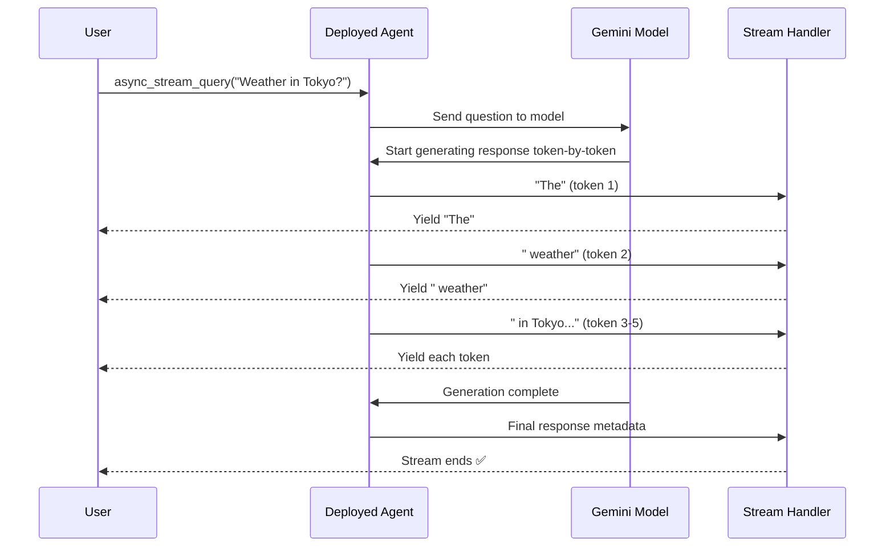

# Chapter 9: Query Streaming

In [Chapter 8: Agent Deployment Process](08_agent_deployment_process_.md), you learned how to take your agent from your laptop and make it live on the internet using Agent Engine. Your agent is now running in the cloud, ready to answer questions from users worldwide.

But here's a new problem: **When a user asks your agent a complex question, how long should they wait for the answer?**

Imagine you're ordering food at a restaurant. You have two options:

**Option 1 (No streaming):** The chef finishes *everything*—appetizer, main course, dessert—and brings it all at once. You stare at an empty table for 10 minutes, then suddenly get everything. This feels slow and frustrating.

**Option 2 (Streaming):** The chef brings out dishes one-by-one as they're ready. You get the appetizer in 2 minutes and start eating while the main course cooks. By the time you finish appetizers, the main course arrives. You feel like things are happening quickly!

**Query Streaming is Option 2 for AI agents.** Instead of waiting for your agent to finish generating a complete answer, streaming sends back pieces of the response as they're generated—like watching text appear on your screen as it's typed.[1][2]

Think of streaming as **delivering responses incrementally** instead of all at once. This provides better user experience and faster perceived responsiveness.

## The Problem: From Waiting to Seeing Progress

Let's make this concrete.

**Without streaming (the frustrating way):**

```
User: "Tell me about machine learning"
⏳ Waiting... 5 seconds... 10 seconds... 15 seconds...
Agent: [Finally sends complete 500-word essay]
```

**Problem:** User stares at a loading spinner for 15 seconds. They don't know if anything is happening. They might close the app thinking it's broken!

**With streaming (the delightful way):**

```
User: "Tell me about machine learning"
Agent: "Machine learning is..."
Agent: "...a type of artificial intelligence..."
Agent: "...that learns from data..."
Agent: "...instead of being explicitly programmed."
✅ Done in 3 seconds!
```

**Benefit:** User sees responses appearing in real-time. After 1 second, they see text. After 2 seconds, more text. It feels instant and responsive!

## What is Query Streaming, Really?

Query Streaming is **a method of sending agent responses back to you piece-by-piece, as they're generated, instead of waiting for the complete answer.**[1][2]

Here's the simplest possible comparison:

**Without streaming (batching):**
- Agent generates entire response in memory
- Sends complete response all at once
- Like downloading a large file—nothing until it's done

**With streaming:**
- Agent generates response piece by piece
- Sends each piece immediately as it's created
- Like watching a YouTube video—content starts playing instantly

The key insight: **Streaming makes slow processes feel fast** because users see progress happening in real-time.

## The Three Key Concepts of Streaming

Every streaming operation has three important ideas:

### 1. The Query (What You Send)

You send a message to your deployed agent:

```python
message = "What's the weather in Tokyo?"
```

This is just a normal question. Streaming doesn't change how you send queries—it changes how you receive responses.

### 2. The Stream Response (What You Get Back)

Instead of one big response object, you get a **stream of smaller pieces:**

```python
# Without streaming: Wait for complete response
response = "The weather in Tokyo is sunny and 72°F"

# With streaming: Get response piece by piece
stream:
  "The weather"
  " in Tokyo"
  " is sunny"
  " and 72°F"
```

### 3. The Async Iterator (How You Read It)

You read streaming responses using an **async loop** that gets one piece at a time:

```python
async for chunk in stream:
    print(chunk)  # Print each piece as it arrives
```

Think of it like reading a book—you go page by page instead of waiting for the entire book to be written.

## A Real-World Example: Your Deployed Weather Agent

Let's see how streaming works with the agent from [Chapter 8: Agent Deployment Process](08_agent_deployment_process_.md).

**Getting the deployed agent (same as before):**

```python
from vertexai import agent_engines
import vertexai

vertexai.init(project="my-project", location="us-central1")
agents_list = list(agent_engines.list())
remote_agent = agents_list[0]
```

**Making a streaming query:**

```python
async for item in remote_agent.async_stream_query(
    message="What's the weather in Tokyo?"
):
    print(item)
```

**What you'll see:**

```
ContentPartType.TEXT: "The"
ContentPartType.TEXT: " weather"
ContentPartType.TEXT: " in"
ContentPartType.TEXT: " Tokyo"
ContentPartType.TEXT: " is"
ContentPartType.TEXT: " sunny"
ContentPartType.TEXT: " and"
ContentPartType.TEXT: " 72°F"
```

Each piece arrives as it's generated. The complete response assembles before your eyes!

## How Streaming Works: The Journey of a Query

When you make a streaming query, here's what happens internally:[1][2]



**What each step means:**

1. **You make a streaming query** → Call `async_stream_query()` with your message

2. **Agent sends to Gemini** → Your question goes to the language model

3. **Model generates incrementally** → Gemini doesn't generate the entire response at once. It generates **token by token** (tokens are small pieces of text)

4. **Agent intercepts each token** → As soon as Gemini produces each piece, the agent grabs it

5. **Stream yields to you** → Each piece is sent back to your code immediately

6. **You see results in real-time** → Your `async for` loop receives pieces as they arrive

7. **Stream ends** → When the model finishes, the stream closes and you have the complete response

**The key insight:** Streaming doesn't make the agent faster. It makes the *waiting* disappear by showing you progress.

## Under the Hood: How Streaming Actually Works

When you call `async_stream_query()`, here's what the ADK framework does:[1][2]

### Step 1: Connect to Streaming Endpoint

```python
async_stream_query(message="Weather in Tokyo?")
# ADK creates a streaming connection to your deployed agent
```

ADK establishes a persistent connection that stays open, ready to receive data continuously.

### Step 2: Send Your Query

```python
# Your message is sent to the deployed agent
# Format: {"input": "Weather in Tokyo?"}
```

Your message is wrapped in a standard format and sent through the connection.

### Step 3: Receive Streaming Response

```python
# Agent starts responding piece-by-piece
# Each piece is streamed back immediately
async for chunk in response:
    # chunk contains one piece of the response
    print(chunk.text)
```

The connection stays open and receives data continuously. Unlike a normal request-response, streaming connections flow like a water pipe—data flows continuously instead of in one big dump.

### Step 4: Process Each Chunk

```python
# For each chunk received:
for part in chunk.content.parts:
    if part.text:
        print(f"Text: {part.text}")
    if part.inline_data:
        print(f"Audio: {len(part.inline_data)} bytes")
```

Each chunk can contain different types of content—text, audio, function calls, etc.

## Two Ways to Use Your Deployed Agent

From the provided notebook, you have two options:

### Option 1: Streaming (Recommended for User Interfaces)

```python
async for item in remote_agent.async_stream_query(
    message="Weather in Tokyo?"
):
    print(item)
```

**Best for:** 
- Web interfaces (show response appearing in real-time)
- Mobile apps (feel responsive)
- Long responses (user sees progress)

**Why:** Users see responses appearing incrementally, creating a sense of responsiveness.

### Option 2: Non-Streaming (Recommended for Batch Processing)

```python
response = remote_agent.stream_query(
    message="Weather in Tokyo?"
)
print(response)
```

**Best for:**
- Backend batch processing
- When you need the complete response to proceed
- Short responses

**Why:** Simpler to implement, you get everything at once.

## Real-World Example: Building a Streaming UI

Here's how you'd use streaming to build a responsive chat interface:

**Without streaming (the UI feels dead):**

```python
# User clicks "Send"
response = agent.query("Tell me a story")
# UI is frozen for 10 seconds...
# Finally shows the entire story at once
```

**With streaming (the UI feels alive):**

```python
# User clicks "Send"
async for chunk in agent.async_stream_query("Tell me a story"):
    # Update UI immediately with each chunk
    text_box.append(chunk.text)  # Shows text appearing
    time.sleep(0.05)  # Optional: slow down for effect
```

The difference: Users see text appearing word-by-word instead of waiting for the complete response.

## Streaming with Different Content Types

Your agent might stream different types of content. Here's how to handle them:

**Text responses (most common):**

```python
async for chunk in remote_agent.async_stream_query(
    message="Explain AI"
):
    if chunk.content and chunk.content.parts:
        for part in chunk.content.parts:
            if part.text:
                print(f"Text: {part.text}")
```

**Audio responses (for voice agents):**

```python
async for chunk in remote_agent.async_stream_query(
    message="Say hello in Spanish"
):
    if chunk.content and chunk.content.parts:
        for part in chunk.content.parts:
            if part.inline_data:  # Audio data
                print(f"Audio chunk: {len(part.inline_data)} bytes")
```

**Function calls (agent using tools):**

```python
async for event in remote_agent.async_stream_query(
    message="Weather in Tokyo?"
):
    if event.tool_calls:  # Agent is calling a tool
        print(f"Agent called: {event.tool_calls}")
```

## Common Beginner Questions

**Q: Is streaming faster?**
A: No! The agent takes the same amount of time to generate a complete response. But it *feels* faster because you see progress immediately instead of waiting.

**Q: Do I have to use streaming?**
A: No! You can use regular `stream_query()` if you prefer. Streaming is optional—use it when user experience matters.

**Q: What if the connection breaks?**
A: The stream closes with an error. Your `async for` loop will exit. You can handle it with `try/except`.

**Q: Can I cancel a streaming query?**
A: Yes! Break out of the `async for` loop with `break` statement. The connection closes automatically.

**Q: How much data does streaming send?**
A: Only what's necessary. Each token is sent immediately. No buffering, no waste.

## Best Practices: Using Streaming Effectively

### Practice 1: Always Use in User-Facing Applications

```python
# ✅ Good - users see responses appearing
async for chunk in agent.async_stream_query(message):
    ui.append(chunk)

# ❌ Bad - users wait for complete response
response = agent.stream_query(message)
ui.show(response)
```

### Practice 2: Handle Errors Gracefully

```python
try:
    async for chunk in agent.async_stream_query(message):
        display(chunk)
except Exception as e:
    print(f"Stream error: {e}")
```

### Practice 3: Add Timing Information

```python
import time
start = time.time()

async for chunk in agent.async_stream_query(message):
    elapsed = time.time() - start
    print(f"[{elapsed:.1f}s] {chunk.text}")
```

Users love seeing timestamps—it proves things are happening!

## Summary: What You've Learned

**Query Streaming** is getting responses piece-by-piece instead of all at once:[1][2]

✅ **Send your query** → Regular message, nothing special

✅ **Get streaming response** → Use `async_stream_query()` instead of `stream_query()`

✅ **Process incrementally** → Each chunk arrives as it's generated

✅ **Build responsive UIs** → Show text appearing in real-time

✅ **Better user experience** → Users see progress, not spinners

The beauty of streaming is **perceived speed**. By showing responses incrementally, your agent feels responsive and alive, even if the backend is doing complex work.

---

**Next:** [Chapter 10: Memory Bank (Long-term Memory)](10_memory_bank__long_term_memory__.md) will teach you how to give your agent long-term memory so it remembers important facts and preferences across different conversations.

---

Generated by [Erwin R. Pasia](https://github.com/erwinpasia/Full-Stack-Data-Science)