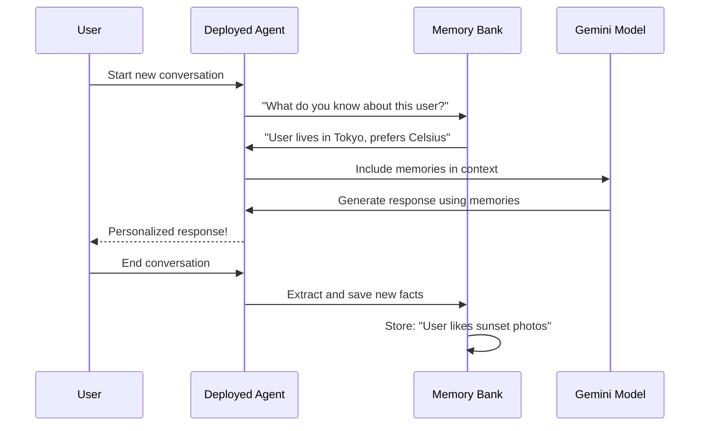

# Chapter 10: Memory Bank (Long-term Memory)

In [Chapter 9: Query Streaming](09_query_streaming_.md), you learned how to efficiently deliver agent responses to users piece-by-piece, creating a responsive user experience. Your deployed agent can now answer questions quickly and stream results as they arrive.

But here's a new problem: **Your agent forgets everything after each conversation ends.**

Imagine you have a personal assistant who helps you every day. On Monday, you tell them: "I prefer weather in Celsius, not Fahrenheit." On Tuesday, they ask: "Do you want Celsius or Fahrenheit?" You have to repeat yourself. On Wednesday, same thing. By Friday, you're frustrated because this person keeps forgetting your preferences despite being told multiple times.[1]

**That's what happens with regular agents.** Each conversation is completely separate. Your agent has no memory of past interactions, preferences, or important facts about you.

**Memory Bank solves this problem.** It's a system that lets your agent **remember important information across different conversations**, just like a person keeping a detailed journal.[1] Once Memory Bank learns something about you, it stays learned forever—even after you close the chat and come back days later.

Think of Memory Bank as your agent's **personal notebook**. Each conversation is a new day, but the agent keeps detailed notes. When you return, the agent reads the notebook: "Ah yes, they prefer Celsius! They love discussing Tokyo weather!" Your experience feels personalized and continuous, not like talking to someone with amnesia.[1]

## The Problem: Session Memory vs. Long-term Memory

Let's make this concrete with a real scenario.

**Without Memory Bank (frustration):**

```
Monday:
  You: "I live in Tokyo and prefer Celsius"
  Agent: "Got it! I'll remember that"
  
Tuesday (new session):
  You: "What's the weather today?"
  Agent: "Where are you?" (forgot you're in Tokyo!)
  You: "Tokyo, remember?"
  Agent: "Oh, temperature? Fahrenheit or Celsius?"
  You: 😤 (didn't I tell you Celsius?!)
```

**With Memory Bank (delightful):**

```
Monday:
  You: "I live in Tokyo and prefer Celsius"
  Agent: "Saving to memory..." ✓
  
Tuesday (new session):
  You: "What's the weather today?"
  Agent: "Checking memory... Found it! You're in Tokyo"
  Agent: "It's 15°C and sunny" (automatically used Celsius!)
  You: 😊 (feels like I'm talking to someone who knows me!)
```

## What is Memory Bank, Really?

Memory Bank is **a managed storage service that automatically extracts and remembers important facts from your conversations, then makes them available to your agent in future conversations.**[1][3]

Here's the simplest way to think about it:

**Without Memory Bank:**
```
Conversation 1 → Forgotten
Conversation 2 → Forgotten
Conversation 3 → Forgotten
```

**With Memory Bank:**
```
Conversation 1 → Extract facts → Save to Memory Bank
Conversation 2 → Retrieve facts from Memory Bank → Use them!
Conversation 3 → Retrieve facts from Memory Bank → Use them!
```

Memory Bank sits in the background, automatically learning and sharing knowledge between conversations.[1]

## The Three Core Concepts of Memory Bank

Every Memory Bank setup has three important ideas:

### 1. Memory Generation (How Does the Agent Learn?)

After a conversation ends, Memory Bank **automatically extracts important facts** and saves them.[1]

```
Conversation:
  User: "I live in Tokyo"
  
Memory Bank extracts:
  Fact: "User lives in Tokyo"
  Fact: "User prefers Celsius"
  Fact: "User interested in weather"
```

This happens automatically—the agent doesn't have to do anything special. Memory Bank reads the conversation and pulls out the important parts.

### 2. Memory Storage (Where Are Memories Kept?)

Extracted facts are **stored permanently in your cloud project**, associated with each user ID.[1]

```
User 123:
  - Lives in Tokyo
  - Prefers Celsius
  - Interested in weather
  
User 456:
  - Lives in London
  - Prefers Fahrenheit
  - Interested in sports
```

Each user's memories stay separate. User 123's preferences don't affect User 456.

### 3. Memory Retrieval (How Does the Agent Use Memories?)

At the start of each new conversation, your agent **searches and retrieves relevant memories**, then uses them to personalize responses.[1]

```
New conversation with User 123:
  
Memory Bank search:
  "What should I know about this user?"
  
Results:
  - Lives in Tokyo
  - Prefers Celsius
  - Interested in weather
  
Agent uses this: "Great! I'll give weather in Celsius for Tokyo"
```

The agent starts each conversation with background knowledge loaded from Memory Bank.

## A Real-World Example: Your Weather Agent with Memory

Let's build on the weather agent from [Chapter 8: Agent Deployment Process](08_agent_deployment_process_.md) and add memory.

### Step 1: Set Up Memory Bank Service

```python
from google.adk.memory import VertexAiMemoryBankService
from google.adk.sessions import VertexAiSessionService

# Create memory and session services
memory_service = VertexAiMemoryBankService(
    agent_engine_id="your-agent-id"
)
session_service = VertexAiSessionService()
```

**What this does:** Initializes two services—one for long-term memory storage, one for managing individual conversations.

### Step 2: Add Memory Tool to Your Agent

```python
from google.adk.tools import preload_memory_tool

memory_tool = preload_memory_tool.PreloadMemoryTool()

root_agent = Agent(
    name="weather_assistant",
    model="gemini-2.5-flash-lite",
    tools=[get_weather, memory_tool],  # Add memory tool!
    instruction="Use memories about user preferences..."
)
```

**What this does:** Gives your agent a tool to access and use memories. The `PreloadMemoryTool` automatically loads relevant memories at the start of each conversation.

### Step 3: Generate Memories After Conversations

```python
from google.adk.memory import GenerateMemoriesRequest

# After a conversation ends, generate memories
client.agent_engines.generate_memories(
    name=agent_engine_id,
    direct_contents_source={"events": conversation_events},
    scope={"user_id": "user_123"}
)
```

**What this does:** Tells Memory Bank to read the conversation and extract important facts. These facts are then stored for future conversations.

## How Memory Bank Works: The Journey of a Memory

When you use Memory Bank, here's what happens internally:[1][3]



**Let me explain each step:**

1. **User starts conversation** → New session begins

2. **Agent asks Memory Bank** → "What should I know about this user?"

3. **Memory Bank searches** → Finds all facts stored for that user

4. **Agent includes memories** → Adds facts to the context sent to Gemini

5. **Gemini generates response** → Uses memories to personalize answer

6. **User gets personalized response** → "I remember you prefer Celsius!"

7. **After conversation** → Agent calls Memory Bank to save new facts

8. **Facts stored** → Available for next conversation

**The key insight:** Memory Bank works behind the scenes, automatically learning and sharing knowledge.

## Under the Hood: Memory Bank's Internal Process

When Memory Bank extracts facts from a conversation, here's exactly what happens:[1][3]

### Phase 1: Memory Generation (After Conversation)

```python
# Memory Bank reads the conversation
conversation = [
    {"role": "user", "content": "I live in Tokyo"},
    {"role": "agent", "content": "Got it, you're in Tokyo!"},
    {"role": "user", "content": "I prefer Celsius"}
]

# Gemini analyzes and extracts facts
extracted_facts = [
    "User location: Tokyo",
    "User temperature unit preference: Celsius"
]
```

Memory Bank uses the language model to understand what's important in the conversation.

### Phase 2: Memory Storage (Save to Database)

```python
# Facts are stored with user ID
for fact in extracted_facts:
    memory_database.save(
        user_id="user_123",
        fact=fact,
        timestamp=now()
    )
```

Facts are saved permanently, tagged with the user ID so they can be retrieved later.

### Phase 3: Memory Retrieval (Next Conversation)

```python
# At start of next conversation, search memories
memories = memory_database.search(
    user_id="user_123",
    limit=10
)

# Load into agent context
context = f"User facts: {memories}"
```

The agent starts with background knowledge loaded from Memory Bank.

## Real-World Scenarios: When to Use Memory Bank

### Scenario 1: Customer Support Agent

**Without Memory:**
```
Customer: "I bought a laptop last week"
Agent: "What product did you buy?"
Customer: "I just told you!"
```

**With Memory:**
```
Customer: "I bought a laptop last week"
Agent: Remembers → Next time: "How's the laptop I helped you with?"
```

### Scenario 2: Personalized Shopping Assistant

**Without Memory:**
```
Day 1: User: "I like red shoes"
Day 7: Agent: "What color do you prefer?"
```

**With Memory:**
```
Day 1: User: "I like red shoes" → Saved
Day 7: Agent: "Found red shoes in your style!"
```

### Scenario 3: Learning Tutor

**Without Memory:**
```
Lesson 1: "You struggle with fractions"
Lesson 2: "Let me explain fractions..." (starting over!)
```

**With Memory:**
```
Lesson 1: "You struggle with fractions" → Saved
Lesson 2: Agent uses special techniques for fraction teaching
```

## Best Practices: Using Memory Bank Effectively

### Practice 1: Set Appropriate Memory Topics

```python
# Tell Memory Bank what information matters
memory_topics = [
    "user_preferences",
    "user_location", 
    "purchase_history"
]

# Memory Bank focuses on extracting these topics
```

This guides Memory Bank to extract the right information. Don't store everything—be selective about what matters.

### Practice 2: Set Time-to-Live (TTL) for Memories

```python
# Memories automatically expire after 90 days
memory_config = MemoryBankConfig(
    ttl_days=90
)
```

Prevent old, stale information from cluttering the memory system. If someone hasn't interacted in a year, their preferences might have changed anyway.

### Practice 3: Use User IDs Consistently

```python
# Always use the same user_id across conversations
memory_service.generate_memories(
    scope={"user_id": "user_123"}  # Same ID every time!
)
```

If you use different IDs for the same user, memories get scattered and lost.

## Common Questions Beginners Ask

**Q: Does Memory Bank work automatically?**
A: Mostly! You set it up once, then it works in the background. Memory generation happens automatically after conversations end.

**Q: Can users delete their memories?**
A: Yes! Memory Bank supports deletion commands. Users can ask their agent: "Forget my preferences" and the agent can clear their memories.

**Q: Will Memory Bank make my agent slower?**
A: Slightly, because retrieving memories adds a small lookup time. But it's fast (milliseconds) and worth the personalization benefit.

**Q: What if I accidentally extract wrong information?**
A: Memory Bank uses AI to extract facts, so it's usually accurate. But if errors happen, you can manually delete incorrect memories.

**Q: How much does Memory Bank cost?**
A: It's part of Vertex AI Agent Engine's pricing. Basic usage is covered in the free tier. See [Agent Engine pricing](https://docs.cloud.google.com/agent-builder/agent-engine/overview#pricing).

## Putting It All Together: Memory Bank in Your Agent

From the provided notebook, here's how Memory Bank integrates with your deployed agent:[1]

```python
# Initialize Memory Bank
memory_service = VertexAiMemoryBankService(
    agent_engine_id=agent_engine_id
)

# Your agent automatically:
# 1. Loads memories at conversation start
# 2. Uses memories to personalize responses
# 3. Generates new memories after conversation

# That's it! Memory Bank handles everything else
```

Once configured, your agent works just like before—but now it remembers users between conversations.

## Summary: What You've Learned

**Memory Bank is your agent's long-term memory system:**[1][3][4]

✅ **Learn automatically** → Extract facts from conversations

✅ **Store permanently** → Save information per user

✅ **Use contextually** → Include memories in future conversations

✅ **Personalize experiences** → Agents recognize users and their preferences

✅ **Manage data lifecycle** → Set TTL to prevent stale information

The beauty of Memory Bank is that **it bridges the gap between conversation sessions**. Your agent stops being forgetful and starts being knowledgeable. Users feel recognized and understood because your agent actually remembers them—like talking to a real person who keeps detailed notes.

---

## 🎉 Congratulations! You've Completed the Course

You've now learned the complete journey of building, deploying, and enhancing AI agents with Vertex AI Agent Engine and ADK:

- **[Chapter 1: Vertex AI Agent Engine](01_vertex_ai_agent_engine_.md)** → Understanding the cloud infrastructure
- **[Chapter 2: Agent Development Kit (ADK)](02_agent_development_kit__adk__.md)** → The framework for building agents
- **[Chapter 3: Agent Object](03_agent_object_.md)** → The core building block
- **[Chapter 4: Tools](04_tools_.md)** → Giving agents hands to do work
- **[Chapter 5: Environment Configuration (.env)](05_environment_configuration___env__.md)** → Managing secrets safely
- **[Chapter 6: Requirements Management](06_requirements_management_.md)** → Declaring dependencies
- **[Chapter 7: Deployment Configuration](07_deployment_configuration_.md)** → Configuring resources
- **[Chapter 8: Agent Deployment Process](08_agent_deployment_process_.md)** → Taking agents to production
- **[Chapter 9: Query Streaming](09_query_streaming_.md)** → Delivering responses efficiently
- **Chapter 10: Memory Bank (Long-term Memory)** → Making agents remember users

You now have the complete toolkit to build production-ready AI agents that are intelligent, responsive, personalized, and scalable. Happy building! 🚀

---

Generated by [Erwin R. Pasia](https://github.com/erwinpasia/Full-Stack-Data-Science)