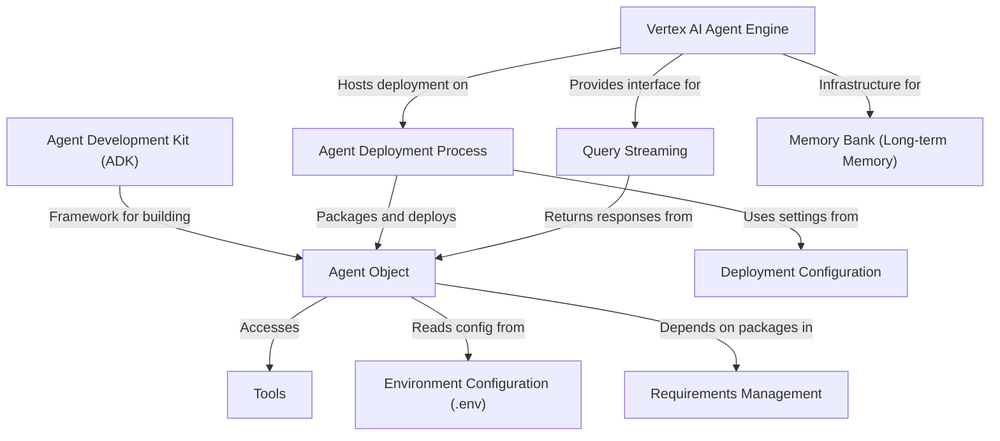

# Tutorial: place_the_code_here

This project is a **practical guide to deploying AI agents to production** using Google Cloud's Vertex AI Agent Engine. It teaches you how to build a **Weather Assistant agent** using the Agent Development Kit (ADK)—a framework that combines a language model, custom tools, and system instructions—and then deploy it to the cloud where it can scale automatically and serve real users. The notebook walks through creating agent code, configuring deployment settings, testing the live agent, and understanding how to add long-term memory so agents remember information across different conversations.

**Source Repository:** [None](None)

## Chapters

1. [Vertex AI Agent Engine
](01_vertex_ai_agent_engine_.md)
2. [Agent Development Kit (ADK)
](02_agent_development_kit__adk__.md)
3. [Agent Object
](03_agent_object_.md)
4. [Tools
](04_tools_.md)
5. [Environment Configuration (.env)
](05_environment_configuration___env__.md)
6. [Requirements Management
](06_requirements_management_.md)
7. [Deployment Configuration
](07_deployment_configuration_.md)
8. [Agent Deployment Process
](08_agent_deployment_process_.md)
9. [Query Streaming
](09_query_streaming_.md)
10. [Memory Bank (Long-term Memory)
](10_memory_bank__long_term_memory__.md)

---

Generated by [Erwin R. Pasia](https://github.com/erwinpasia/Full-Stack-Data-Science)