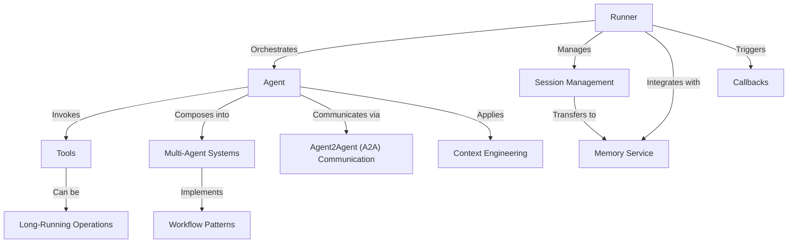

# Tutorial: codes_2

The **Agent Development Kit (ADK)** is a framework for building, orchestrating, and deploying **AI agents** - autonomous systems that can reason, take actions, and collaborate to solve complex problems. Agents use **Tools** to interact with external systems (like APIs and databases), **Multi-Agent Systems** enable specialized agents to work together through patterns like sequential, parallel, and loop workflows, and **Memory Management** (via Sessions for short-term context and Memory Services for long-term knowledge) allows agents to maintain context across conversations. The framework includes **A2A Communication** for cross-organization agent integration and provides **Runners** and **Apps** to orchestrate execution, with support for **Callbacks** to customize agent lifecycle behavior.

**Source Repository:** [None](None)

## Chapters

1. [Agent
](01_agent_.md)
2. [Tools
](02_tools_.md)
3. [Multi-Agent Systems
](03_multi_agent_systems_.md)
4. [Workflow Patterns
](04_workflow_patterns_.md)
5. [Agent2Agent (A2A) Communication
](05_agent2agent__a2a__communication_.md)
6. [Runner
](06_runner_.md)
7. [Session Management
](07_session_management_.md)
8. [Memory Service
](08_memory_service_.md)
9. [Context Engineering
](09_context_engineering_.md)
10. [Callbacks
](10_callbacks_.md)
11. [Long-Running Operations
](11_long_running_operations_.md)

